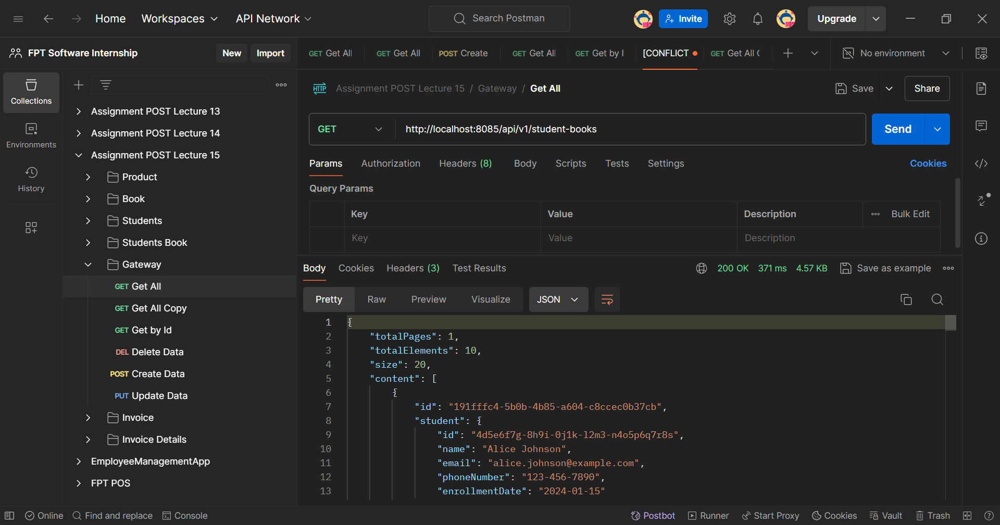
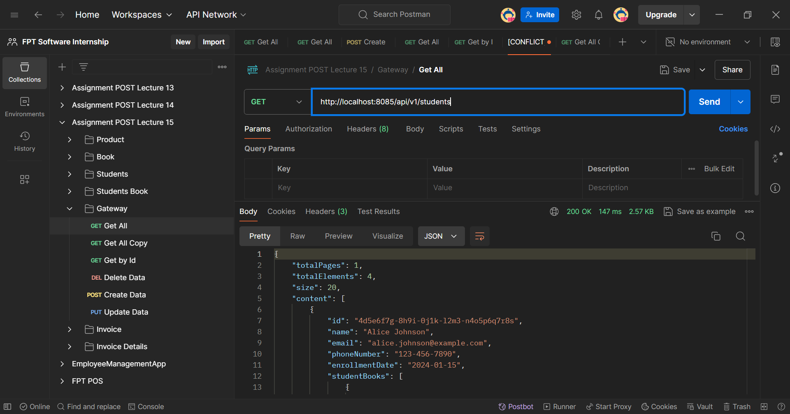
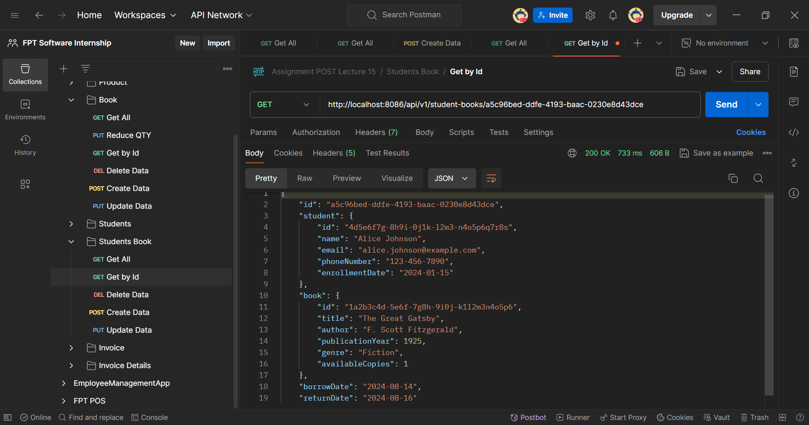
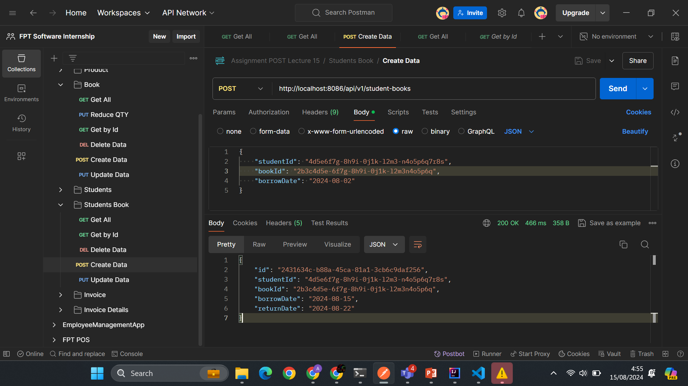
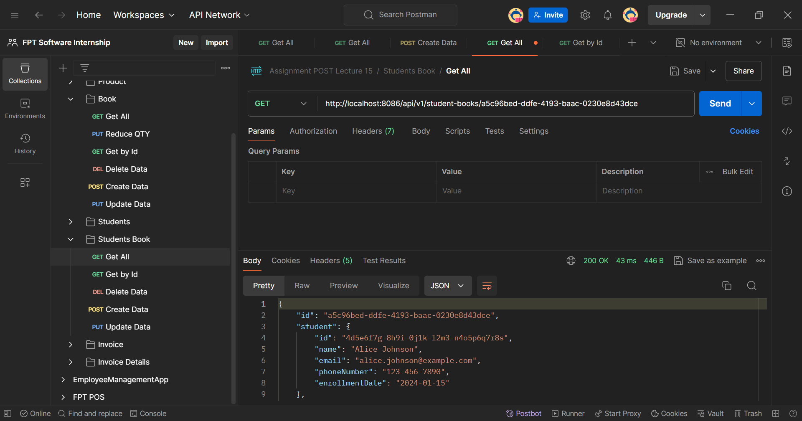

# Microservices: Spring Cloud Gateway

## Detailed Overview

Spring Cloud Gateway is a powerful API gateway for routing requests to microservices in a Spring Cloud application. It acts as a front door to your system, handling cross-cutting concerns like security, routing, rate limiting, and monitoring.

### Key features include:

- Routing: Directs incoming HTTP requests to appropriate microservices based on URI paths, request headers, or other criteria.
- Filters: Allows pre- and post-processing of requests, such as adding headers, modifying requests or responses, and logging.
- Load Balancing: Supports integration with Spring Cloud LoadBalancer for distributing requests across multiple service instances.
- Security: Can handle authentication and authorization, such as validating API keys or integrating with OAuth2.
- Resilience: Supports circuit breakers, retries, and timeouts to enhance the resilience of the gateway.

Spring Cloud Gateway is built on Spring Framework 5, Project Reactor, and uses non-blocking APIs, making it a good fit for reactive microservice architectures.

`This is example implementation`:

## Setting Up Spring Cloud Gateway Project

1. Create new spring project.Add the necessary dependencies in your pom.xml:

```xml
<dependencies>
    <dependency>
        <groupId>org.springframework.boot</groupId>
        <artifactId>spring-boot-starter-webflux</artifactId>
    </dependency>
    <dependency>
        <groupId>org.springframework.cloud</groupId>
        <artifactId>spring-cloud-starter-gateway</artifactId>
    </dependency>
    <dependency>
        <groupId>org.springframework.cloud</groupId>
        <artifactId>spring-cloud-starter-netflix-eureka-client</artifactId>
    </dependency>
    <dependency>
        <groupId>org.springframework.boot</groupId>
        <artifactId>spring-boot-starter-actuator</artifactId>
    </dependency>
</dependencies>
```

2. Configure application.yaml
   Place the application.yml in the src/main/resources directory. This file defines the gateway routes and configurations. Here’s an example configuration:

```yaml
server:
  port: 8085 # Gateway server port

spring:
  application:
    name: gateway-service

  cloud:
    gateway:
      routes:
        - id: books-service
          uri: http://localhost:8087
          predicates:
            - Path=/api/v1/books/**

        - id: student-service
          uri: http://localhost:8086
          predicates:
            - Path=/api/v1/**

management:
  endpoints:
    web:
      exposure:
        include: "*"
```

### _Notes_ :

`books-service` Route: Maps all requests with /api/v1/books/\*\* to the Books service running on port 8087.
`student-service` Route : Maps all requests with /api/v1/\*\* to the Student service running on port 8086.

Ensure all ports is running, The gateway will automatically route incoming requests to the appropriate service based on the path.

## Summary

Spring Cloud Gateway serves as the entry point to your microservices, efficiently managing traffic by routing requests and applying filters. With its powerful features, such as routing, load balancing, and security, you can build a scalable and secure microservices architecture by configuring routes tailored to your needs.

## Project Structure and Query Data

### `Book-Service`

`Project Structure`

```bash
product
├── .mvn/wrapper/
│   └── maven-wrapper.properties
├── src/main/
│   ├── java/com/example/product/
│   │   ├── controller/
│   │   │   └── BookController.java
│   │   ├── data/
│   │   │   ├── model/
│   │   │   │   ├── Book.java
│   │   │   └── repository/
│   │   │       ├── BookRepository.java
│   │   ├── dto/
│   │   │   ├── BookDTO.java
│   │   │   ├── BookSaveDTO.java
│   │   │   ├── BookShowDTO.java
│   │   ├── mapper/
│   │   │   └── BookMapper.java
│   │   ├── service/
│   │   │   ├── impl/
│   │   │   │   └── BookServiceImpl.java
│   │   │   └── BookService.java
│   │   └── BookApplication.java
│   └── resources/
│       ├── application.properties
├── .gitignore
├── env.properties
├── mvnw
├── mvnw.cmd
├── pom.xml
```

### `DDL and DML Book-Service`

```sql
CREATE TABLE book (
    id char(36) PRIMARY KEY,
    title VARCHAR(255) NOT NULL,
    author VARCHAR(255) NOT NULL,
    publication_year INT,
    genre VARCHAR(100),
    available_copies INT NOT NULL DEFAULT 0,
    created_at TIMESTAMP,
    updated_at TIMESTAMP
);


-- Inserting data into the book table
INSERT INTO book (id, title, author, publication_year, genre, available_copies, created_at, updated_at)
VALUES
    ('1a2b3c4d-5e6f-7g8h-9i0j-k1l2m3n4o5p6', 'The Great Gatsby', 'F. Scott Fitzgerald', 1925, 'Fiction', 3, CURRENT_TIMESTAMP, CURRENT_TIMESTAMP),
    ('2b3c4d5e-6f7g-8h9i-0j1k-l2m3n4o5p6q', '1984', 'George Orwell', 1949, 'Dystopian', 5, CURRENT_TIMESTAMP, CURRENT_TIMESTAMP),
    ('3c4d5e6f-7g8h-9i0j-k1l2-m3n4o5p6q7r', 'To Kill a Mockingbird'	, 'Harper Lee', 1960, 'Classic', 2, CURRENT_TIMESTAMP, CURRENT_TIMESTAMP);
```

### `Student-Service`

`Project Structure`

```bash
product
├── .mvn/wrapper/
│   └── maven-wrapper.properties
├── src/main/
│   ├── java/com/example/product/
│   │   ├── client/
│   │   │   ├── BookClient.java
│   │   ├── config/
│   │   │   ├── AppConfig.java
│   │   ├── controller/
│   │   │   ├── StudentController.java
│   │   │   └── StudentBookController.java
│   │   ├── data/
│   │   │   ├── model/
│   │   │   │   ├── Student.java
│   │   │       └── StudentBook.java
│   │   │   └── repository/
│   │   │       ├── StudentRepository.java
│   │   │       └── StudentBookRepository.java
│   │   ├── dto/
│   │   │   ├── BookDTO.java
│   │   │   ├── StudentDTO.java
│   │   │   ├── StudentSaveDTO.java
│   │   │   ├── StudentShowDTO.java
│   │   │   ├── StudentBook.java
│   │   │   ├── StudentSaveBook.java
│   │   │   ├── StudentShowBook.java
│   │   ├── exception/
│   │   │   ├── BookNotFoundException.java
│   │   │   └── StudentNotFoundException.java
│   │   ├── mapper/
│   │   │   ├── StudentMapper.java
│   │   │   └── StudentBookMapper.java
│   │   ├── service/
│   │   │   ├── impl/
│   │   │   │   └── StudentServiceImpl.java
│   │   │   │   └── StudentBookServiceImpl.java
│   │   │   ├── StudentService.java
│   │   │   └── StudentBookService.java
│   │   └── StudentApplication.java
│   └── resources/
│       ├── application.properties
├── .gitignore
├── env.properties
├── mvnw
├── mvnw.cmd
├── pom.xml
```

### `DDL and DML Student-Service`

```sql


CREATE TABLE student (
    id char(36) PRIMARY KEY,
    name VARCHAR(255) NOT NULL,
    email VARCHAR(255) UNIQUE NOT NULL,
    phone_number VARCHAR(20),
    enrollment_date DATE NOT NULL,
    created_at TIMESTAMP,
    updated_at TIMESTAMP
);

-- Inserting data into the student table
INSERT INTO student (id, name, email, phone_number, enrollment_date, created_at, updated_at)
VALUES
    ('4d5e6f7g-8h9i-0j1k-l2m3-n4o5p6q7r8s', 'Alice Johnson', 'alice.johnson@example.com', '123-456-7890', '2024-01-15', CURRENT_TIMESTAMP, CURRENT_TIMESTAMP),
    ('5e6f7g8h-9i0j-k1l2-m3n4-o5p6q7r8s9t', 'Bob Smith', 'bob.smith@example.com', '987-654-3210', '2024-02-20', CURRENT_TIMESTAMP, CURRENT_TIMESTAMP),
    ('6f7g8h9i-0j1k-l2m3-n4o5-p6q7r8s9t0u', 'Carol White', 'carol.white@example.com', '456-789-1234', '2024-03-10', CURRENT_TIMESTAMP, CURRENT_TIMESTAMP);


CREATE TABLE studentBook (
    id char(36) PRIMARY KEY,
    student_id char(36) NOT NULL,
    book_id char(36) NOT NULL,
    borrow_date DATE NOT NULL,
    return_date DATE
    FOREIGN KEY (student_id) REFERENCES student(id)
);

-- Inserting data into the studentBook table
INSERT INTO studentBook (id, student_id, book_id, borrow_date, return_date)
VALUES
    ('7g8h9i0j-1k2l-3m4n-5o6p-q7r8s9t0u1v', '4d5e6f7g-8h9i-0j1k-l2m3-n4o5p6q7r8s', '1a2b3c4d-5e6f-7g8h-9i0j-k1l2m3n4o5p6', '2024-08-01', NULL),
    ('8h9i0j1k-2l3m-4n5o-6p7q-r8s9t0u1v2w', '5e6f7g8h-9i0j-k1l2-m3n4-o5p6q7r8s9t', '2b3c4d5e-6f7g-8h9i-0j1k-l2m3n4o5p6q', '2024-08-05', '2024-08-15'),
    ('9i0j1k2l-3m4n-5o6p-7q8r-s9t0u1v2w3x', '6f7g8h9i-0j1k-l2m3-n4o5-p6q7r8s9t0u', '3c4d5e6f-7g8h-9i0j-k1l2-m3n4o5p6q7r', '2024-08-10', NULL);

```

### `Gateway-Service`

```bash
gateway
├── .mvn/wrapper/
│   └── maven-wrapper.properties
├── src/main/
│   ├── java/com/example/gateway/
│   │   └── GatewayApplication.java
│   └── resources/
│       ├── application.properties
│       └── application.yml
├── .gitignore
├── mvnw
├── mvnw.cmd
├── pom.xml
├── run.bat
└── run.sh
```

## Some Documentation Result

1. Gateway Service 1
   
2. Gateway Service 2
   
3. Gateway Service 3
   
4. Student-Books Service
   
5. Student-Books Service
   
6. Student Service
   
