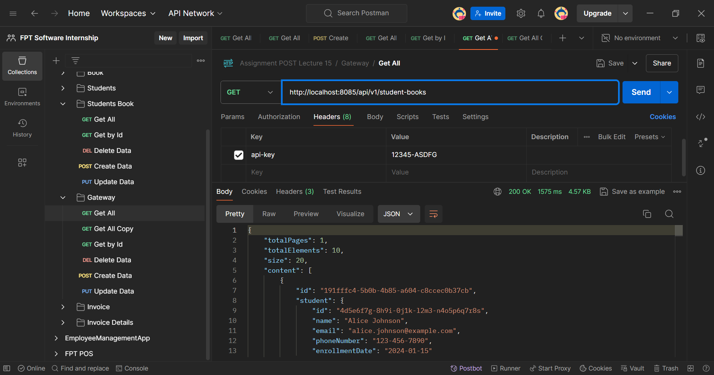
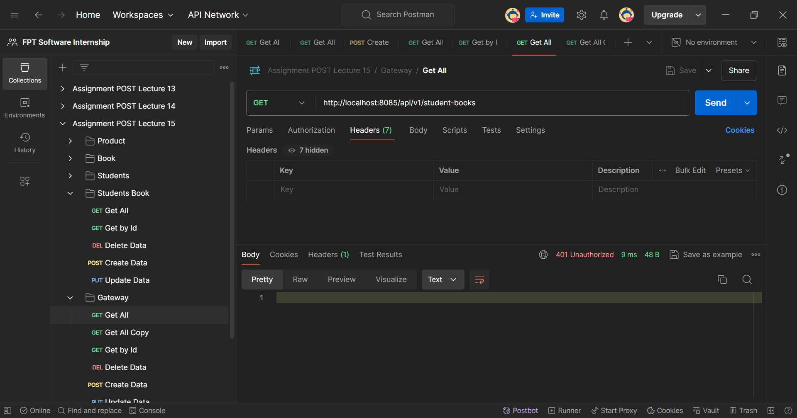

# Microservices: Spring Cloud Gateway with Filter

## Detailed Overview

In Spring Cloud Gateway, filters are used to modify requests and responses as they pass through the gateway. Filters can be applied globally, per route, or specifically to pre-process incoming requests or post-process outgoing responses. They are a key feature for implementing cross-cutting concerns like security, logging, and transformations.

## Types of Filters:

- Global Filters:

Applied to all routes.
Useful for tasks like global logging, security checks, or error handling.
Example: A global filter that adds a custom header to all responses.

- Pre-filters:

Executed before the request is routed to the backend service.
Used for tasks like authentication, request logging, modifying headers, or rate limiting.
Example: A pre-filter that checks for an API key in the request header.

- Post-filters:

Executed after the request has been routed and a response is received.
Used for modifying the response, adding headers, or logging the response data.
Example: A post-filter that adds a response time header to the response.

- Custom Filters:

You can create custom filters by implementing the GatewayFilter interface for route-specific filters or the GlobalFilter interface for global filters.
Custom filters allow you to define specific logic tailored to your application's needs.
Ordering Filters:
Filters can be ordered to control their execution sequence, ensuring that critical filters run before or after others.

## Example Use Cases:

- Security: Validate authentication tokens or API keys.
- Logging: Track request and response data for monitoring and debugging.
- Traffic Management: Implement rate limiting or circuit breaking to manage traffic load.

Filters in Spring Cloud Gateway are powerful tools that give you fine-grained control over how requests and responses are processed as they move through the gateway.

`This is example implementation`:

## Setting Up Spring Cloud Gateway Project with Filter

Create new spring project for authentication service. Add the necessary dependencies in the pom.xml:

```xml
    <dependency>
        <groupId>org.springframework.boot</groupId>
        <artifactId>spring-boot-starter-data-jpa</artifactId>
    </dependency>
    <dependency>
        <groupId>org.springframework.boot</groupId>
        <artifactId>spring-boot-starter-web</artifactId>
    </dependency>

    <dependency>
        <groupId>org.springframework.boot</groupId>
        <artifactId>spring-boot-devtools</artifactId>
        <scope>runtime</scope>
        <optional>true</optional>
        </dependency>
    <dependency>
    <groupId>com.mysql</groupId>
        <artifactId>mysql-connector-j</artifactId>
        <scope>runtime</scope>
    </dependency>
```

## Create the all components project of authentication service

This example components:
`Entity`  
Here is the detail of [ApiKey](./authentication/src/main/java/aliramadhan/assignment/data/model/ApiKey.java)

```java
@Data
@NoArgsConstructor
@AllArgsConstructor
@Entity
@Table(name = "api_key")
public class ApiKey {

    @Id
    @Column(name = "id", columnDefinition = "BIGINT", updatable = false, nullable = false)
    @GeneratedValue(strategy = GenerationType.IDENTITY)
    private Long id;
    private String apiKey;
    private String description;
    private LocalDateTime createdAt;
    private LocalDateTime updatedAt;
    private boolean active;
}
```

`Repository`
Here is the detail of [Repository](./authentication/src/main/java/aliramadhan/assignment/data/repository/ApiKeyRepository.java)

```java
package aliramadhan.assignment.data.repository;

import java.util.Optional;

import aliramadhan.assignment.data.model.ApiKey;
import org.springframework.data.jpa.repository.JpaRepository;
import org.springframework.stereotype.Repository;


@Repository
public interface ApiKeyRepository extends JpaRepository<ApiKey, Long> {

    // Get the first API key, order by ID
    Optional<ApiKey> findFirstByOrderById();

    // Find the first active API key
    Optional<ApiKey> findFirstByActiveTrueOrderById();
}
```

`Service Interface`
Here is the detail of [Service Interface](./authentication/src/main/java/aliramadhan/assignment/service/ApiKeyService.java)

```java
package aliramadhan.assignment.service;

import aliramadhan.assignment.data.model.ApiKey;

import java.util.List;

public interface ApiKeyService {

    List<ApiKey> getAll();

    // Validates if the provided API key is valid and active
    boolean isValidApiKey(String requestApiKey);
}

```

`Service Implementation`
Here is the detail of [Service Implementation](./authentication/src/main/java/aliramadhan/assignment/service/impl/ApiKeyServiceImpl.java)

```java
@Service
public class ApiKeyServiceImpl implements ApiKeyService {

    private final ApiKeyRepository apiKeyRepository;

    @Autowired
    public ApiKeyServiceImpl(ApiKeyRepository apiKeyRepository) {
        this.apiKeyRepository = apiKeyRepository;
    }

    @Override
    public List<ApiKey> getAll() {
        // Return the list of all ApiKey entities from the repository
        return apiKeyRepository.findAll();
    }

    @Override
    public boolean isValidApiKey(String requestApiKey) {
        // Check from the repo
        Optional<ApiKey> apiKeyOpt = apiKeyRepository.findFirstByActiveTrueOrderById();
        if (apiKeyOpt.isPresent()) {
            // Check if it's the same
            String storedApiKey = apiKeyOpt.get().getApiKey();
            return storedApiKey.equals(requestApiKey);
        }
        return false;
    }
}

```

`Controller`
Here is the detail of [Controller](./authentication/src/main/java/aliramadhan/assignment/controller/ApiKeyController.java)

```java
@RestController
@RequestMapping("/api/v1/auth")
@Validated
public class ApiKeyController {

    private final ApiKeyService apiKeyService;

    @Autowired
    public ApiKeyController(ApiKeyService apiKeyService) {
        this.apiKeyService = apiKeyService;
    }

    @GetMapping
    public ResponseEntity<List<ApiKey>> getAllApiKeys() {
        List<ApiKey> apiKeys = apiKeyService.getAll();
        return ResponseEntity.ok(apiKeys);
    }

    @GetMapping("/validate")
    public ResponseEntity<Boolean> validateApiKey(@RequestParam String key) {
        boolean isValid = apiKeyService.isValidApiKey(key);
        return ResponseEntity.ok(isValid);
    }
}
```

## Configure Gateway Service with Filter

This example implementation:
`ApiKeyConfig`
Here is the detail of [ApiKeyConfig](./gateway/src/main/java/aliramadhan/gateway/config/ApiKeyConfig.java)

```java
package aliramadhan.gateway.config;

import lombok.Getter;
import lombok.Setter;
import org.springframework.context.annotation.Configuration;

@Setter
@Getter
@Configuration
public class ApiKeyConfig {
private String apiKeyHeaderName = "api-key";
private String authServiceUrl = "http://localhost:8084/api/v1/auth/validate";
}
```

`ApiKeyFilter`
Here is the detail of [ApiKeyConfig](./gateway/src/main/java/aliramadhan/gateway/filter/ApiKeyFilter.java)

Configure `Application.yaml`
Here is the detail of [ApplicationYaml](./gateway/src/main/resources/application.yaml)

```yaml
server:
  port: 8085 # Gateway server port

spring:
  application:
    name: gateway-service

  cloud:
    gateway:
      routes:
        - id: books-service
          uri: http://localhost:8087
          predicates:
            - Path=/api/v1/books/**
          filters:
            - name: ApiKeyFilter
              args:
                apiKeyHeaderName: api-key
                authServiceUrl: http://localhost:8084/api/v1/auth/validate
        - id: student-service
          uri: http://localhost:8086
          predicates:
            - Path=/api/v1/**
          filters:
            - name: ApiKeyFilter
              args:
                apiKeyHeaderName: api-key
                authServiceUrl: http://localhost:8084/api/v1/auth/validate

management:
  endpoints:
    web:
      exposure:
        include: "*"
```

### _Notes_ :

`books-service` Route: Maps all requests with /api/v1/books/\*\* to the Books service running on port 8087 with api-key filter.
`student-service` Route : Maps all requests with /api/v1/\*\* to the Student service running on port 8086 with api-key filter.

This implementation securely controls access to microservices by verifying an "api-key" through Spring Cloud Gateway. The centralized management of API keys in the Authentication service simplifies the maintenance and updating of keys as needed.

## Project Structure and Query Data

### `Authentication-Service`

`Project Structure`

```bash
gateway
├── .mvn/wrapper/
│   └── maven-wrapper.properties
├── src/main/
│   ├── java/com/example/authentication/
│   │   ├── controller/
│   │   │   ├── ApiKeyController.java
│   │   ├── data/
│   │   │   ├── model/
│   │   │   │   ├── ApiKey.java
│   │   │   └── repository/
│   │   │       ├── ApiKeyRepository.java
│   │   ├── service/
│   │   │   ├── impl/
│   │   │   │   └── ApiKeyServiceImpl.java
│   │   │   └── ApiKeyService.java
│   │   └── ApiKeyApplication.java
│   └── resources/
│       ├── application.properties
│       └── application.yml
├── .gitignore
├── mvnw
├── mvnw.cmd
├── pom.xml
├── run.bat
└── run.sh
```

`DDL and DML`

```sql
CREATE TABLE api_key (
    id BIGINT AUTO_INCREMENT PRIMARY KEY,
    api_key VARCHAR(255) NOT NULL,
    description VARCHAR(255),
    created_at TIMESTAMP DEFAULT CURRENT_TIMESTAMP,
    updated_at TIMESTAMP DEFAULT CURRENT_TIMESTAMP ON UPDATE CURRENT_TIMESTAMP,
    active BOOLEAN DEFAULT TRUE
);

-- Prepare API Keys
INSERT INTO api_Key (api_key, description, created_at, updated_at, active) VALUES
('12345-ASDFG', 'Primary API Key for Main Access', NOW(), NOW(), TRUE),
('67890-ABCDE', 'Secondary API Key for Testing Access', NOW(), NOW(), FALSE);
```

### `Gateway-Service`

```bash
gateway
├── .mvn/wrapper/
│   └── maven-wrapper.properties
├── src/main/
│   ├── java/com/example/gateway/
│   │   ├── config/
│   │   │   ├── ApiKeyConfig.java
│   │   ├── filter/
│   │   │   ├── ApiKeyFilter.java
│   │   └── GatewayApplication.java
│   └── resources/
│       ├── application.properties
│       └── application.yml
├── .gitignore
├── mvnw
├── mvnw.cmd
├── pom.xml
├── run.bat
└── run.sh
```

### `Book-Service`

`Project Structure`

```bash
product
├── .mvn/wrapper/
│   └── maven-wrapper.properties
├── src/main/
│   ├── java/com/example/book/
│   │   ├── controller/
│   │   │   └── BookController.java
│   │   ├── data/
│   │   │   ├── model/
│   │   │   │   ├── Book.java
│   │   │   └── repository/
│   │   │       ├── BookRepository.java
│   │   ├── dto/
│   │   │   ├── BookDTO.java
│   │   │   ├── BookSaveDTO.java
│   │   │   ├── BookShowDTO.java
│   │   ├── mapper/
│   │   │   └── BookMapper.java
│   │   ├── service/
│   │   │   ├── impl/
│   │   │   │   └── BookServiceImpl.java
│   │   │   └── BookService.java
│   │   └── BookApplication.java
│   └── resources/
│       ├── application.properties
├── .gitignore
├── env.properties
├── mvnw
├── mvnw.cmd
├── pom.xml
```

### `DDL and DML Book-Service`

```sql
CREATE TABLE book (
    id char(36) PRIMARY KEY,
    title VARCHAR(255) NOT NULL,
    author VARCHAR(255) NOT NULL,
    publication_year INT,
    genre VARCHAR(100),
    available_copies INT NOT NULL DEFAULT 0,
    created_at TIMESTAMP,
    updated_at TIMESTAMP
);


-- Inserting data into the book table
INSERT INTO book (id, title, author, publication_year, genre, available_copies, created_at, updated_at)
VALUES
    ('1a2b3c4d-5e6f-7g8h-9i0j-k1l2m3n4o5p6', 'The Great Gatsby', 'F. Scott Fitzgerald', 1925, 'Fiction', 3, CURRENT_TIMESTAMP, CURRENT_TIMESTAMP),
    ('2b3c4d5e-6f7g-8h9i-0j1k-l2m3n4o5p6q', '1984', 'George Orwell', 1949, 'Dystopian', 5, CURRENT_TIMESTAMP, CURRENT_TIMESTAMP),
    ('3c4d5e6f-7g8h-9i0j-k1l2-m3n4o5p6q7r', 'To Kill a Mockingbird'	, 'Harper Lee', 1960, 'Classic', 2, CURRENT_TIMESTAMP, CURRENT_TIMESTAMP);
```

### `Student-Service`

`Project Structure`

```bash
product
├── .mvn/wrapper/
│   └── maven-wrapper.properties
├── src/main/
│   ├── java/com/example/student/
│   │   ├── client/
│   │   │   ├── BookClient.java
│   │   ├── config/
│   │   │   ├── AppConfig.java
│   │   ├── controller/
│   │   │   ├── StudentController.java
│   │   │   └── StudentBookController.java
│   │   ├── data/
│   │   │   ├── model/
│   │   │   │   ├── Student.java
│   │   │       └── StudentBook.java
│   │   │   └── repository/
│   │   │       ├── StudentRepository.java
│   │   │       └── StudentBookRepository.java
│   │   ├── dto/
│   │   │   ├── BookDTO.java
│   │   │   ├── StudentDTO.java
│   │   │   ├── StudentSaveDTO.java
│   │   │   ├── StudentShowDTO.java
│   │   │   ├── StudentBook.java
│   │   │   ├── StudentSaveBook.java
│   │   │   ├── StudentShowBook.java
│   │   ├── exception/
│   │   │   ├── BookNotFoundException.java
│   │   │   └── StudentNotFoundException.java
│   │   ├── mapper/
│   │   │   ├── StudentMapper.java
│   │   │   └── StudentBookMapper.java
│   │   ├── service/
│   │   │   ├── impl/
│   │   │   │   └── StudentServiceImpl.java
│   │   │   │   └── StudentBookServiceImpl.java
│   │   │   ├── StudentService.java
│   │   │   └── StudentBookService.java
│   │   └── StudentApplication.java
│   └── resources/
│       ├── application.properties
├── .gitignore
├── env.properties
├── mvnw
├── mvnw.cmd
├── pom.xml
```

### `DDL and DML Student-Service`

```sql


CREATE TABLE student (
    id char(36) PRIMARY KEY,
    name VARCHAR(255) NOT NULL,
    email VARCHAR(255) UNIQUE NOT NULL,
    phone_number VARCHAR(20),
    enrollment_date DATE NOT NULL,
    created_at TIMESTAMP,
    updated_at TIMESTAMP
);

-- Inserting data into the student table
INSERT INTO student (id, name, email, phone_number, enrollment_date, created_at, updated_at)
VALUES
    ('4d5e6f7g-8h9i-0j1k-l2m3-n4o5p6q7r8s', 'Alice Johnson', 'alice.johnson@example.com', '123-456-7890', '2024-01-15', CURRENT_TIMESTAMP, CURRENT_TIMESTAMP),
    ('5e6f7g8h-9i0j-k1l2-m3n4-o5p6q7r8s9t', 'Bob Smith', 'bob.smith@example.com', '987-654-3210', '2024-02-20', CURRENT_TIMESTAMP, CURRENT_TIMESTAMP),
    ('6f7g8h9i-0j1k-l2m3-n4o5-p6q7r8s9t0u', 'Carol White', 'carol.white@example.com', '456-789-1234', '2024-03-10', CURRENT_TIMESTAMP, CURRENT_TIMESTAMP);


CREATE TABLE studentBook (
    id char(36) PRIMARY KEY,
    student_id char(36) NOT NULL,
    book_id char(36) NOT NULL,
    borrow_date DATE NOT NULL,
    return_date DATE
    FOREIGN KEY (student_id) REFERENCES student(id)
);

-- Inserting data into the studentBook table
INSERT INTO studentBook (id, student_id, book_id, borrow_date, return_date)
VALUES
    ('7g8h9i0j-1k2l-3m4n-5o6p-q7r8s9t0u1v', '4d5e6f7g-8h9i-0j1k-l2m3-n4o5p6q7r8s', '1a2b3c4d-5e6f-7g8h-9i0j-k1l2m3n4o5p6', '2024-08-01', NULL),
    ('8h9i0j1k-2l3m-4n5o-6p7q-r8s9t0u1v2w', '5e6f7g8h-9i0j-k1l2-m3n4-o5p6q7r8s9t', '2b3c4d5e-6f7g-8h9i-0j1k-l2m3n4o5p6q', '2024-08-05', '2024-08-15'),
    ('9i0j1k2l-3m4n-5o6p-7q8r-s9t0u1v2w3x', '6f7g8h9i-0j1k-l2m3-n4o5-p6q7r8s9t0u', '3c4d5e6f-7g8h-9i0j-k1l2-m3n4o5p6q7r', '2024-08-10', NULL);

```


## Some Documentation Result

1. Gateway Service Valid
   
2. Gateway Service Invalid 1
   
3. Gateway Service Invalid 2
   