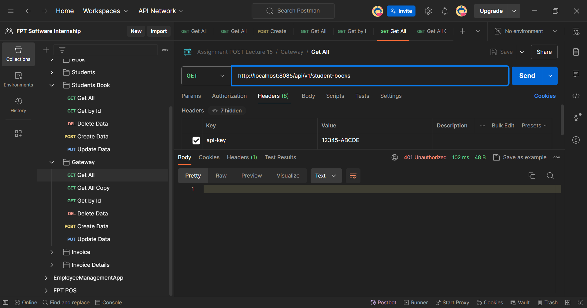
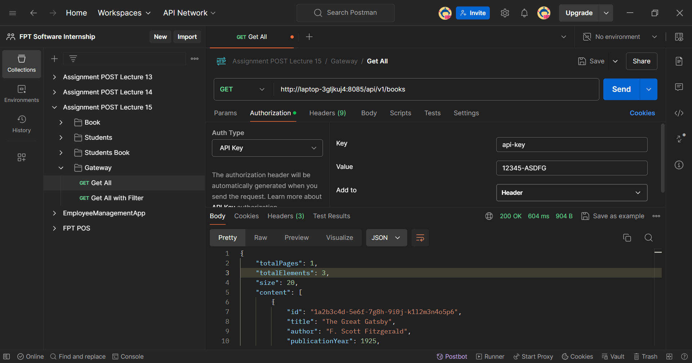
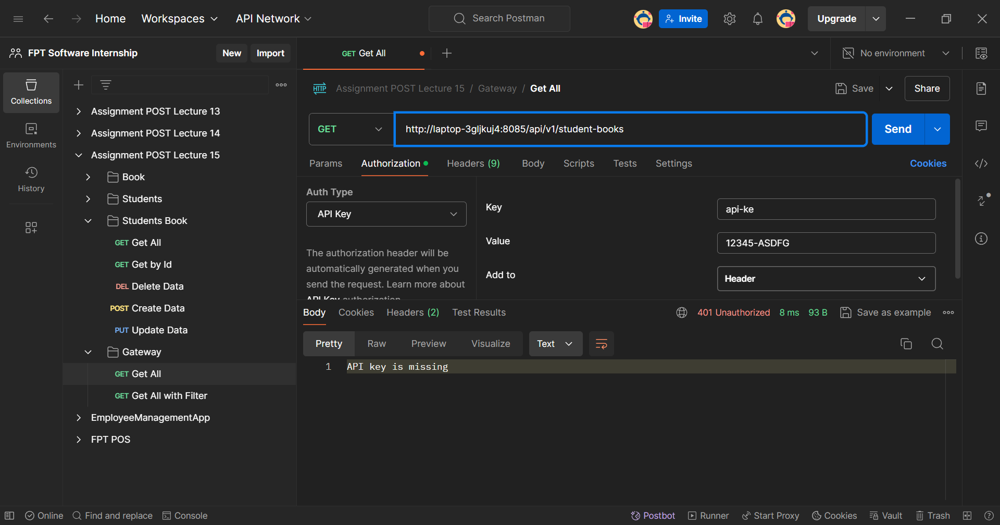
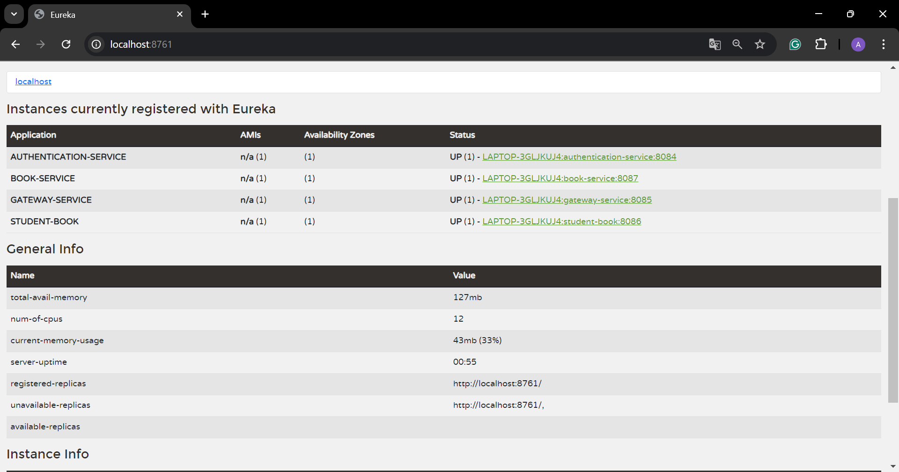

# Microservices: Spring Cloud Gateway with Filter

## Detailed Overview

A discovery service in microservices architecture helps different services find and communicate with each other dynamically. Instead of hardcoding service locations (like URLs), the discovery service keeps track of all registered services and their instances. This allows services to discover others based on logical names rather than exact network addresses.

### Key Components:

- **Service Registry:** A central database where all service instances register themselves, usually with details like service name, IP address, and port.
- **Service Discovery:** The process where a service queries the registry to find the address of another service it needs to communicate with.

### Common Implementations:

- **Eureka** (by Netflix): Often used in Spring Boot projects.
- **Consul:** Offers service discovery, configuration, and health monitoring.
- **Zookeeper:** Originally designed for distributed systems coordination, also used for service discovery.

In essence, a discovery service helps maintain flexibility and scalability in a microservices environment by enabling services to discover each other dynamically, even as they scale up or down.

`This is example implementation`:

## 1. Setting Up Spring Discovery Service (Eureka Server)

In this case i use Spring Cloud Netflix Eureka as the discovery service.

- Add dependencies

```xml
  <dependency>
    <groupId>org.springframework.cloud</groupId>
    <artifactId>spring-cloud-starter-netflix-eureka-server</artifactId>
  </dependency>
```

- Configure Eureka Server on main application

```java
@SpringBootApplication
@EnableEurekaServer
public class DiscoveryApplication {

    public static void main(String[] args) {
        SpringApplication.run(DiscoveryApplication.class, args);
    }
}
```

- Add configure into `application.properties`

```properties
# Eureka setup
server.port=8761

eureka.client.register-with-eureka=false
eureka.client.fetch-registry=false
eureka.client.service-url.defaultZone = http://localhost:8761
```

## 2. Setting Up for Service Client (Eureka Client)

Each microservice needs to register itself with the Eureka Server so that it can be discovered by other services.

- Add dependencies

```xml
<dependency>
    <groupId>org.springframework.cloud</groupId>
    <artifactId>spring-cloud-starter-netflix-eureka-client</artifactId>
</dependency>
```

- Configure Eureka Client on main application

```java
@SpringBootApplication
@EnableDiscoveryClient
public class DiscoveryApplication {

    public static void main(String[] args) {
        SpringApplication.run(DiscoveryApplication.class, args);
    }
}
```

- Add configure into `application.properties`

```properties
# Eureka setup
eureka.client.service-url.default-zone=http://localhost:8761/eureka
```

Repeat similar steps for other service client (e.g., book-service, etc.),

## Setup discovery-client for Service communication

Once microservices are registered with Eureka, Spring Cloud's DiscoveryClient can be used to dynamically discover and access other registered services.

In this case using `feign client`

```java

@FeignClient(name = "student-book", url = "http://localhost:8087/api/v1", configuration = AppConfig.class)
public interface BookClient {

    @GetMapping("/books/{id}")
    BookDTO getBookById(@PathVariable("id") String id);

    @PutMapping("/books/{id}/reduce-copies")
    String reduceAvailableCopies(
            @PathVariable String id,
            @RequestParam Integer quantity);


}
```

## 4. Integrating the gateway with discovery service

- Add configure into `application.properties`

```properties
spring.application.name=gateway-service

eureka.client.service-url.default-zone=http://localhost:8761/eureka

spring.cloud.gateway.discovery.locator.enabled=true
spring.cloud.gateway.discovery.locator.lower-case-service-id=true
```

- add configure into `application.yaml`

```yaml
server:
  port: 8085 # Gateway server port

spring:
  application:
    name: gateway-service

  cloud:
    gateway:
      routes:
        - id: book-service
          uri: lb://book-service ## replace from uri: http://localhost:8087
          predicates:
            - Path=/api/v1/books/**
        - id: student-book
          uri: lb://student-book ## replace uri: http://localhost:8086
          predicates:
            - Path=/api/v1/**

management:
  endpoints:
    web:
      exposure:
        include: "*"
```

## Project Structure and Query Data

### `Discovery-Service`

`Project Structure`

```bash
gateway
├── .mvn/wrapper/
│   └── maven-wrapper.properties
├── src/main/
│   ├── java/com/example/discover/
│   │   └── GatewayApplication.java
│   └── resources/
│       └── application.properties
├── .gitignore
├── mvnw
├── mvnw.cmd
├── pom.xml
├── run.bat
└── run.sh
```

### `Authentication-Service`

`Project Structure`

```bash
gateway
├── .mvn/wrapper/
│   └── maven-wrapper.properties
├── src/main/
│   ├── java/com/example/authentication/
│   │   ├── controller/
│   │   │   ├── ApiKeyController.java
│   │   ├── data/
│   │   │   ├── model/
│   │   │   │   ├── ApiKey.java
│   │   │   └── repository/
│   │   │       ├── ApiKeyRepository.java
│   │   ├── service/
│   │   │   ├── impl/
│   │   │   │   └── ApiKeyServiceImpl.java
│   │   │   └── ApiKeyService.java
│   │   └── ApiKeyApplication.java
│   └── resources/
│       ├── application.properties
│       └── application.yml
├── .gitignore
├── mvnw
├── mvnw.cmd
├── pom.xml
├── run.bat
└── run.sh
```

`DDL and DML`

```sql
CREATE TABLE api_key (
    id BIGINT AUTO_INCREMENT PRIMARY KEY,
    api_key VARCHAR(255) NOT NULL,
    description VARCHAR(255),
    created_at TIMESTAMP DEFAULT CURRENT_TIMESTAMP,
    updated_at TIMESTAMP DEFAULT CURRENT_TIMESTAMP ON UPDATE CURRENT_TIMESTAMP,
    active BOOLEAN DEFAULT TRUE
);

-- Prepare API Keys
INSERT INTO api_Key (api_key, description, created_at, updated_at, active) VALUES
('12345-ASDFG', 'Primary API Key for Main Access', NOW(), NOW(), TRUE),
('67890-ABCDE', 'Secondary API Key for Testing Access', NOW(), NOW(), FALSE);
```

### `Gateway-Service`

```bash
gateway
├── .mvn/wrapper/
│   └── maven-wrapper.properties
├── src/main/
│   ├── java/com/example/gateway/
│   │   ├── config/
│   │   │   ├── ApiKeyConfig.java
│   │   ├── filter/
│   │   │   ├── ApiKeyFilter.java
│   │   └── GatewayApplication.java
│   └── resources/
│       ├── application.properties
│       └── application.yml
├── .gitignore
├── mvnw
├── mvnw.cmd
├── pom.xml
├── run.bat
└── run.sh
```

### `Book-Service`

`Project Structure`

```bash
product
├── .mvn/wrapper/
│   └── maven-wrapper.properties
├── src/main/
│   ├── java/com/example/book/
│   │   ├── controller/
│   │   │   └── BookController.java
│   │   ├── data/
│   │   │   ├── model/
│   │   │   │   ├── Book.java
│   │   │   └── repository/
│   │   │       ├── BookRepository.java
│   │   ├── dto/
│   │   │   ├── BookDTO.java
│   │   │   ├── BookSaveDTO.java
│   │   │   ├── BookShowDTO.java
│   │   ├── mapper/
│   │   │   └── BookMapper.java
│   │   ├── service/
│   │   │   ├── impl/
│   │   │   │   └── BookServiceImpl.java
│   │   │   └── BookService.java
│   │   └── BookApplication.java
│   └── resources/
│       ├── application.properties
├── .gitignore
├── env.properties
├── mvnw
├── mvnw.cmd
├── pom.xml
```

`DDL and DML Book-Service`

```sql
CREATE TABLE book (
    id char(36) PRIMARY KEY,
    title VARCHAR(255) NOT NULL,
    author VARCHAR(255) NOT NULL,
    publication_year INT,
    genre VARCHAR(100),
    available_copies INT NOT NULL DEFAULT 0,
    created_at TIMESTAMP,
    updated_at TIMESTAMP
);


-- Inserting data into the book table
INSERT INTO book (id, title, author, publication_year, genre, available_copies, created_at, updated_at)
VALUES
    ('1a2b3c4d-5e6f-7g8h-9i0j-k1l2m3n4o5p6', 'The Great Gatsby', 'F. Scott Fitzgerald', 1925, 'Fiction', 3, CURRENT_TIMESTAMP, CURRENT_TIMESTAMP),
    ('2b3c4d5e-6f7g-8h9i-0j1k-l2m3n4o5p6q', '1984', 'George Orwell', 1949, 'Dystopian', 5, CURRENT_TIMESTAMP, CURRENT_TIMESTAMP),
    ('3c4d5e6f-7g8h-9i0j-k1l2-m3n4o5p6q7r', 'To Kill a Mockingbird'	, 'Harper Lee', 1960, 'Classic', 2, CURRENT_TIMESTAMP, CURRENT_TIMESTAMP);
```

### `Student-Service`

`Project Structure`

```bash
product
├── .mvn/wrapper/
│   └── maven-wrapper.properties
├── src/main/
│   ├── java/com/example/student/
│   │   ├── client/
│   │   │   ├── BookClient.java
│   │   ├── config/
│   │   │   ├── AppConfig.java
│   │   ├── controller/
│   │   │   ├── StudentController.java
│   │   │   └── StudentBookController.java
│   │   ├── data/
│   │   │   ├── model/
│   │   │   │   ├── Student.java
│   │   │       └── StudentBook.java
│   │   │   └── repository/
│   │   │       ├── StudentRepository.java
│   │   │       └── StudentBookRepository.java
│   │   ├── dto/
│   │   │   ├── BookDTO.java
│   │   │   ├── StudentDTO.java
│   │   │   ├── StudentSaveDTO.java
│   │   │   ├── StudentShowDTO.java
│   │   │   ├── StudentBook.java
│   │   │   ├── StudentSaveBook.java
│   │   │   ├── StudentShowBook.java
│   │   ├── exception/
│   │   │   ├── BookNotFoundException.java
│   │   │   └── StudentNotFoundException.java
│   │   ├── mapper/
│   │   │   ├── StudentMapper.java
│   │   │   └── StudentBookMapper.java
│   │   ├── service/
│   │   │   ├── impl/
│   │   │   │   └── StudentServiceImpl.java
│   │   │   │   └── StudentBookServiceImpl.java
│   │   │   ├── StudentService.java
│   │   │   └── StudentBookService.java
│   │   └── StudentApplication.java
│   └── resources/
│       ├── application.properties
├── .gitignore
├── env.properties
├── mvnw
├── mvnw.cmd
├── pom.xml
```

`DDL and DML Student-Service`

```sql


CREATE TABLE student (
    id char(36) PRIMARY KEY,
    name VARCHAR(255) NOT NULL,
    email VARCHAR(255) UNIQUE NOT NULL,
    phone_number VARCHAR(20),
    enrollment_date DATE NOT NULL,
    created_at TIMESTAMP,
    updated_at TIMESTAMP
);

-- Inserting data into the student table
INSERT INTO student (id, name, email, phone_number, enrollment_date, created_at, updated_at)
VALUES
    ('4d5e6f7g-8h9i-0j1k-l2m3-n4o5p6q7r8s', 'Alice Johnson', 'alice.johnson@example.com', '123-456-7890', '2024-01-15', CURRENT_TIMESTAMP, CURRENT_TIMESTAMP),
    ('5e6f7g8h-9i0j-k1l2-m3n4-o5p6q7r8s9t', 'Bob Smith', 'bob.smith@example.com', '987-654-3210', '2024-02-20', CURRENT_TIMESTAMP, CURRENT_TIMESTAMP),
    ('6f7g8h9i-0j1k-l2m3-n4o5-p6q7r8s9t0u', 'Carol White', 'carol.white@example.com', '456-789-1234', '2024-03-10', CURRENT_TIMESTAMP, CURRENT_TIMESTAMP);


CREATE TABLE studentBook (
    id char(36) PRIMARY KEY,
    student_id char(36) NOT NULL,
    book_id char(36) NOT NULL,
    borrow_date DATE NOT NULL,
    return_date DATE
    FOREIGN KEY (student_id) REFERENCES student(id)
);

-- Inserting data into the studentBook table
INSERT INTO studentBook (id, student_id, book_id, borrow_date, return_date)
VALUES
    ('7g8h9i0j-1k2l-3m4n-5o6p-q7r8s9t0u1v', '4d5e6f7g-8h9i-0j1k-l2m3-n4o5p6q7r8s', '1a2b3c4d-5e6f-7g8h-9i0j-k1l2m3n4o5p6', '2024-08-01', NULL),
    ('8h9i0j1k-2l3m-4n5o-6p7q-r8s9t0u1v2w', '5e6f7g8h-9i0j-k1l2-m3n4-o5p6q7r8s9t', '2b3c4d5e-6f7g-8h9i-0j1k-l2m3n4o5p6q', '2024-08-05', '2024-08-15'),
    ('9i0j1k2l-3m4n-5o6p-7q8r-s9t0u1v2w3x', '6f7g8h9i-0j1k-l2m3-n4o5-p6q7r8s9t0u', '3c4d5e6f-7g8h-9i0j-k1l2-m3n4o5p6q7r', '2024-08-10', NULL);

```

## Some Documentation Result

### Before use Discovery Service

1. Gateway Service Valid
   
2. Gateway Service Invalid 1
   
3. Gateway Service Invalid 2
   

### After use Discovery Service

1. Gateway Service Valid Books All
   
2. Gateway Service Invalid 1
   
3. Gateway Service Invalid 2
   

### Eureka

- Eureka Server
  
