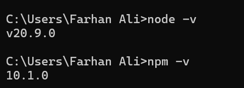
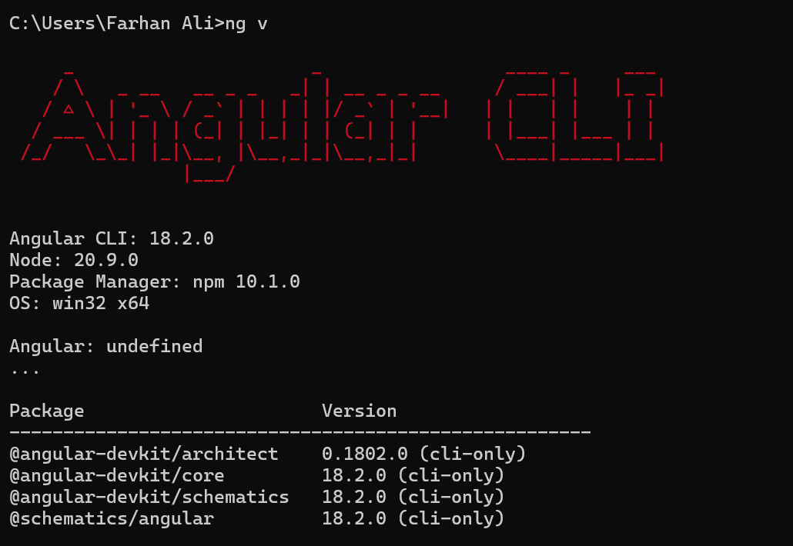
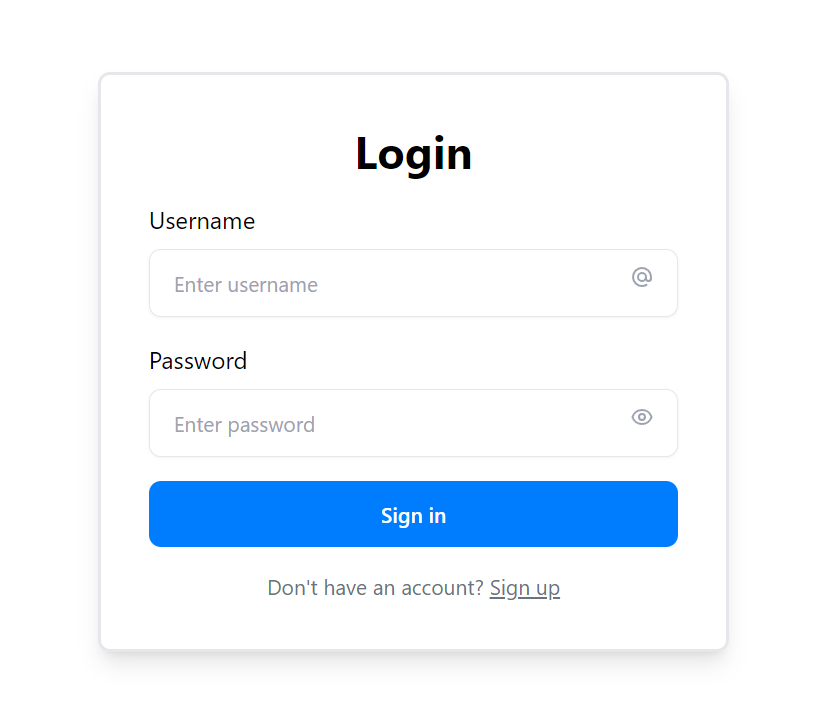
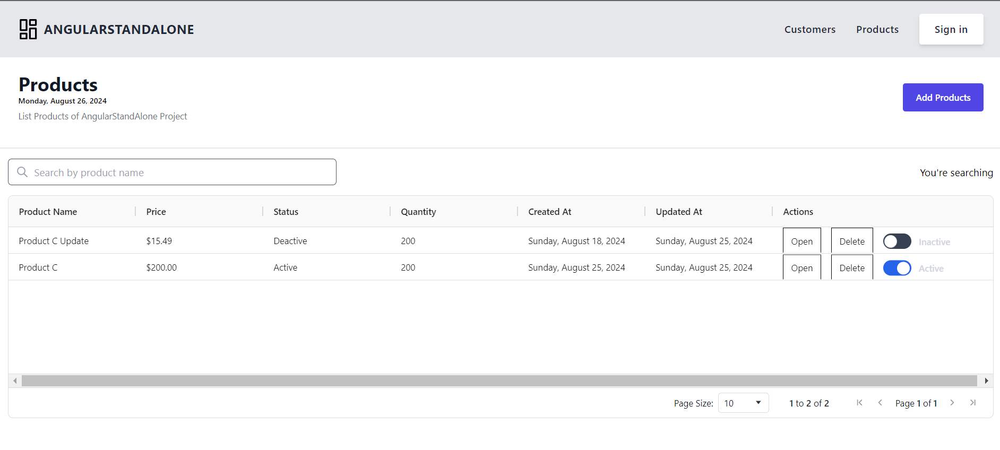
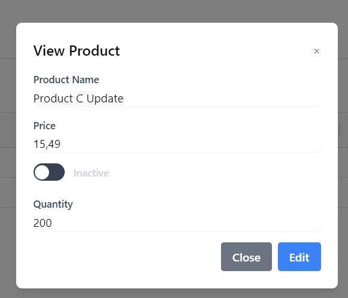
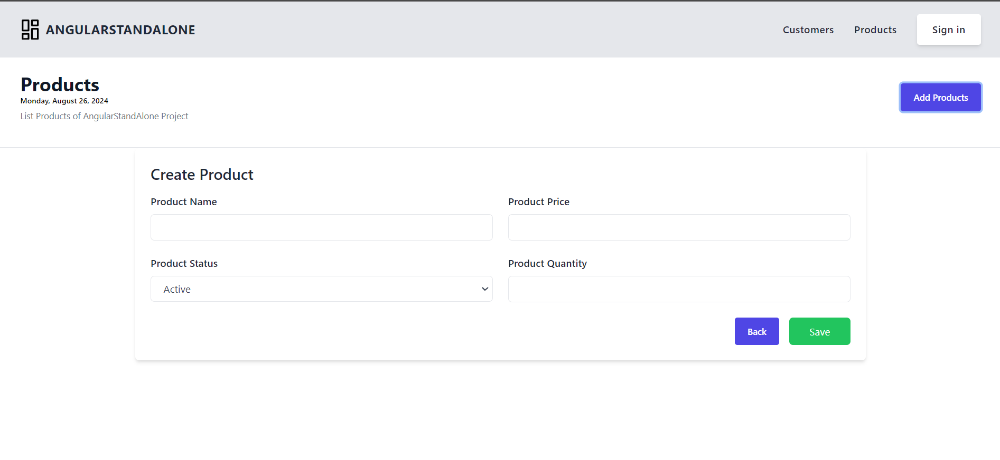
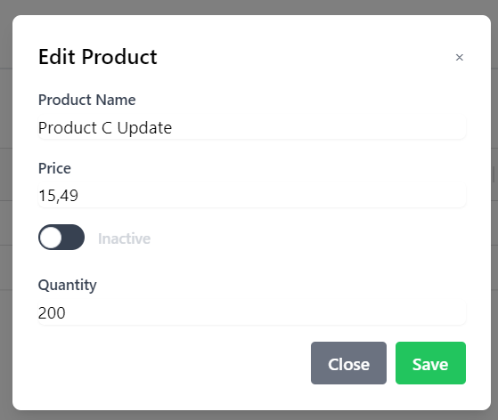
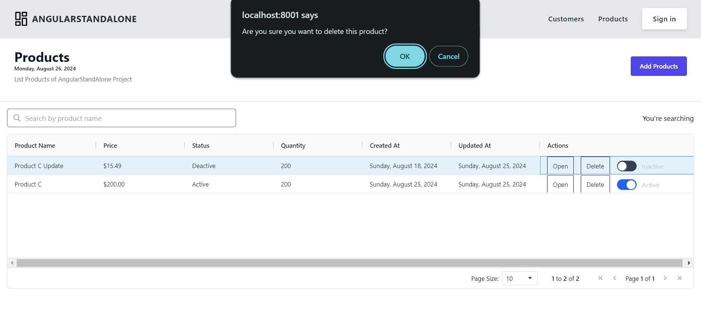
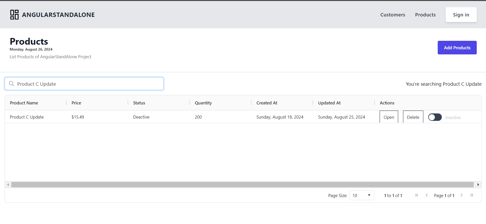

# **Some basic Frontend and Angular Framework**

## **Some basic about html/css**

---

### **HTML (Hypertext Markup Language)**

HTML is the standard language used to create the structure of a web page. It uses elements like headings, paragraphs, links, and forms to define content.

Example:

```html
<!DOCTYPE html>
<html lang="en">
  <head>
    <meta charset="UTF-8" />
    <meta name="viewport" content="width=device-width, initial-scale=1.0" />
    <title>Sample Page</title>
  </head>
  <body>
    <h1>Hello, World!</h1>
    <p>This is an example of HTML.</p>
  </body>
</html>
```

### **CSS (Cascading Style Sheets)**

CSS is used to style and layout HTML elements. It controls the look and feel of a webpage, including colors, fonts, spacing, and positioning.

Example:

```html
<style>
  body {
    font-family: Arial, sans-serif;
    background-color: #f4f4f4;
    color: #333;
  }

  h1 {
    color: #007bff;
  }
</style>
```

### **SCSS (Sassy CSS) and SASS (Syntactically Awesome Stylesheets)**

SCSS and SASS are extensions of CSS that add powerful features like variables, nested rules, mixins, and more.

- **SASS:** Uses indentation and omits semicolons and braces.
- **SCSS:** Uses the same syntax as CSS but allows advanced features.

### **Comparison Between CSS and SASS/SCSS**

| Feature              | CSS                                       | SASS/SCSS                                          |
| -------------------- | ----------------------------------------- | -------------------------------------------------- |
| **Syntax**           | Simple, standard CSS syntax.              | Adds advanced features (variables, nesting).       |
| **Variables**        | Not supported.                            | Supported using `$` (e.g., `$primary-color`).      |
| **Nesting**          | Not supported.                            | Allows nesting of selectors.                       |
| **Mixins/Functions** | Not supported.                            | Allows reusable styles with `@mixin`.              |
| **Partials**         | Not supported.                            | Can import partial files with `@import`.           |
| **Code Readability** | Simple but repetitive for complex styles. | Cleaner and more maintainable for large codebases. |

### **Example Comparison**

#### CSS:

```css
/* CSS example */
.primary-btn {
  background-color: #007bff;
  color: white;
  padding: 10px 20px;
  border: none;
  border-radius: 5px;
}

.primary-btn:hover {
  background-color: #0056b3;
}
```

#### SCSS:

```scss
// SCSS example
$primary-color: #007bff;
$primary-hover-color: #0056b3;

.primary-btn {
  background-color: $primary-color;
  color: white;
  padding: 10px 20px;
  border: none;
  border-radius: 5px;

  &:hover {
    background-color: $primary-hover-color;
  }
}
```

### Key Advantages of SCSS/SASS Over CSS:

1. **Variables**: Store values like colors and fonts in variables for reuse.
2. **Nesting**: Write cleaner, more structured code by nesting selectors.
3. **Mixins**: Reuse chunks of code across your styles.
4. **Partials**: Organize styles into smaller, maintainable files.

In conclusion, while CSS is the base for styling, SCSS and SASS offer more powerful features for larger and more complex projects.

References

- [HTML](https://www.w3schools.com/css/)
- [CSS](https://www.w3schools.com/html/)
- [SCSS](https://sass-lang.com/guide/)

## **Angular Framework**

### **Overview**

Angular is a platform and framework for building single-page client applications using HTML and TypeScript. Angular is written in TypeScript. It implements core and optional functionality as a set of TypeScript libraries that you import into your applications.

The architecture of an Angular application relies on certain fundamental concepts. The basic building blocks of the Angular framework are Angular components.

### **Install and Setup Environment**

To install and set up an Angular project, follow these steps:

### 1. Install Node.js and npm

Angular requires Node.js and npm. You can download and install them from [nodejs.org](https://nodejs.org/).

Check the installation:

```bash
node -v
npm -v
```



### 2. Install Angular CLI

Use npm to install the Angular Command Line Interface (CLI) globally:

```bash
npm install -g @angular/cli
```

Check the installation:

```bash
ng version
```



### 3. Create a New Angular Project

Create a new Angular project using the Angular CLI:

```bash
ng new my-angular-app
```

You’ll be prompted to choose options like routing and the stylesheet format. Select according to your needs.

### 4. Navigate to Your Project Directory

```bash
cd my-angular-app
```

### 5. Serve the Application

Start the development server:

```bash
ng serve
```

By default, the app will be available at `http://localhost:4200/`.

## **Standalone vs No Standalone**

Standalone components in Angular are self-contained and can be used directly without being part of an @NgModule, making them simpler and more flexible for smaller or isolated features. In contrast, non-standalone components must be declared within an @NgModule, which helps organize and manage dependencies in larger applications. Standalone components reduce boilerplate and are ideal for quick setups, while @NgModule-based components provide better structure and scalability for complex apps.

Here’s a comparison between **Standalone** and **Non-Standalone (Traditional)** Angular projects:

| Feature/Aspect            | Standalone Components/Projects                                            | Non-Standalone (Traditional) Components/Projects                        |
| ------------------------- | ------------------------------------------------------------------------- | ----------------------------------------------------------------------- |
| **Introduction**          | Introduced in Angular 14+.                                                | Standard approach used since the early days of Angular.                 |
| **Component Declaration** | Declared directly using `standalone: true` in the component.              | Declared in an Angular module (`NgModule`).                             |
| **NgModule Requirement**  | No `NgModule` required.                                                   | Must be declared in an `NgModule`.                                      |
| **Dependency Management** | Imports dependencies directly within the component.                       | Dependencies are managed via `NgModule` imports.                        |
| **Application Structure** | More modular and decentralized. Focuses on single-file components.        | Centralized through `NgModule` files.                                   |
| **Bootstrapping**         | Standalone components can be bootstrapped directly.                       | Requires an `AppModule` to bootstrap the application.                   |
| **Use Case**              | Ideal for small projects, micro frontends, and reusable components.       | Suitable for large applications where centralized management is needed. |
| **Learning Curve**        | Easier for those new to Angular due to simplified setup.                  | Involves understanding of modules, declarations, and imports.           |
| **Component Sharing**     | Easier to share and reuse across projects.                                | Sharing requires more boilerplate setup (module management).            |
| **Migration**             | Requires adjustments when migrating from a traditional setup.             | The standard way; no migration needed.                                  |
| **Setup Flexibility**     | Can combine both standalone and non-standalone components in one project. | Purely based on `NgModule` for organizing components.                   |

### **Code Comparison**

#### **Standalone Component Example:**

```typescript
// app.component.ts
import { Component } from "@angular/core";
import { CommonModule } from "@angular/common";

@Component({
  selector: "app-root",
  standalone: true, // Mark as standalone
  imports: [CommonModule],
  template: `<h1>Standalone Component</h1>`,
})
export class AppComponent {}
```

#### **Non-Standalone (Traditional) Component Example:**

```typescript
// app.component.ts
import { Component } from "@angular/core";

@Component({
  selector: "app-root",
  template: `<h1>Non-Standalone Component</h1>`,
})
export class AppComponent {}
```

```typescript
// app.module.ts
import { NgModule } from "@angular/core";
import { BrowserModule } from "@angular/platform-browser";
import { AppComponent } from "./app.component";

@NgModule({
  declarations: [AppComponent],
  imports: [BrowserModule],
  bootstrap: [AppComponent],
})
export class AppModule {}
```

### 1. **Project Structure:**

- **Standalone Project**:
  - Angular introduced standalone components, directives, and pipes starting from Angular 14. Standalone projects focus on eliminating the need for NgModules.
  - The structure has fewer modules and instead promotes standalone components that manage their dependencies directly.
  - Example:
    ```
    src/
    ├── app/
    │   ├── app.component.ts (Standalone component)
    │   ├── app.component.html
    │   ├── app.component.css
    │   └── app.routes.ts (Routing configuration)
    └── main.ts
    ```
  - **Benefits**:
    - Simplifies development by reducing the complexity of managing multiple modules.
    - Encourages direct dependency injection at the component level.
- **Non-Standalone (Traditional) Project**:
  - Traditional Angular projects are module-centric, with NgModules (like `AppModule`) playing a central role in organizing components, services, and routes.
  - Example:
    ```
    src/
    ├── app/
    │   ├── app.module.ts (Contains declarations and imports)
    │   ├── app.component.ts
    │   ├── app.component.html
    │   ├── app.component.css
    │   └── app-routing.module.ts (Routing configuration)
    └── main.ts
    ```
  - **Benefits**:
    - Well-suited for larger, enterprise applications that need strict separation of concerns and feature modules.

### 2. **Modules:**

- **Standalone Project**:

  - Components are marked with `standalone: true` and manage their own imports and providers.
  - There’s no need for an `AppModule` or any other NgModules for managing components.
  - Example:

    ```typescript
    import { Component } from "@angular/core";
    import { CommonModule } from "@angular/common";

    @Component({
      selector: "app-root",
      standalone: true,
      imports: [CommonModule],
      templateUrl: "./app.component.html",
      styleUrls: ["./app.component.css"],
    })
    export class AppComponent {}
    ```

- **Non-Standalone Project**:

  - Modules like `AppModule` and feature modules are essential.
  - Components, directives, and pipes are declared within an NgModule and imported where needed.
  - Example:

    ```typescript
    import { NgModule } from "@angular/core";
    import { BrowserModule } from "@angular/platform-browser";

    import { AppComponent } from "./app.component";
    import { AppRoutingModule } from "./app-routing.module";

    @NgModule({
      declarations: [AppComponent],
      imports: [BrowserModule, AppRoutingModule],
      bootstrap: [AppComponent],
    })
    export class AppModule {}
    ```

### 3. **Routing:**

- **Standalone Project**:

  - Routing configuration is done independently, often in a simple route file (e.g., `app.routes.ts`).
  - Routes can directly reference standalone components without requiring modules.
  - Example:

    ```typescript
    import { Routes } from "@angular/router";
    import { HomeComponent } from "./home.component";

    export const routes: Routes = [{ path: "", component: HomeComponent }];
    ```

- **Non-Standalone Project**:

  - Routing is managed through a dedicated `AppRoutingModule` or feature modules for specific routes.
  - Routes are integrated within the module system.
  - Example:

    ```typescript
    import { NgModule } from "@angular/core";
    import { RouterModule, Routes } from "@angular/router";
    import { HomeComponent } from "./home.component";

    const routes: Routes = [{ path: "", component: HomeComponent }];

    @NgModule({
      imports: [RouterModule.forRoot(routes)],
      exports: [RouterModule],
    })
    export class AppRoutingModule {}
    ```

### 4. **Other Considerations:**

- **Dependency Injection**:

  - In standalone projects, services can be provided directly in the component using `providers: []` or through `@Injectable({ providedIn: 'root' })`, similar to traditional projects.
  - Non-standalone projects often rely more heavily on module-level providers.

- **Flexibility**:
  - Standalone components provide more flexibility for lightweight and simpler applications or micro frontends.
  - Traditional module-based architecture is still robust for large-scale applications requiring feature modules.

### **Why should use standalone components?**

We should use standalone components because they simplify development by removing the need for @NgModule, offer greater flexibility and modularity, optimize performance with smaller bundle sizes, and are easier to test and maintain.
The following are the advantages of the standalone type:

- Simplified Architecture: Standalone components reduce the need for NgModules, simplifying the codebase and making it easier to understand.
- Improved Performance: Reduces the overhead of module processing, leading to faster load times.
- Enhanced Flexibility: Standalone components can be used independently, making them more reusable across different projects.

### **Summary:**

- **Standalone components** simplify Angular by removing the need for `NgModule`, making the code more modular and easier to manage, especially in smaller projects or reusable libraries.
- **Non-standalone components** offer a centralized way to manage dependencies, making them more suitable for large applications with complex structures.

Choosing between the two approaches depends on the scale and architecture of your application.

## **Components Lifecycle**

The Angular lifecycle consists of a sequence of events that happen from the creation of a component to its destruction. Understanding these lifecycle hooks allows developers to intervene at specific stages to perform operations like data fetching, setting up subscriptions, or cleaning up resources. Here are the main lifecycle hooks in Angular:

### 1. **ngOnChanges**

- **Triggered:** Whenever the input properties of a component or directive change.
- **Usage:** It is often used to respond to changes in input properties (e.g., `@Input` bindings). It receives a `SimpleChanges` object containing the current and previous values of the changed properties.
- Example:
  ```typescript
  ngOnChanges(changes: SimpleChanges) {
    console.log('Input property changed', changes);
  }
  ```

### 2. **ngOnInit**

- **Triggered:** Once after the first `ngOnChanges` is called. It's called after the component's input properties have been initialized.
- **Usage:** Commonly used for initialization logic, such as fetching data, setting up default values, or starting subscriptions.
- Example:
  ```typescript
  ngOnInit() {
    this.loadData();
  }
  ```

### 3. **ngDoCheck**

- **Triggered:** During every change detection cycle, after `ngOnChanges` and `ngOnInit`.
- **Usage:** It allows developers to implement custom change detection logic. Typically, it is used when more control over change detection is needed.
- Example:
  ```typescript
  ngDoCheck() {
    console.log('Change detection cycle triggered');
  }
  ```

### 4. **ngAfterContentInit**

- **Triggered:** Once after Angular projects external content into the component’s view (via `ng-content`).
- **Usage:** Used for performing actions after content projection. This is relevant when using `ng-content` to insert content from a parent component.
- Example:
  ```typescript
  ngAfterContentInit() {
    console.log('ng-content initialized');
  }
  ```

### 5. **ngAfterContentChecked**

- **Triggered:** After every check of projected content, following `ngAfterContentInit`.
- **Usage:** It runs after the content is checked and is used for responding to changes in projected content.
- Example:
  ```typescript
  ngAfterContentChecked() {
    console.log('Projected content checked');
  }
  ```

### 6. **ngAfterViewInit**

- **Triggered:** Once after Angular initializes the component's view and child views.
- **Usage:** Used for initializing logic that depends on the view being fully initialized. For example, querying DOM elements or setting up view-based subscriptions.
- Example:
  ```typescript
  ngAfterViewInit() {
    console.log('View initialized');
  }
  ```

### 7. **ngAfterViewChecked**

- **Triggered:** After every check of the component's view and child views, following `ngAfterViewInit`.
- **Usage:** It is used to respond after the view has been checked. It’s often used in conjunction with change detection.
- Example:
  ```typescript
  ngAfterViewChecked() {
    console.log('View checked');
  }
  ```

### 8. **ngOnDestroy**

- **Triggered:** Just before Angular destroys the component or directive.
- **Usage:** This is used for cleanup activities such as unsubscribing from Observables, stopping timers, or detaching event handlers to avoid memory leaks.
- Example:

  ```typescript
  ngOnDestroy() {
    console.log('Component destroyed');
    this.subscription.unsubscribe();
  }
  ```

  Understanding this order is crucial for managing component behavior effectively. For more details, check the [Angular Lifecycle Guide](https://angular.dev/guide/components/lifecycle#ngoninit).

## **Login Components**

To create a login component in Angular with a corresponding service, follow these steps. This example includes setting up the Angular CLI, generating the component and service, and implementing them with basic functionality.

### 1. **Install Angular CLI (if not already installed)**

```bash
npm install -g @angular/cli
```

### 2. **Create a New Angular Project (if needed)**

```bash
ng new my-login-app
cd my-login-app
```

### 3. **Set Up json-server**

Create a db.json file in the root directory of the project to mock the data.

```json
{
  "users": [
    {
      "id": "u1234567-a89b-123c-d456-7890f12g3456",
      "username": "user1",
      "email": "user1@example.com",
      "password": "securepassword1",
      "gender": "male"
    }
  ]
}
```

Add a script to the package.json to start the json-server.

```json
"scripts": {
  "dev": "ng serve",
  "dev:daata": "json-server --watch db.json --port 3000"
}
```

Start the json-server in the different terminal.

```
npm run json-server
```

### 4. **Generate the Login Component and Service**

```bash
ng generate component login
ng generate service auth
```

### 5. **Implement the Login Service**

Edit `src/app/auth.service.ts`:

```typescript
import { Injectable } from "@angular/core";
import { HttpClient } from "@angular/common/http";
import { Observable } from "rxjs";

@Injectable({
  providedIn: "root",
})
export class AuthService {
  private apiUrl = "https://your-api-endpoint/login"; // Replace with your API endpoint

  constructor(private http: HttpClient) {}

  login(username: string, password: string): Observable<any> {
    return this.http.post(this.apiUrl, { username, password });
  }
}
```

### 6. **Implement the Login Component**

Edit `src/app/login/login.component.ts`:

```typescript
import { Component } from "@angular/core";
import { AuthService } from "../../../../service/auth.service";
import { Router, RouterModule } from "@angular/router";
import { FormsModule } from "@angular/forms";
import { CommonModule } from "@angular/common";

@Component({
  selector: "app-signin",
  standalone: true,
  imports: [RouterModule, FormsModule, CommonModule],
  templateUrl: "./signin.component.html",
  styleUrl: "./signin.component.css",
})
export class SigninComponent {
  username = "";
  password = "";
  errorMessage = "";

  constructor(private authService: AuthService, private router: Router) {}

  onSubmit() {
    this.authService.login(this.username, this.password).subscribe((user) => {
      if (user) {
        // Redirect to a dashboard or home page after successful login
        alert("Login Successfully");
        this.router.navigate(["/customers"]);
      } else {
        this.errorMessage = "Invalid email or password";
      }
    });
  }
}
```

Edit `src/app/login/login.component.html`:

```html
<div class="w-full h-screen flex justify-center items-center">
  <div class="mx-auto w-full lg:w-1/3">
    <form
      (ngSubmit)="onSubmit()"
      class="mb-0 mt-6 space-y-4 rounded-lg p-4 shadow-lg sm:p-6 lg:p-8 border-2"
    >
      <p class="text-center text-3xl font-bold">Login</p>

      <div>
        <label for="email">Username</label>

        <div class="relative">
          <input
            type="text"
            [(ngModel)]="username"
            name="username"
            required
            class="w-full rounded-lg border border-gray-200 px-4 py-3 mt-2 pe-12 text-sm shadow-sm"
            placeholder="Enter username"
          />

          <span class="absolute inset-y-0 end-0 grid place-content-center px-4">
            <svg
              xmlns="http://www.w3.org/2000/svg"
              class="size-4 text-gray-400"
              fill="none"
              viewBox="0 0 24 24"
              stroke="currentColor"
            >
              <path
                stroke-linecap="round"
                stroke-linejoin="round"
                stroke-width="2"
                d="M16 12a4 4 0 10-8 0 4 4 0 008 0zm0 0v1.5a2.5 2.5 0 005 0V12a9 9 0 10-9 9m4.5-1.206a8.959 8.959 0 01-4.5 1.207"
              />
            </svg>
          </span>
        </div>
      </div>

      <div>
        <label for="password">Password</label>

        <div class="relative">
          <input
            [(ngModel)]="password"
            name="password"
            type="password"
            required
            class="w-full rounded-lg border border-gray-200 px-4 py-3 mt-2 pe-12 text-sm shadow-sm"
            placeholder="Enter password"
          />

          <span class="absolute inset-y-0 end-0 grid place-content-center px-4">
            <svg
              xmlns="http://www.w3.org/2000/svg"
              class="size-4 text-gray-400"
              fill="none"
              viewBox="0 0 24 24"
              stroke="currentColor"
            >
              <path
                stroke-linecap="round"
                stroke-linejoin="round"
                stroke-width="2"
                d="M15 12a3 3 0 11-6 0 3 3 0 016 0z"
              />
              <path
                stroke-linecap="round"
                stroke-linejoin="round"
                stroke-width="2"
                d="M2.458 12C3.732 7.943 7.523 5 12 5c4.478 0 8.268 2.943 9.542 7-1.274 4.057-5.064 7-9.542 7-4.477 0-8.268-2.943-9.542-7z"
              />
            </svg>
          </span>
        </div>
      </div>

      <button
        type="submit"
        class="block w-full rounded-lg bg-[#007DFF] px-5 py-3 text-sm font-medium text-white"
      >
        Sign in
      </button>

      <p class="text-center text-sm text-gray-500">
        Don't have an account?
        <a class="underline" routerLink="/auth/signup">Sign up</a>
      </p>
      <p *ngIf="errorMessage">{{ errorMessage }}</p>
    </form>
  </div>
</div>
```

Edit `auth-routing.module.ts`:

```typescript
import { NgModule } from "@angular/core";
import { RouterModule, Routes } from "@angular/router";
import { SigninComponent } from "./components/signin/signin.component";
import { SignupComponent } from "./components/signup/signup.component";

const routes: Routes = [
  {
    path: "signin",
    component: SigninComponent,
  },
  {
    path: "signup",
    component: SignupComponent,
  },
];

@NgModule({
  imports: [RouterModule.forChild(routes)],
  exports: [RouterModule],
})
export class AuthRoutingModule {}
```

Edit `app.routes.ts`:

```typescript
import { Routes } from "@angular/router";
import { RouterConfig } from "./config/app.constants";

export const routes: Routes = [
  {
    path: RouterConfig.AUTH.path,
    loadChildren: () =>
      import("./modules/auth/auth.module").then((m) => m.AuthModule), // Lazy loading AuthModule
  },
];
```

### 7. **Update app.config.ts**

Ensure the `provideHttpClient` and `withFetch` are imported in `src/app/app.config.ts`:

```typescript
import { ApplicationConfig, provideZoneChangeDetection } from "@angular/core";
import { provideRouter } from "@angular/router";

import { routes } from "./app.routes";
import { provideClientHydration } from "@angular/platform-browser";
import { provideHttpClient, withFetch } from "@angular/common/http";
import { provideAnimations } from "@angular/platform-browser/animations";

export const appConfig: ApplicationConfig = {
  providers: [
    provideZoneChangeDetection({ eventCoalescing: true }),
    provideRouter(routes),
    provideClientHydration(),
    provideHttpClient(withFetch()),
    provideAnimations(),
  ],
};
```

### 8. **Run the Application**

Start the development server:

```bash
ng serve
```


By default, visit `http://localhost:4200` to see the login form in action.

### Summary

This setup provides a simple login component with a service for handling authentication. The component includes a form for user input, which is managed by Angular's reactive forms. The service communicates with an API to authenticate users, and the component handles responses and errors.

## **Project with base project structure**

Follow this example includes setting up the Angular CLI, generating the component and service, and implementing them with basic functionality.

### 1. **Install Angular CLI (if not already installed)**

```bash
npm install -g @angular/cli
```

### 2. **Create a New Angular Project (if needed)**

```bash
ng new my-project-app
cd my-project-app
```

### 3. **Set Up json-server**

Create a db.json file in the root directory of the project to mock the data.

```json
{
  "products": [
    {
      "id": "027d791f-8c5f-4f7d-90e3-cda2ef6c6ce4",
      "name": "Product C",
      "price": 200,
      "status": "Active",
      "quantity": 200,
      "createdAt": "2024-08-25T09:43:51.948Z",
      "updatedAt": "2024-08-25T09:43:51.948Z"
    }
  ]
}
```

Add a script to the package.json to start the json-server.

```json
"scripts": {
  "dev": "ng serve",
  "dev:daata": "json-server --watch db.json --port 3000"
}
```

Start the json-server in the different terminal.

```
npm run json-server
```

### 4. **Generate the Needed Component and Service**

```bash
ng generate component component_name
ng generate service service_name
```

### 5. **Follow this structure**

`sample structure`

```
src/
  ├── app/
  │   ├── app.module.ts                # Main module containing declarations and imports
  │   ├── config/
  │   │   └── app.constants.ts         # Configuration constants for the application
  │   ├── core/
  │   │   ├── interfaces/
  │   │   │   ├── product.type.ts      # Type definitions for product-related data
  │   │   │   └── status.type.ts       # Type definitions for status-related data
  │   │   ├── model/
  │   │   │   └── product.model.ts     # Data model for product entity
  │   │   └── pipe/
  │   │       └── phone.pipe.ts        # Pipe for transforming phone number data
  │   ├── main/
  │   │   ├── components/
  │   │   │   ├── footer/              # Footer component
  │   │   │   │   ├── footer.component.html  # Template for the footer component
  │   │   │   │   ├── footer.component.css   # Styles for the footer component
  │   │   │   │   └── footer.component.ts    # TypeScript logic for the footer component
  │   │   │   ├── header/              # Header component
  │   │   │   │   ├── header.component.html  # Template for the header component
  │   │   │   │   ├── header.component.css   # Styles for the header component
  │   │   │   │   └── header.component.ts    # TypeScript logic for the header component
  │   │   │   └── modal-product/       # Product modal component
  │   │   │       ├── modal-product.component.html  # Template for the product modal component
  │   │   │       ├── modal-product.component.css   # Styles for the product modal component
  │   │   │       └── modal-product.component.ts    # TypeScript logic for the product modal component
  │   ├── pages/
  │   │   ├── product/
  │   │   │   ├── components/
  │   │   │   │   ├── create-products/  # Component for creating products
  │   │   │   │   │   ├── create-products.component.html  # Template for the create products component
  │   │   │   │   │   ├── create-products.component.css   # Styles for the create products component
  │   │   │   │   │   └── create-products.component.ts    # TypeScript logic for the create products component
  │   │   │   │   ├── list-products/    # Component for listing products
  │   │   │   │   │   ├── list-products.component.html  # Template for the list products component
  │   │   │   │   │   ├── list-products.component.css   # Styles for the list products component
  │   │   │   │   │   └── list-products.component.ts    # TypeScript logic for the list products component
  │   │   │   │   └── products/         # Component for managing products
  │   │   │   │       ├── products.component.html  # Template for the products component
  │   │   │   │       ├── products.component.css   # Styles for the products component
  │   │   │   │       └── products.component.ts    # TypeScript logic for the products component
  │   │   │   └── product.routes.ts     # Routing configuration for product pages
  │   │   └── not-found/                # Not found page component
  │   │       ├── not-found.component.html  # Template for the not found page
  │   │       ├── not-found.component.css   # Styles for the not found page
  │   │       └── not-found.component.ts    # TypeScript logic for the not found page
  │   ├── service/
  │   │   └── product.service.ts        # Service for managing product-related operations
  │   ├── app.component.ts              # Root component for the application
  │   ├── app.component.html            # Template for the root component
  │   ├── app.component.css             # Styles for the root component
  │   ├── app.config.ts                 # Application configuration
  │   └── app-routes.ts                 # Application routing configuration
  └── main.ts                           # Entry point for the application
```

Here's an improved version of the documentation for the "Implement Component" section:

---

### 6. **Implement Component**

To implement the component, refer to the codebase in the following repository:

- **Repository Location**: [AngularStandAlone/src/app/](./AngularStandAlone/src/app/)

In this repository, you'll find the implementation details for the component. Review the files in the specified directory to understand the component's structure, functionality, and integration.

### **Sample “Parent listens for child event”**

In Angular, using `@Input` and `@Output` is a common pattern for parent-child component communication. Here's a simple example demonstrating how a parent component listens to an event emitted by a child component.

#### 1. **Child Component**

**child.component.ts**

```typescript
import {
  Component,
  Input,
  Output,
  EventEmitter,
  OnChanges,
  SimpleChanges,
} from "@angular/core";
import { trigger, transition, style, animate } from "@angular/animations";
import { CommonModule } from "@angular/common";
import {
  FormsModule,
  ReactiveFormsModule,
  FormBuilder,
  FormGroup,
  Validators,
} from "@angular/forms";
import { Product } from "../../../core/interfaces/product.type";
import { Status } from "../../../core/interfaces/status.type";
import { ProductService } from "../../../service/product.service";

@Component({
  selector: "app-modal-product",
  standalone: true,
  imports: [CommonModule, FormsModule, ReactiveFormsModule],
  templateUrl: "./modal-product.component.html",
  styleUrls: ["./modal-product.component.css"],
})
export class ModalProductComponent implements OnChanges {
  @Input() isOpenModal = false;
  @Input() product: Product = {
    id: "",
    name: "",
    price: 0,
    status: Status.Active,
    quantity: 0,
    createdAt: null,
    updatedAt: null,
  };

  // Define an EventEmitter to emit events to the parent component
  @Output() closeModal = new EventEmitter<void>();
  @Output() productUpdated = new EventEmitter<void>();

  close(): void {
    this.closeModal.emit();
    this.isEditing = false;
  }

  updateProduct(): void {
    if (this.productForm.valid) {
      const updatedProduct = this.productForm.getRawValue();
      if (updatedProduct.id) {
        // Update the updatedAt field with the current date and time
        updatedProduct.updatedAt = new Date().toISOString();

        this.productService
          .updateProduct(updatedProduct.id, updatedProduct)
          .subscribe({
            next: (updatedProduct) => {
              console.log("Product updated successfully:", updatedProduct);
              this.isEditing = false;
              this.productUpdated.emit(); // Emit event to notify parent
              this.close();
            },
            error: (e) => console.error("Error updating product:", e),
          });
      } else {
        console.error("Product ID is missing");
      }
    } else {
      console.error("Form is invalid");
    }
  }
}
```

**child.component.html**

```html
<div
  *ngIf="isOpenModal"
  [@enterAnimation]
  class="fixed inset-0 flex items-center justify-center bg-black bg-opacity-50 z-50"
>
  <div class="bg-white rounded-lg shadow-lg w-full max-w-md mx-auto p-6">
    <form [formGroup]="productForm" (ngSubmit)="updateProduct()">
      <div class="modal-header flex justify-between items-center mb-4">
        <h5 class="text-xl font-semibold">
          {{ isEditing ? "Edit Product" : "View Product" }}
        </h5>
        <button
          type="button"
          class="text-gray-500 hover:text-gray-700"
          (click)="close()"
        >
          &times;
        </button>
      </div>
      <div class="modal-body space-y-4">Body Form</div>
      <div class="modal-footer mt-4 flex justify-end space-x-2">
        <button
          type="button"
          class="bg-gray-500 hover:bg-gray-600 text-white font-semibold py-2 px-4 rounded"
          (click)="close()"
        >
          Close
        </button>
        <button
          type="button"
          class="bg-blue-500 hover:bg-blue-600 text-white font-semibold py-2 px-4 rounded"
          *ngIf="!isEditing"
          (click)="startEditing()"
        >
          Edit
        </button>
        <button
          type="submit"
          class="bg-green-500 hover:bg-green-600 text-white font-semibold py-2 px-4 rounded"
          *ngIf="isEditing"
        >
          Save
        </button>
      </div>
    </form>
  </div>
</div>
```

#### 2. **Parent Component**

**parent.component.ts**

```typescript
// list-products.component.ts

import { Component, OnInit, Input } from "@angular/core";
import { AgGridAngular, AgGridModule } from "ag-grid-angular";
import { ColDef } from "ag-grid-community";
import { ProductService } from "../../../../service/product.service";
import { Product } from "../../../../core/interfaces/product.type";
import { CurrencyPipe, DatePipe } from "@angular/common";
import { FormsModule } from "@angular/forms";
import { Status } from "../../../../core/interfaces/status.type";
import { ListProductsActionComponent } from "../../../../main/components/list-products-action/list-products-action.component";
import { ModalProductComponent } from "../../../../main/components/modal-product/modal-product.component";

@Component({
  selector: "app-list-products",
  standalone: true,
  imports: [
    AgGridModule,
    AgGridAngular,
    FormsModule,
    ListProductsActionComponent,
    ModalProductComponent,
  ],
  templateUrl: "./list-products.component.html",
  styleUrls: ["./list-products.component.css"],
  providers: [CurrencyPipe, DatePipe],
})
export class ListProductsComponent implements OnInit {
  products: Product[] = [];
  rowData: Product[] = [];
  productName = "";
  currentProduct: Product = {
    id: "",
    name: "",
    price: 0,
    status: Status.Active,
    quantity: 0,
    createdAt: null,
    updatedAt: null,
  };
  @Input() isOpenModal = false;

  ngOnInit(): void {
    this.loadProducts();
  }
  onProductUpdated(): void {
    this.loadProducts();
  }

  setActiveProduct(product: Product, index: number): void {
    this.isOpenModal = true;
    this.currentProduct = product;
    this.currentIndex = index;
    console.log("Modal opened for product ID:", product.id);
  }

  onCloseModal(): void {
    this.isOpenModal = false;
  }
}
```

**parent.component.html**

```html
<section class="container">
  <ag-grid-angular
    class="ag-theme-quartz"
    style="height: 350px; width: 100%"
    [rowData]="rowData"
    [columnDefs]="colDefs"
    [pagination]="true"
    [paginationPageSize]="paginationPageSize"
    [paginationPageSizeSelector]="paginationPageSizeSelector"
  ></ag-grid-angular>
  <app-modal-product
    [isOpenModal]="isOpenModal"
    [product]="currentProduct"
    (closeModal)="onCloseModal()"
    (productUpdated)="onProductUpdated()"
  ></app-modal-product>
</section>
```

### Explanation

1. **Child Component**:

   - **`@Output`**: This decorator defines an `EventEmitter` property named `notify`. The `EventEmitter` is used to send data from the child to the parent component.
   - **`sendNotification()`**: This method emits an event with a message when a button is clicked.

2. **Parent Component**:
   - **`handleNotification(message: string)`**: This method receives the message emitted by the child component and handles it. In this example, it logs the message to the console.
   - **`<app-child (notify)="handleNotification($event)"></app-child>`**: This syntax in the parent component's template listens for the `notify` event from the child component. When the event is emitted, it calls `handleNotification($event)` with the event data.

### Summary

- **Child Component**: Emits an event using `@Output` and `EventEmitter`.
- **Parent Component**: Listens to the child's event using `(eventName)="handlerMethod($event)"` syntax.

This setup allows for clear and effective communication between components in Angular.

### 📷 Documentation Result

1. **List Product**:
   
2. **Details Product**:
   
3. **Create Product**:
   
4. **Update Product**:
   
5. **Delete Product**:
   
6. **Toggle Status Product**:
   
7. **Search Product**:
   
