# Follow the example

## `pre-requirement`

- JDK : 18.0.2.1
  - 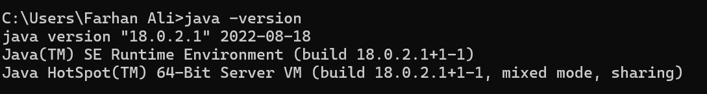
- Database : mysql (latest version)
  - 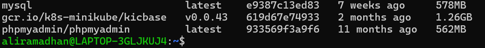
- IDE : intelij

## Create Spring Project

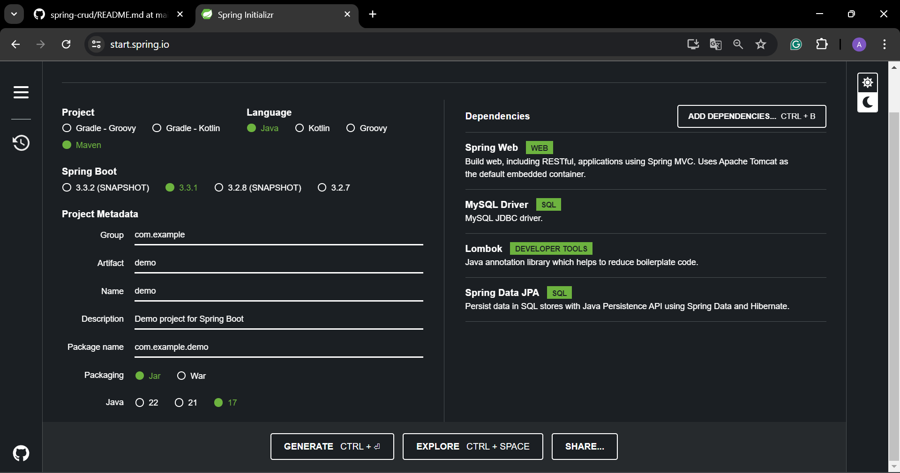 with springinitializr

## Maven Dependencies

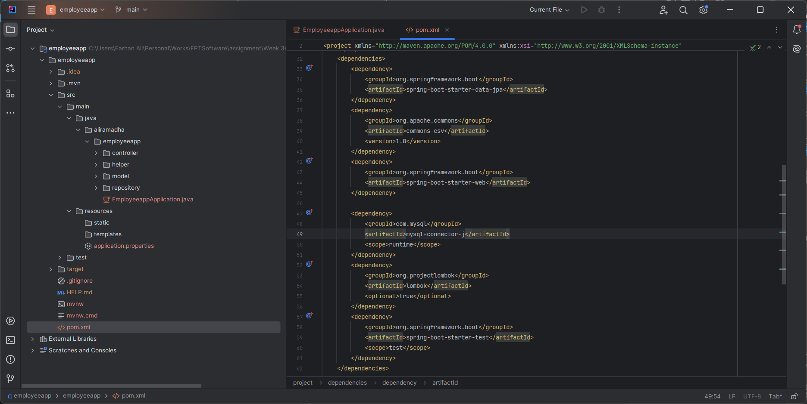

## Create Database

### Create Database and Table

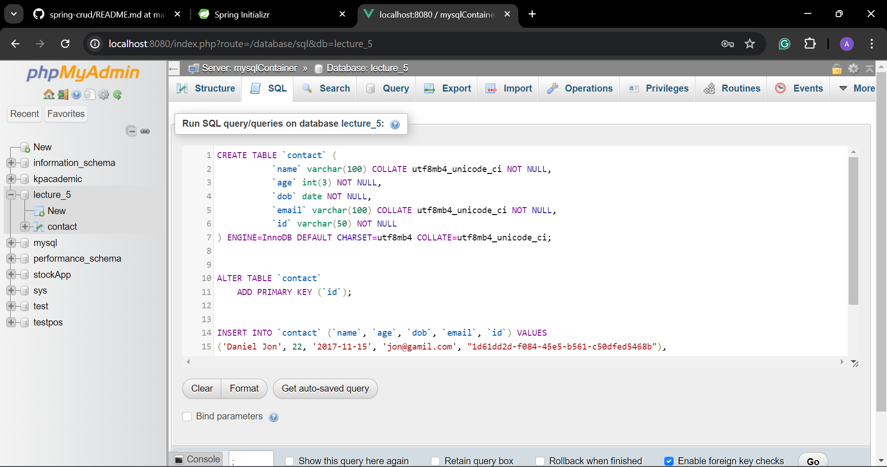

### Result

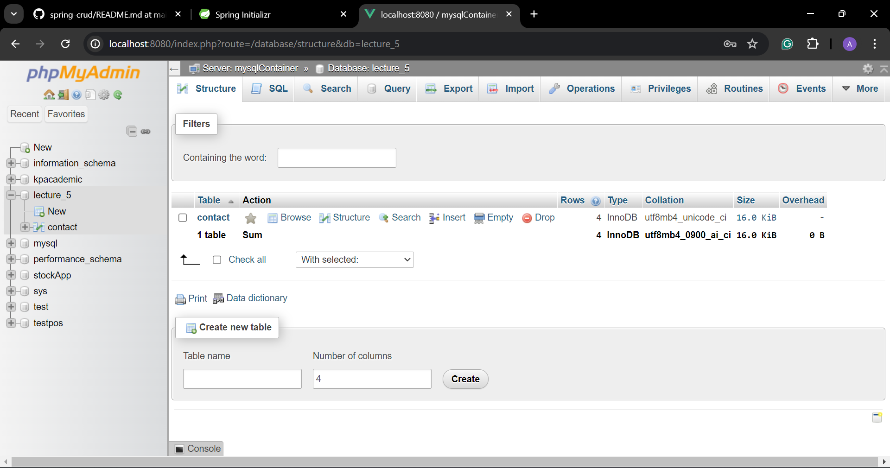

## Configure Properties

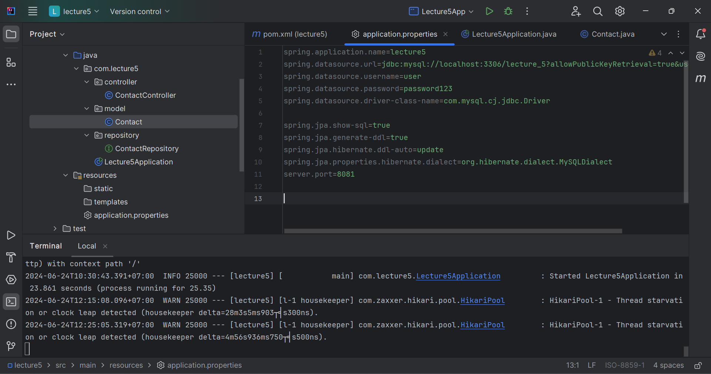

## Create Model

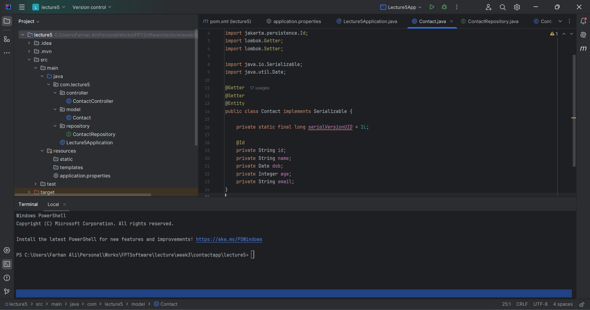

## Create Repository

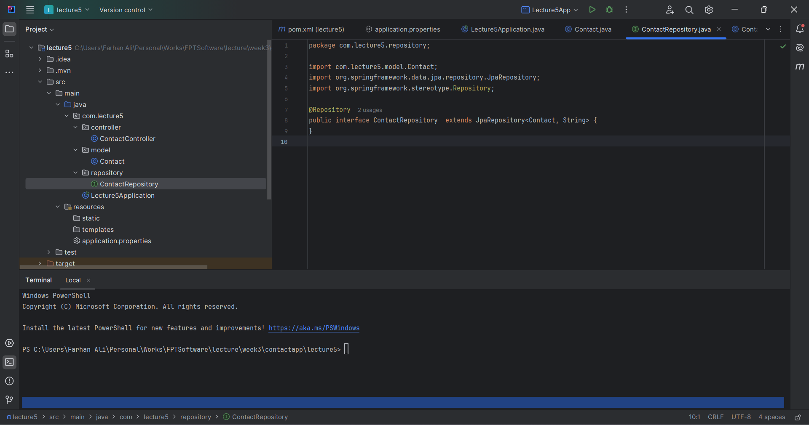

## Create Controller

- Package

  - 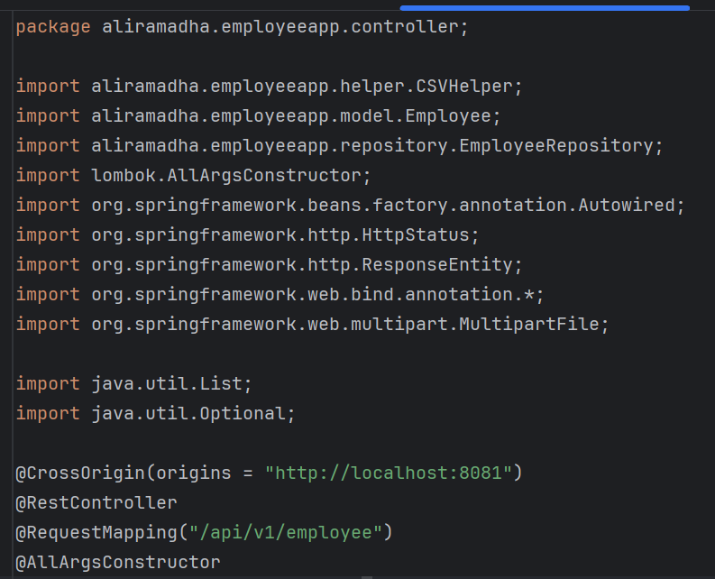

- @GetMapping // get all contacts

  - 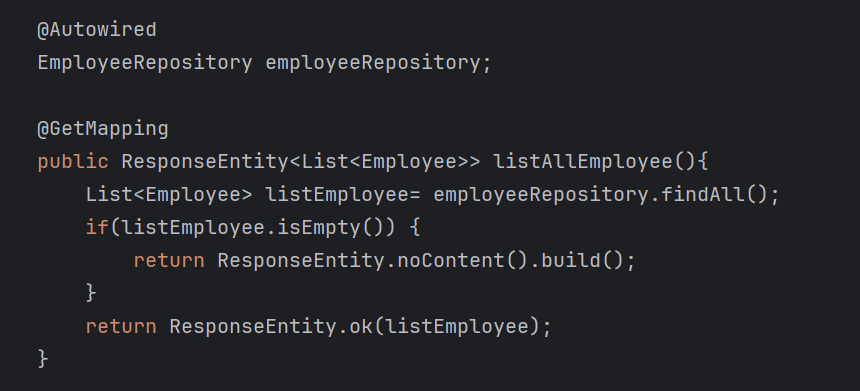

- @GetMapping(value = "/{id}") // get contact detail by id

  - 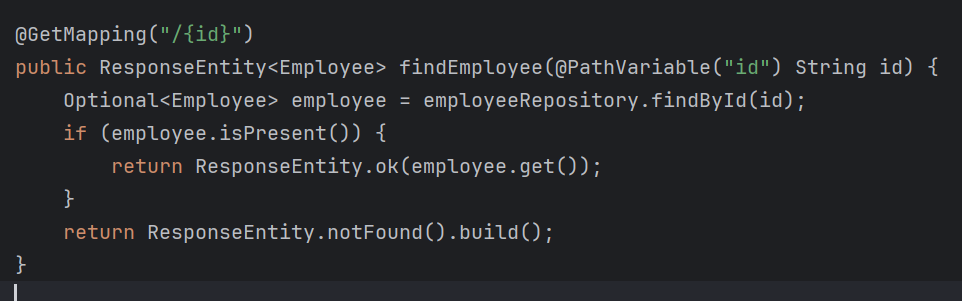

- @PostMapping // create new contact

  - 

- @PutMapping(value = "/{id}") // update by id

  - 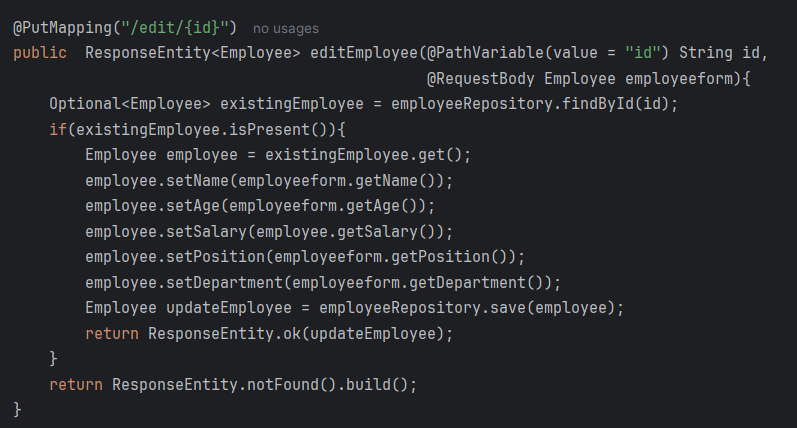

- @DeleteMapping(value = "/contact/{id}") // delete by id

  - 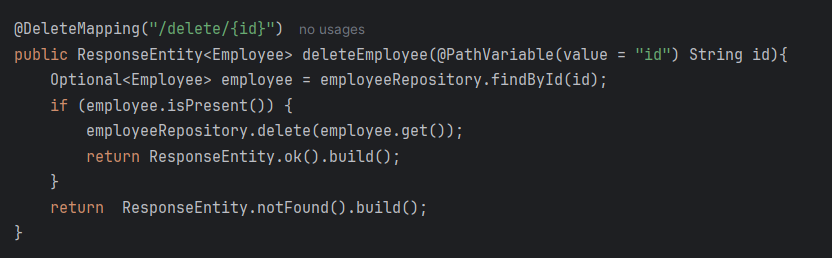

## Import Postman Collection

### import process

### result

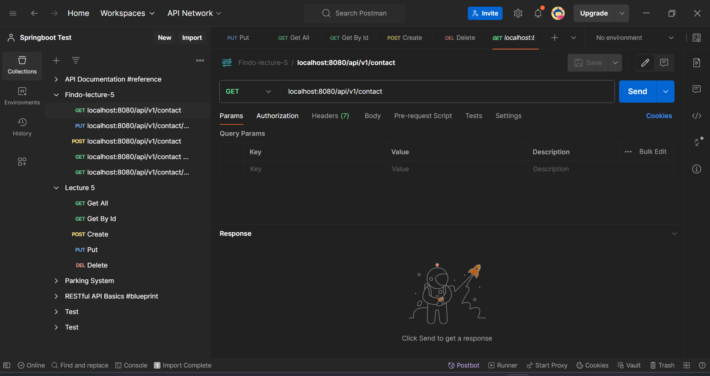
