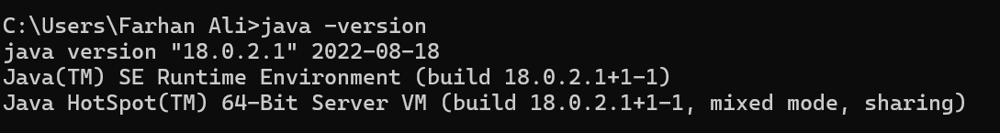
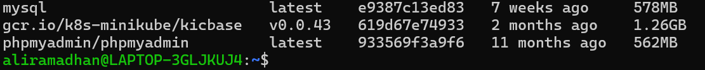
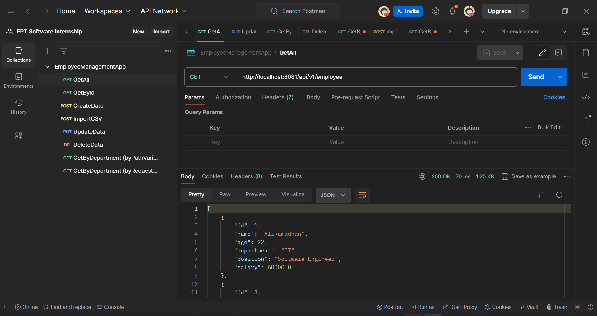
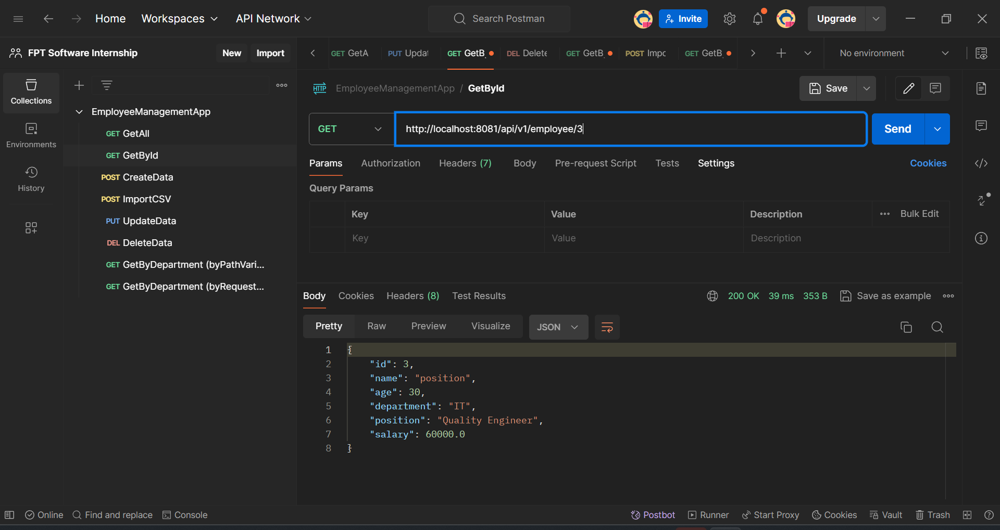
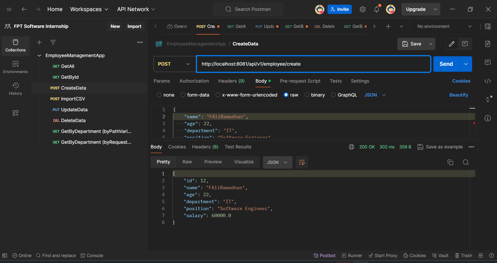
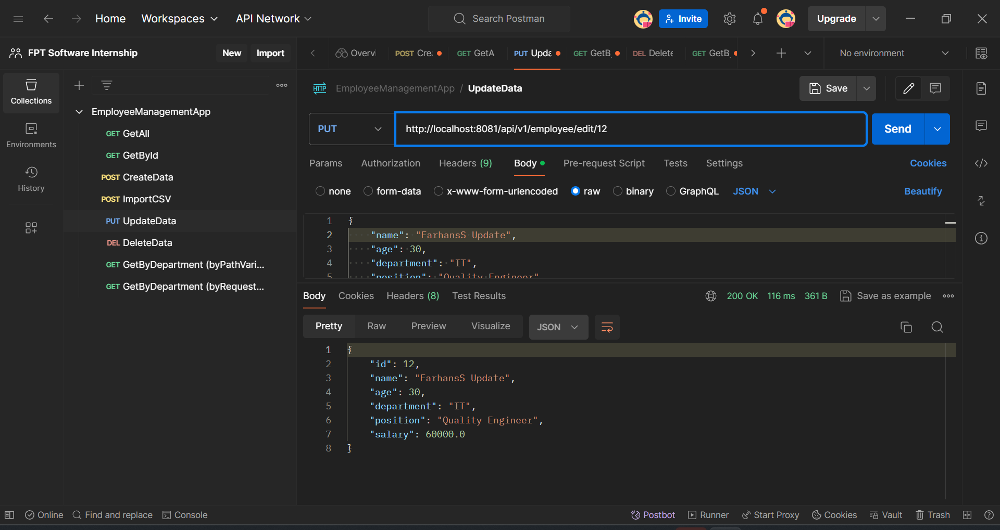
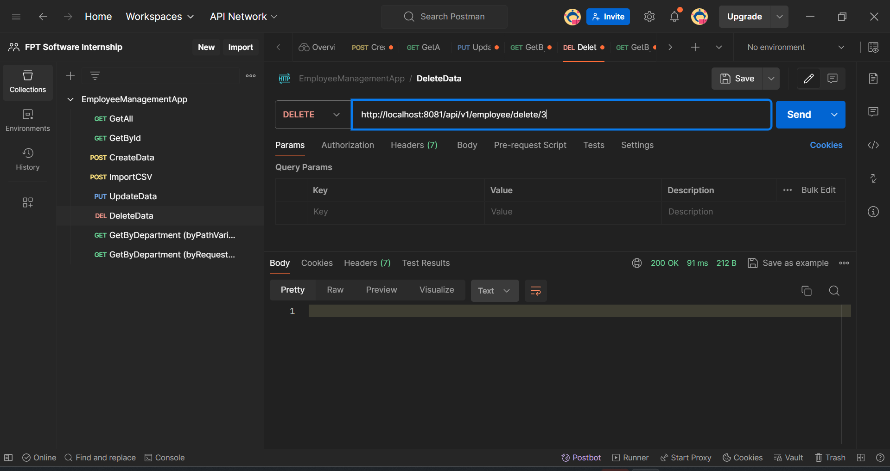
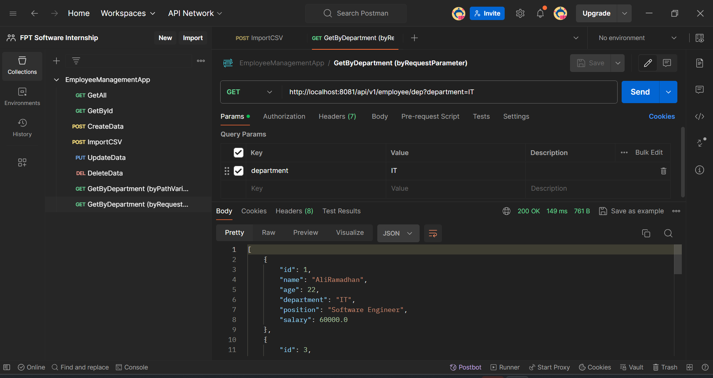
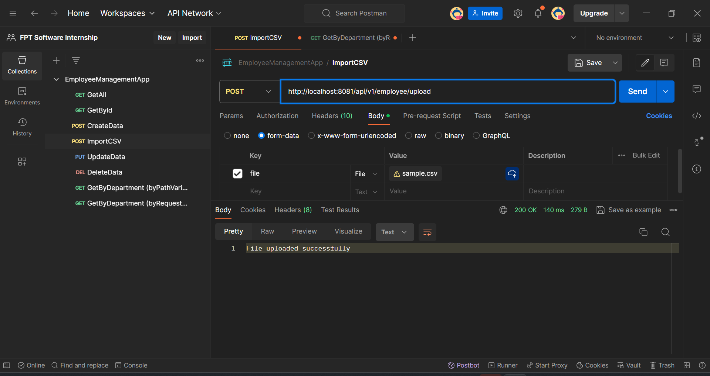

# Employee Management App

## `pre-requirement`

- JDK : 18.0.2.1
  - 
- Database : mysql (latest version)
  - 
- IDE : intelij

## Postman Result

- @GetMapping // get all employees

  - 

- @GetMapping(value = "/{id}") // get employee detail by id

  - 

- @PostMapping // create new data

  - 

- @PutMapping(value = "/{id}") // update by id

  - 

- @DeleteMapping(value = "/{id}") // delete by id

  - 

- @GetMapping

  - 

- @PostMapping

  - 
