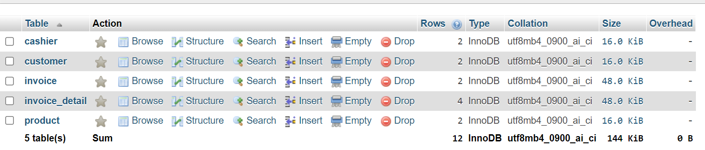

# Database Manage Invoice

### 🗒️ Initialize Database

Question:

A store want to have an application to manage invoices. And also can see the daily, monthly, annual revenue.

Write sql to create tables:

- customer: id, name, phone
- cashier: id, name
- invoice: id, customer_id, cashier_id, amount, created_date
- invoice_detail: id, quantity, product_id, product_price, invoice_id, amount
- product: id, name, price

**1️⃣ Create database**

```sql
CREATE DATABASE invoiceManagement;
```

**2️⃣ Create customer table**

```sql
CREATE TABLE customer (
    id INT AUTO_INCREMENT PRIMARY KEY,
    name VARCHAR(255) NOT NULL,
    phone VARCHAR(30)
);
```

For all tables, I use auto_increment for id column.

**3️⃣ Create cashier table**

```sql
CREATE TABLE cashier (
    id INT AUTO_INCREMENT PRIMARY KEY,
    name VARCHAR(255) NOT NULL
);
```

**4️⃣ Create product table**

```sql
CREATE TABLE product (
    id INT AUTO_INCREMENT PRIMARY KEY,
    name VARCHAR(255) NOT NULL,
    price DECIMAL(10, 2) NOT NULL
);
```

**5️⃣ Create invoice table**

```sql
CREATE TABLE invoice (
    id INT AUTO_INCREMENT PRIMARY KEY,
    customer_id INT NOT NULL,
    cashier_id INT NOT NULL,
    amount DECIMAL(10, 2) NOT NULL,
    created_date DATE NOT NULL,
    FOREIGN KEY (customer_id) REFERENCES customer(id),
    FOREIGN KEY (cashier_id) REFERENCES cashier(id)
);
```

**6️⃣ Create invoice_detail table**

```sql
CREATE TABLE invoice_detail (
    id INT AUTO_INCREMENT PRIMARY KEY,
    quantity INT NOT NULL,
    product_id INT NOT NULL,
    product_price DECIMAL(10, 2) NOT NULL,
    invoice_id INT NOT NULL,
    amount DECIMAL(10, 2) NOT NULL,
    FOREIGN KEY (product_id) REFERENCES product(id),
    FOREIGN KEY (invoice_id) REFERENCES invoice(id)
);
```

**7️⃣ Drop the database**

```sql
DROP DATABASE IF EXISTS invoiceManagement;
```

## Explaination Tables

- The customer table stores customer details.

- The cashier table stores cashier details.
- The product table stores product details.
- The invoice table stores general invoice information, including references to the customer and cashier involved.
- The invoice_detail table stores detailed information about each product included in the invoice.

---

## Defintion Rules

- invoice.amount is the sum of invoice_detail.amount for the respective invoice.
- invoice_detail.amount is calculated as quantity \* product_price.

**1️⃣ Inserting sample data into the customer table **

```sql
INSERT INTO customer (name, phone) VALUES ('John Doe', '123-456-7890');
INSERT INTO customer (name, phone) VALUES ('Jane Smith', '098-765-4321');
```

** 2️⃣ Inserting sample data into the cashier table**

```sql
INSERT INTO cashier (name) VALUES ('Alice Johnson');
INSERT INTO cashier (name) VALUES ('Bob Brown');
```

**3️⃣ Inserting sample data into the product table**

```sql
INSERT INTO product (name, price) VALUES ('Product A', 10.00);
INSERT INTO product (name, price) VALUES ('Product B', 20.00);
```

**4️⃣Inserting sample data into the invoice table (initially without amount)**

```sql
INSERT INTO invoice (customer_id, cashier_id, amount, created_date) VALUES (1, 1, 0, '2024-06-28');
INSERT INTO invoice (customer_id, cashier_id, amount, created_date) VALUES (2, 2, 0, '2024-06-28');
```

**5️⃣ Inserting sample data into the invoice_detail table and calculating the amount**

```sql
-- For invoice 1
INSERT INTO invoice_detail (quantity, product_id, product_price, invoice_id, amount) VALUES
(2, 1, 10.00, 1, 2 * 10.00),
(1, 2, 20.00, 1, 1 * 20.00);

-- For invoice 2
INSERT INTO invoice_detail (quantity, product_id, product_price, invoice_id, amount) VALUES
(3, 1, 10.00, 2, 3 * 10.00),
(2, 2, 20.00, 2, 2 * 20.00);
```

**6️⃣ Updating the invoice table to set the correct amount**

```sql
UPDATE invoice SET amount = (
SELECT SUM(amount)
FROM invoice_detail
WHERE invoice_detail.invoice_id = invoice.id
);
```

## 👨‍🏫 Explaination

- Insert sample data into the customer, cashier, and product tables.
- Insert sample data into the invoice table with an initial amount of 0.
- Insert sample data into the invoice_detail table, calculating the amount based on quantity and product_price.
- Update the invoice table to set the correct amount based on the sum of the invoice_detail amounts.

## Result
