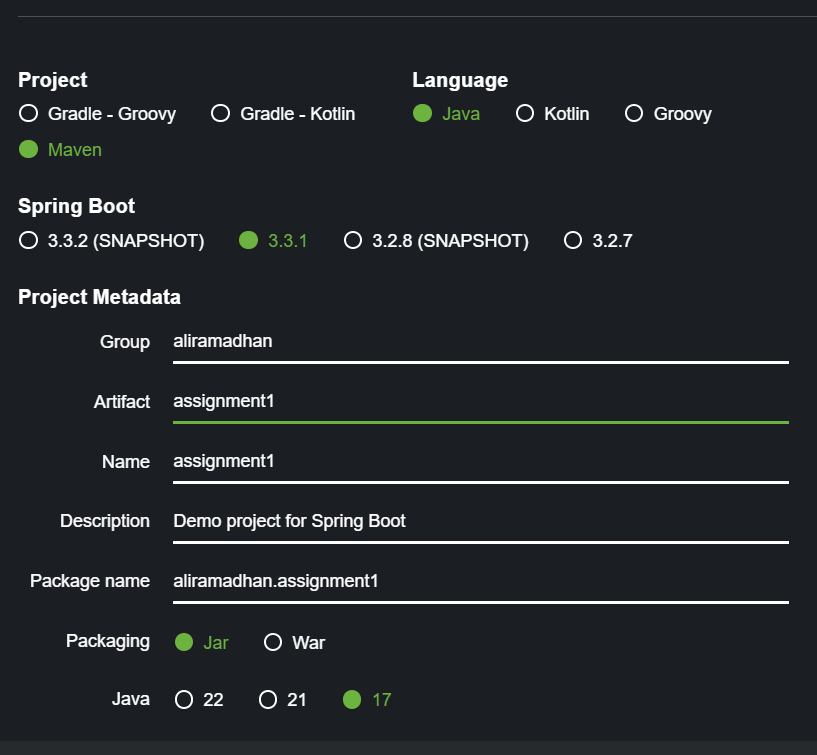
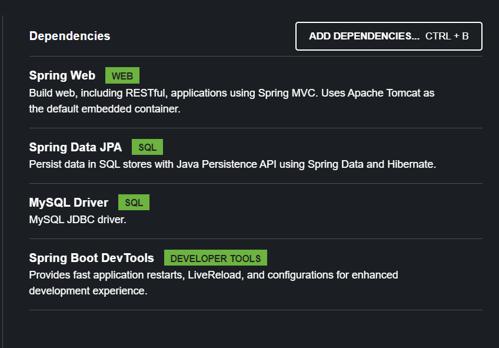
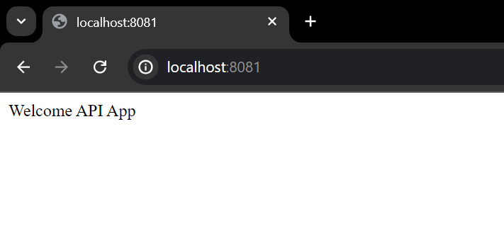

# Create Spring Boot Project and Run it Local

## **Create a Spring Boot Project**

In this assignment i'm using Spring Initializr to init my Spring Boot project. Here is how i initialize my Spring Boot project.

1. **Visit Spring Initializr:** Go to [start.spring.io](https://start.spring.io).

2. **Configure the Project:**

   - **Project:** Select `Maven Project` or `Gradle Project` (choose Maven in this case).
   - **Language:** Choose `Java`.
   - **Spring Boot:** Select the latest stable version (i choose 3.3.1 in this case).
   - **Project Metadata:** - **Group:** e.g., `aliramadhan` - **Artifact:** e.g., `assignment1` - **Name:** e.g., `assignment1` - **Description:** e.g., `Demo project for Spring Boot` - **Package name:** e.g., `aliramadhan.assignment1` - **Packaging:** Choose `Jar`. - **Java Version:** Choose the appropriate version (i choose `17` in this case).



3. **Add Dependencies:** Add the necessary dependencies for our project. Common ones include:

   - `Spring Web` for web applications.
   - `Spring Data JPA` for data access.
   - `MySQL Database` for an in-memory database (optional).
   - `Spring Boot DevTools` for live reload (optional).

4. **Generate the Project:** Click `Generate` to download a ZIP file.
   
5. **Extract the ZIP:** Unzip the downloaded file to the preferred directory.

The project structure must be looking something like this.

```bash
lecture_8_1
├── .mvn/wrapper/
│   └── maven-wrapper.properties
├── src/main/
│   ├── java/com/aliramadhan/assignment1/
|   |   ├── Controller/
│   │   |      └──DemoController.java
│   │   └── Lecture81Application.java
│   └── resources/
│       └── application.properties
├── .gitignore
├── mvnw
├── mvnw.cmd
└── pom.xml
```

## **Run the Spring Boot Application Locally**

Run it SpringBootApplication, In this assignment im use port 8081 for access

### **Access the Application:**

Once the application starts, we can access it typically at [http://localhost:8081](http://localhost:8080).

### 🚀 **Verify the Application**

Open the browser and navigate to [http://localhost:8081](http://localhost:8081) to see if our Spring Boot application is running.

Here’s a simple code i create to start a Spring Boot application.

[**`Assignment1Application.java`**](./assignment1/src/main/java/aliramadhan/assignment1/Assignment1Application.java)

```java
package aliramadhan.assignment1;

import org.springframework.boot.SpringApplication;
import org.springframework.boot.autoconfigure.SpringBootApplication;

@SpringBootApplication
public class Assignment1Application {

	public static void main(String[] args) {
		SpringApplication.run(Assignment1Application.class, args);
	}

}

```

**`DemoController.java`**

```java
package aliramadhan.assignment1.controller;

import org.springframework.web.bind.annotation.GetMapping;
import org.springframework.web.bind.annotation.RestController;

@RestController
public class DemoController {
    @GetMapping("/")
    public String hello() {
        return "Welcome API App";
    }
}
```

In this example, when we navigate to [http://localhost:8081](http://localhost:8081), we should see "Hello, World!" displayed.

Here is the result showed.


