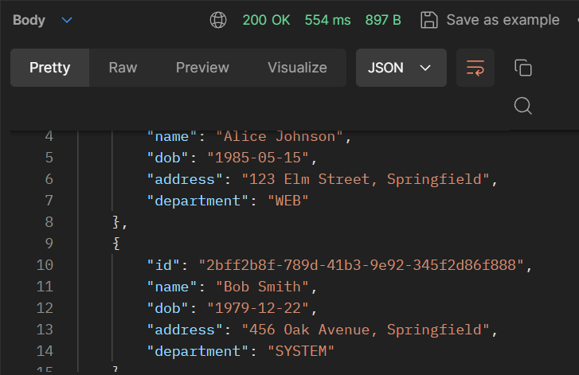
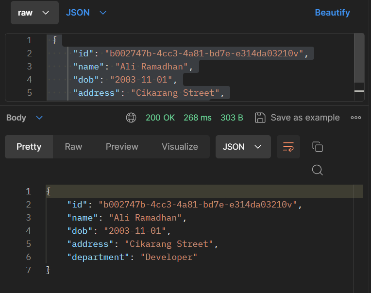
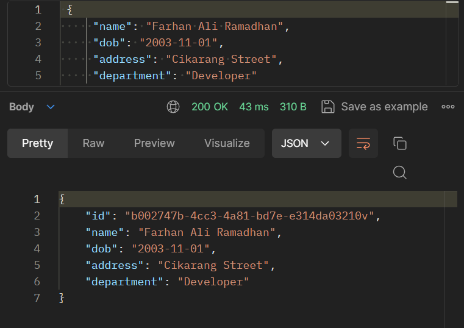
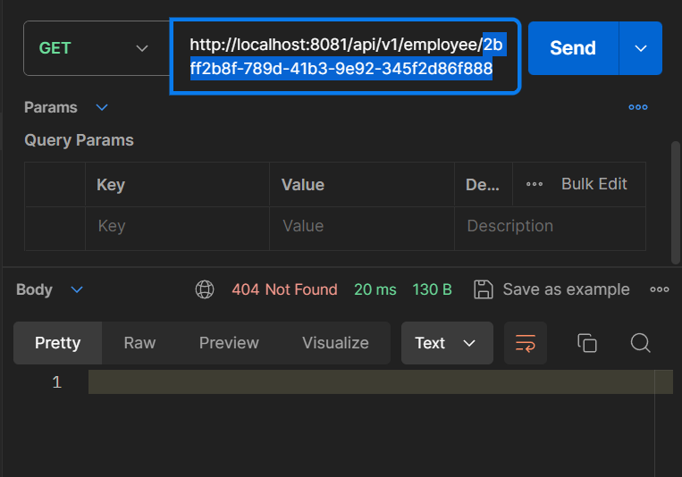
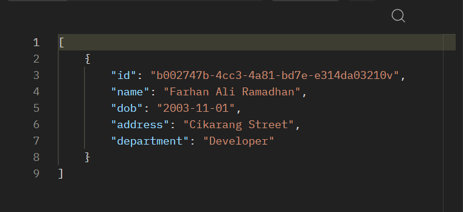

# CRUD Project for Employee Management with JDBC Template

## 1. Set Up Spring Boot Project

Follow the steps to create a new Spring Boot project as i explained in the previous assignment. Ensure that we add `Spring Web`, `Spring Data JPA`, `Spring Boot DevTools`, and `MySQL Driver` as dependencies.

## 2. Create Employee Table in MySQL

Execute the following SQL script to create the database and the `employee` table in MySQL:

```sql
-- Create the database
CREATE DATABASE employeeApp;

-- Use the database
USE employeeApp;

-- Create the employee table
CREATE TABLE employee (
    id VARCHAR(50) NOT NULL,
    name VARCHAR(100) COLLATE utf8mb4_unicode_ci NOT NULL,
    dob DATE NOT NULL,
    address VARCHAR(255) NOT NULL,
    department VARCHAR(100) NOT NULL,
    PRIMARY KEY (id)
);

-- Insert dummy data into the employee table
-- Insert dummy data into the employee table
INSERT INTO employee (id, name, dob, address, department) VALUES
('EMP001', 'John Doe', '1985-06-15', '123 Main St, Springfield', 'HR'),
('EMP002', 'Jane Smith', '1990-09-25', '456 Oak St, Shelbyville', 'Finance'),
('EMP003', 'Alice Johnson', '1982-03-12', '789 Pine St, Capital City', 'IT'),
('EMP004', 'Bob Brown', '1978-11-20', '321 Maple St, Springfield', 'Marketing'),
('EMP005', 'Carol White', '1986-01-05', '654 Elm St, Shelbyville', 'Sales')
```

## 3. Configure Data Source in `application.properties`

The [`src/main/resources/application.properties`](./assignment2/src/main/resources/application.properties) file to include the MySQL data source configuration.

```properties
spring.application.name=assignment2
spring.datasource.url=jdbc:mysql://localhost:3306/employeeApp
spring.datasource.driver-class-name=com.mysql.cj.jdbc.Driver
spring.datasource.username=user
spring.datasource.password=password123
spring.jpa.hibernate.ddl-auto=update
spring.datasource.initialize=true

server.port =8081
```

Here is the detail explanation.

- `spring.datasource.url` specifies the JDBC URL for MySQL database.
- `spring.datasource.username` and `spring.datasource.password` set the database credentials for username .
- `spring.datasource.driver-class-name` defines the JDBC driver class.
- `spring.jpa.hibernate.ddl-auto` specifies the DDL mode (`update` to create/update schema automatically).
- `spring.jpa.show-sql` enables logging of SQL statements.

## 4. Create Employee Model

`Employee` in [`src/main/java/aliramdhan/assignment2/model/Employee.java`](./assignment2/src/main/java/aliramdhan/assignment2/model/Employee.java)

```java
package aliramdhan.assignment2.model;

import java.io.Serializable;
import java.time.LocalDate;

import jakarta.persistence.Entity;
import jakarta.persistence.Id;
import lombok.Getter;
import lombok.NoArgsConstructor;
import lombok.Setter;

@Getter
@Setter
@Entity
@NoArgsConstructor
public class Employee implements Serializable {

    private static final long serialVersionUID = 1L;

    @Id
    private String id;
    private String name;
    private LocalDate dob;
    private String address;
    private String department;

    public Employee(String id, String name, LocalDate dob, String address, String department) {
        this.id = id;
        this.name = name;
        this.dob = dob;
        this.address = address;
        this.department = department;
    }
}
```

## 5. Create Employee Repository

`EmployeeRepository` in [`/src/main/java/aliramdhan/assignment2/repository/EmployeeRepository.java`](./assignment2/src/main/java/aliramdhan/assignment2/repository/EmployeeRepository.java).

```java
package aliramdhan.assignment2.repository;

import java.sql.ResultSet;
import java.util.List;
import java.util.Optional;

import aliramdhan.assignment2.model.Employee;
import org.springframework.beans.factory.annotation.Autowired;
import org.springframework.dao.DataAccessException;
import org.springframework.jdbc.core.JdbcTemplate;
import org.springframework.jdbc.core.RowMapper;
import org.springframework.stereotype.Repository;


@Repository
public class EmployeeRepository {

   @Autowired
   private JdbcTemplate jdbcTemplate;

   // RowMapper to map ResultSet to Employee
   private static final RowMapper<Employee> EMPLOYEE_ROW_MAPPER = (ResultSet rs, int rowNum) -> {
       Employee employee = new Employee();
       employee.setId(rs.getString("id"));
       employee.setName(rs.getString("name"));
       employee.setDob(rs.getDate("dob").toLocalDate());
       employee.setAddress(rs.getString("address"));
       employee.setDepartment(rs.getString("department"));
       return employee;
   };

   // Find all employees
   public List<Employee> findAll() {
       String sql = "SELECT * FROM employee";
       return jdbcTemplate.query(sql, EMPLOYEE_ROW_MAPPER);
   }

   // Find employee by ID
   public Optional<Employee> findById(String id) {
       String sql = "SELECT * FROM employee WHERE id = ?";
       try {
           Employee employee = jdbcTemplate.queryForObject(sql, EMPLOYEE_ROW_MAPPER, id);
           return Optional.ofNullable(employee);
       } catch (DataAccessException e) {
           return Optional.empty();
       }
   }

   // Save new employee
   public Employee save(Employee employee) {
       String sql = "INSERT INTO employee (id, name, dob, address, department) VALUES (?, ?, ?, ?, ?)";
       jdbcTemplate.update(sql, employee.getId(), employee.getName(), employee.getDob(),
               employee.getAddress(), employee.getDepartment());
       return employee;
   }

   // Update existing employee
   public Employee update(Employee employee) {
       String sql = "UPDATE employee SET name = ?, dob = ?, address = ?, department = ? WHERE id = ?";
       jdbcTemplate.update(sql, employee.getName(), employee.getDob(),
               employee.getAddress(), employee.getDepartment(), employee.getId());
       return employee;
   }

   // Delete employee by ID
   public void deleteById(String id) {
       String sql = "DELETE FROM employee WHERE id = ?";
       jdbcTemplate.update(sql, id);
   }

   // Find employees by department
   public List<Employee> findByDepartmentId(String department) {
       String sql = "SELECT * FROM employee WHERE department = ?";
       return jdbcTemplate.query(sql, EMPLOYEE_ROW_MAPPER, department);
   }
}

```

## 6. Create Employee Controller

`EmployeeController` in [`/src/main/java/aliramdhan/assignment2/controller/EmployeeController.java`](./assignment2/src/main/java/aliramdhan/assignment2/controller/EmployeeController.java).

```java
package aliramdhan.assignment2.controller;

import java.util.List;
import java.util.Optional;

import aliramdhan.assignment2.model.Employee;
import aliramdhan.assignment2.repository.EmployeeRepository;
import org.springframework.beans.factory.annotation.Autowired;
import org.springframework.http.ResponseEntity;
import org.springframework.web.bind.annotation.DeleteMapping;
import org.springframework.web.bind.annotation.GetMapping;
import org.springframework.web.bind.annotation.PathVariable;
import org.springframework.web.bind.annotation.PostMapping;
import org.springframework.web.bind.annotation.PutMapping;
import org.springframework.web.bind.annotation.RequestBody;
import org.springframework.web.bind.annotation.RequestMapping;
import org.springframework.web.bind.annotation.RequestParam;
import org.springframework.web.bind.annotation.RestController;

import lombok.AllArgsConstructor;

@RestController
@RequestMapping("/api/v1/employee")
@AllArgsConstructor
public class EmployeeController {

    @Autowired
    private final EmployeeRepository employeeRepository;
    /**
     * This method retrieves all employee data from the database
     */
    @GetMapping ("/all")
    public ResponseEntity<List<Employee>> listAllEmployee() {
        List<Employee> employees;
        employees = employeeRepository.findAll();
        if (employees.isEmpty()) {
            return ResponseEntity.noContent().build();
        }

        return ResponseEntity.ok(employees);
    }
    /**
     * This method retrieves an employee based department
     */
    @GetMapping ("/department")
    public ResponseEntity<List<Employee>> listAllEmployee(@RequestParam(value = "department", required = false) String departmentId) {
        List<Employee> employees;

        if (departmentId != null && !departmentId.isEmpty()) {
            employees = employeeRepository.findByDepartmentId(departmentId);
        } else {
            employees = employeeRepository.findAll();
        }

        if (employees.isEmpty()) {
            return ResponseEntity.noContent().build();
        }

        return ResponseEntity.ok(employees);
    }

    /**
     * This method retrieves an employee from the database by its id
     */
    @GetMapping(value = "/{id}")
    public ResponseEntity<Employee> findEmployeeById(@PathVariable("id") String id) {
        Optional<Employee> employeeOpt= employeeRepository.findById(id);
        if(employeeOpt.isPresent()) {
            return ResponseEntity.ok(employeeOpt.get());
        }
        return ResponseEntity.notFound().build();
    }

    /**
     * This method saves an employee to the database.
     */
    @PostMapping
    public ResponseEntity<Employee> saveEmployee(@RequestBody Employee employee) {
        Optional<Employee> employeeOpt = employeeRepository.findById(employee.getId());
        if(employeeOpt.isPresent()) {
            return ResponseEntity.badRequest().build();
        }
        return ResponseEntity.ok(employeeRepository.save(employee));
    }

    /**
     * This method updates an employee in the database by its id.
     */
    @PutMapping(value = "/{id}")
    public ResponseEntity<Employee> updateEmployee(@PathVariable(value = "id") String id,
                                                   @RequestBody Employee employeeForm) {
        Optional<Employee> employeeOpt = employeeRepository.findById(id);
        if(employeeOpt.isPresent()) {
            Employee employee = employeeOpt.get();
            employee.setName(employeeForm.getName());
            employee.setDob(employeeForm.getDob());
            employee.setAddress(employeeForm.getAddress());
            employee.setDepartment(employeeForm.getDepartment());

            Employee updatedEmployee = employeeRepository.update(employee);
            return ResponseEntity.ok(updatedEmployee);
        }
        return ResponseEntity.notFound().build();
    }

    /**
     * This method deletes an employee from the database by its id.
     */
    @DeleteMapping(value = "/{id}")
    public ResponseEntity<Employee> deleteEmployee(@PathVariable(value = "id") String id) {
        Optional<Employee> employeeOpt = employeeRepository.findById(id);
        if(employeeOpt.isPresent()) {
            employeeRepository.deleteById(employeeOpt.get().getId());
            return ResponseEntity.ok().build();
        }
        return ResponseEntity.notFound().build();
    }
}

```

## 8. Testing the CRUD Application

### Project Structure

```bash
lecture_8_2
├── .mvn/wrapper/
│   └── maven-wrapper.properties
├── src/main/
│   ├── java/aliramadahan/assignment2/
│   │   ├── controller/
│   │   │   └── EmployeeController.java
│   │   ├── model/
│   │   │   └── Employee.java
│   │   ├── repository/
│   │   │   └── EmployeeRepository.java
│   │   └── Assignment2Application.java
│   └── resources/
│       ├── schema.sql
│       └── application.properties
├── .gitignore
├── mvnw
├── mvnw.cmd
└── pom.xml
```

**Run the Spring Boot Application Locally** on Assignment2Application.java
**Access the Application:** _(port: 8081)_ Once the application starts, we can access it typically at [http://localhost:8081](http://localhost:8081).

### **Verify the Application**

Here is some result of the APIs created.

1. **Get All Employees**
   `(GET /api/v1/employee/all)`

   

2. **Get Employee By ID**
   `(GET /api/v1/employee/3ccd3c90-890e-41c4-9fa3-456f3d97f999)`

   

3. **Add New Employee**
   `(POST /api/v1/employee)`

   Body (Raw):

   ```json
   {
     "id": "b002747b-4cc3-4a81-bd7e-e314da03210v",
     "name": "Ali Ramadhan",
     "dob": "2003-11-01",
     "address": "Cikarang Street",
     "department": "Developer"
   }
   ```

   

4. **Edit Employee**
   `(PUT api/v1/employee/b002747b-4cc3-4a81-bd7e-e314da03210v)`

   Body (Raw):

   ```json
   {
     "name": "Farhan Ali Ramadhan",
     "dob": "2003-11-01",
     "address": "Cikarang Street",
     "department": "Developer"
   }
   ```

   

5. **Delete Employee**
   `(DELETE /api/v1/employee/2bff2b8f-789d-41b3-9e92-345f2d86f888)`

   

6. **Get All Employees by Department**
   `(GET /api/v1/employee/department?department=Developer)`

   
