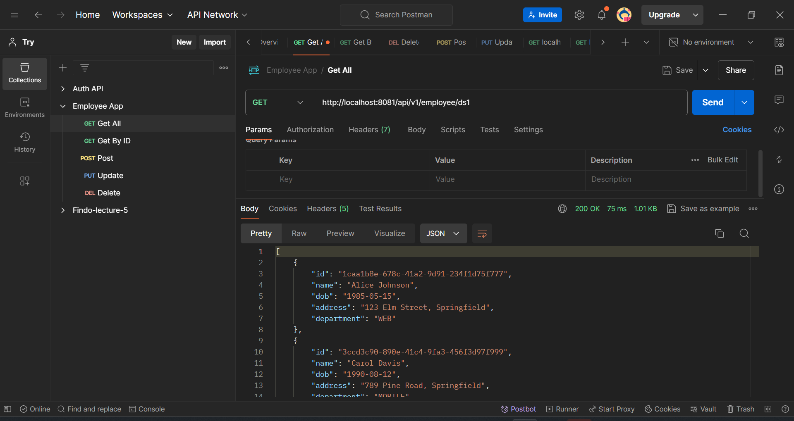
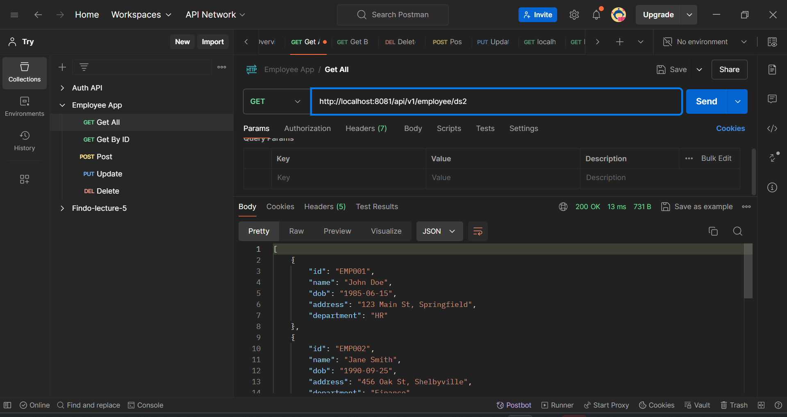
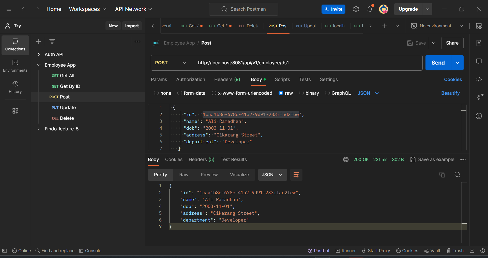
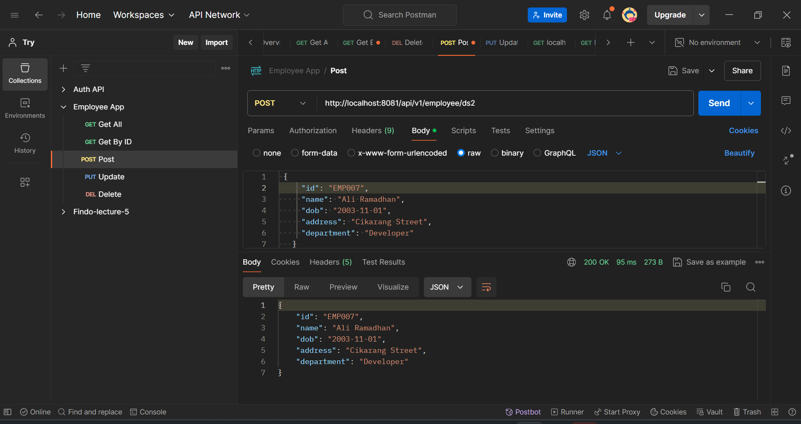
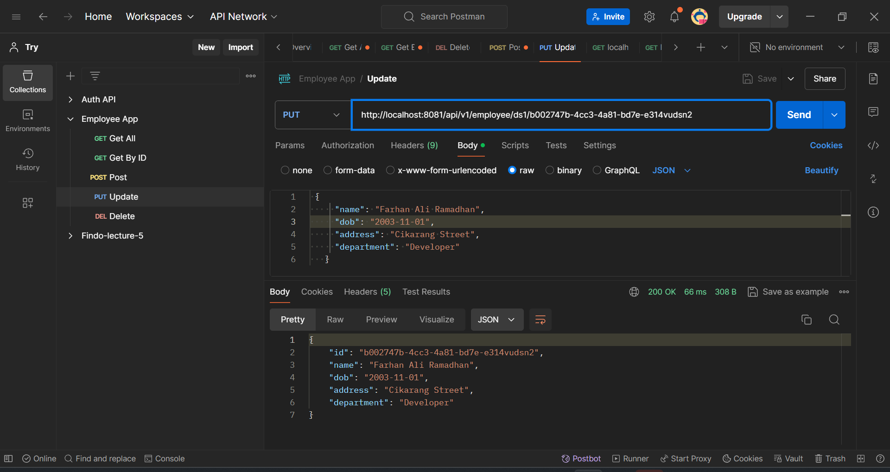
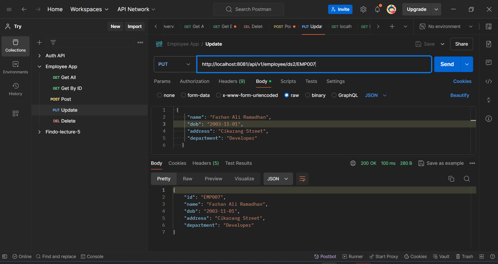
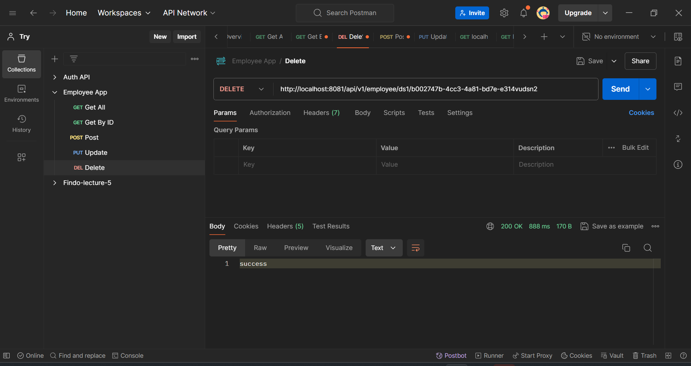
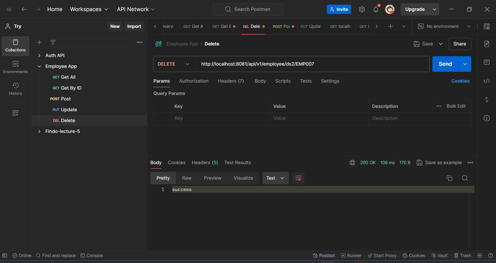

# Multiple Datasources and Transactions and Lombok Dependency

## Change DataSource to Use Bean Configuration

### Configuration to use Multiple DataSource

Create a new Java configuration class to define the `DataSource` bean. Define each `DataSource` as a separate bean in a configuration class. It is defined on [this file](./assignment3/src/main/java/aliramadhan/assignment3/config/DataSourceConfig.java)

```java
package aliramadhan.assignment3.config;


import javax.sql.DataSource;

import org.springframework.beans.factory.annotation.Qualifier;
import org.springframework.boot.jdbc.DataSourceBuilder;
import org.springframework.context.annotation.Bean;
import org.springframework.context.annotation.Configuration;

@Configuration
public class DataSourceConfig {

    @Bean
    @Qualifier("dataSource1")
    public DataSource dataSource1() {
        DataSourceBuilder dataSourceBuilder = DataSourceBuilder.create();
        dataSourceBuilder.driverClassName("com.mysql.cj.jdbc.Driver");
        dataSourceBuilder.url("jdbc:mysql://localhost:3306/employeeApp?useSSL=false&serverTimezone=Asia/Jakarta");
        dataSourceBuilder.username("user");
        dataSourceBuilder.password("password123");
        return dataSourceBuilder.build();
    }

    @Bean
    @Qualifier("dataSource2")
    public DataSource getDataSourcePart2() {
        DataSourceBuilder dataSourceBuilder = DataSourceBuilder.create();
        dataSourceBuilder.driverClassName("com.mysql.cj.jdbc.Driver");
        dataSourceBuilder.url("jdbc:mysql://localhost:3306/employeeApp1?useSSL=false&serverTimezone=Asia/Jakarta");
        dataSourceBuilder.username("user");
        dataSourceBuilder.password("password123");
        return dataSourceBuilder.build();
    }

}
```

---

## Handle Transactions for Insert/Update

### What is a Transaction?

In database terms, a **transaction** is a sequence of operations performed as a single logical unit of work or sequence of operations that must be executed in its entirety or not at all to maintain data integrity. The key properties of a transaction are encapsulated in the ACID acronym:

- **Atomicity**: Ensures that all operations within a transaction are completed; if not, the transaction is aborted, and no changes are applied.
- **Consistency**: Ensures that the database moves from one consistent state to another consistent state.
- **Isolation**: Ensures that transactions are executed in isolation from one another.
- **Durability**: Ensures that once a transaction has been committed, it will remain so, even in the event of a system failure.

For example , if we development feature in e-commerce that allows customers to make a purchase.

1. Reduce the number of stock items.
2. Record purchase transactions.
3. Updating customer balances.
   If any of these operations fail (for example, due to insufficient stock items), all changes must be cancelled to maintain data integrity.

### 👨🏻‍💻 Implementing Transactions in Multiple Data Sources with Spring

Spring provides ways to manage transactions, even across multiple data sources, using its transaction management abstractions. By **using `@Transactional` annotation** to methods in the service layer with, we ensure that they are executed within a transaction context.

- [**Service Layer**](./assignment3/src/main/java/aliramadhan/assignment3/service/EmployeeService.java)
  This layer taking control on how the transaction for both datasources is handled gracefully.

### Testing the CRUD Application

### Create Another Employee Table in MySQL in other Database

```sql
-- Create the database
CREATE DATABASE employeeApp1;

-- Use the database
USE employeeApp1;

-- Create the employee table
CREATE TABLE employee (
    id VARCHAR(50) NOT NULL,
    name VARCHAR(100) COLLATE utf8mb4_unicode_ci NOT NULL,
    dob DATE NOT NULL,
    address VARCHAR(255) NOT NULL,
    department VARCHAR(100) NOT NULL,
    PRIMARY KEY (id)
);

-- Insert dummy data into the employee table
INSERT INTO employee (id, name, dob, address, department) VALUES
('EMP001', 'John Doe', '1985-06-15', '123 Main St, Springfield', 'HR'),
('EMP002', 'Jane Smith', '1990-09-25', '456 Oak St, Shelbyville', 'Finance'),
('EMP003', 'Alice Johnson', '1982-03-12', '789 Pine St, Capital City', 'IT'),
('EMP004', 'Bob Brown', '1978-11-20', '321 Maple St, Springfield', 'Marketing'),
('EMP005', 'Carol White', '1986-01-05', '654 Elm St, Shelbyville', 'Sales')
```

### Project Structure

```bash
assignment3
├── .mvn/wrapper/
│   └── maven-wrapper.properties
├── src/main/
│   ├── java/aliramadhan/assignment3
│   │   ├── config/
│   │   │   └── DataSourceConfig.java
│   │   ├── controller/
│   │   │   └── EmployeeController.java
│   │   ├── model/
│   │   │   └── Employee.java
│   │   ├── repository/
│   │   │   └── EmployeeRepository.java
│   │   ├── service/
│   │   │   └── EmployeeService.java
│   │   └── Assignment3Application.java
│   └── resources/
│       └── application.properties
├── .gitignore
├── mvnw
├── mvnw.cmd
└── pom.xml
```

**Run the Spring Boot Application Locally** on Assignment2Application.java
**Access the Application:** _(port: 8081)_ Once the application starts, we can access it typically at [http://localhost:8081](http://localhost:8081).

### 🚀 **Verify the Application**

Here is some result of the APIs created.

1. **Get All Employees from DataSource 1**
   `(GET /api/v1/employee/ds1)`

   

2. **Get All Employees from DataSource 2**
   `(GET /api/v1/employee/ds2)`

   

3. **Get Employee By ID from DataSource 1**
   `(GET /api/v1/employee/ds1/{id})`

   

4. **Get Employee By ID from DataSource 2**
   `(GET /api/v1/employee/ds2/{id})`

   

5. **Add New Employee Into DataSource 1**
   `(POST /api/v1/employee/ds1)`

   

6. **Add New Employee Into DataSource 2**
   `(POST /api/v1/employee/ds2)`

   

7. **Edit Employee DataSource 1**
   `(PUT /api/v1/employee/ds1/{id})`

   

8. **Edit Employee DataSource 2**
   `(PUT /api/v1/employee/ds2/{id})`

   

9. **Delete Employee From DataSource 1**
   `(DELETE /api/v1/employee/ds1/{id})`

   

10. **Delete Employee From DataSource 2**
    `(DELETE /api/v1/employee/ds2/{id})`



## 💡 3. Research Lombok and Add to Project

### What is Lombok?

Lombok is a Java library that reduces boilerplate code in Java applications by automatically generating common methods such as getters, setters, equals, hashCode, toString, and constructors at compile time. This can significantly reduce the amount of code we need to write and maintain.
It aims to reduce the amount of manual coding, thereby streamlining the codebase and reducing potential for errors.

### Lombok Dependency

Add Lombok to the `pom.xml`:

```xml
<dependency>
    <groupId>org.projectlombok</groupId>
    <artifactId>lombok</artifactId>
    <version>1.18.28</version>
    <scope>provided</scope>
</dependency>
```

### Lombok Annotations

Now we can simplify the `Employee` model by using Lombok annotations like `@Data`, `@NoArgsConstructor`, and `@AllArgsConstructor`.

### Example

```java
import lombok.Data;
import lombok.NoArgsConstructor;
import lombok.AllArgsConstructor;

@Data
@NoArgsConstructor
@AllArgsConstructor
public class User {
    private Long id;
    private String name;
    private String email;
}

```

The implementation is written on [this file](./assignment3/src/main/java/aliramadhan/assignment3/model/Employee.java).

### Lombok Annotations

Here are some common Lombok annotations:

- `@Getter` and `@Setter`: Generate getters and setters for the fields.
- `@ToString`: Generates a toString method.
- `@EqualsAndHashCode`: Generates equals and hashCode methods.
- `@NoArgsConstructor`: Generates a no-argument constructor.
- `@AllArgsConstructor`: Generates a constructor with one parameter for each field.
- `@RequiredArgsConstructor`: Generates a constructor for final fields.
- `@Builder`: Provides a builder pattern implementation
- `@Data`: A shortcut annotation that bundles @Getter, @Setter, @ToString, @EqualsAndHashCode, and @RequiredArgsConstructor annotations.

### Advantages of Using Lombok

1. **Reduces Boilerplate Code**: Lombok generates repetitive code like getters, setters, and constructors, allowing you to focus on the core logic of your application.
2. **Improves Code Readability**: With less boilerplate, your classes become cleaner and more readable.
3. **Speeds Up Development**: By automatically generating common methods, Lombok can speed up the development process.
