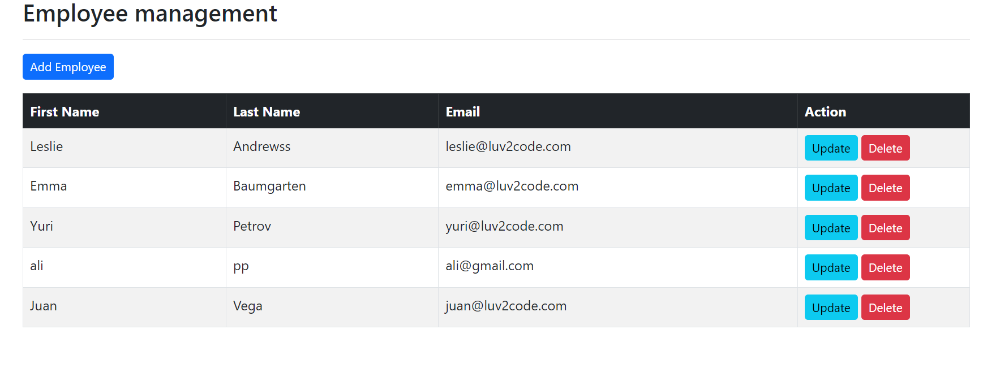
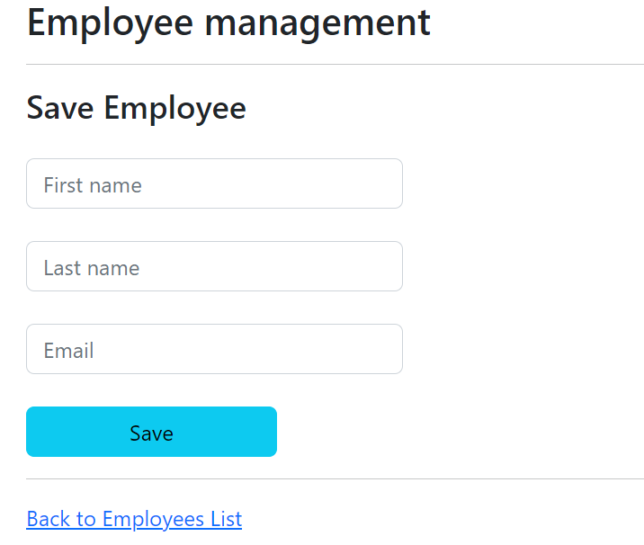
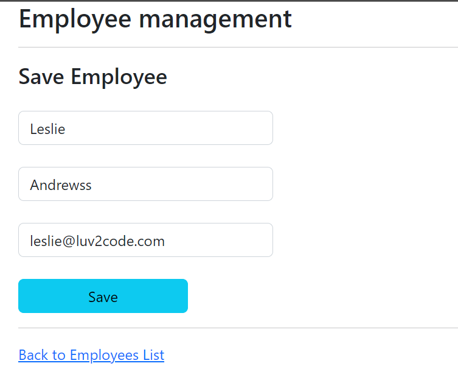

# Recreate Employee Management System with CRUD Operations

#### This guide will walk you through the implementation of an Employee Management System that includes Create, Read, Update, Delete (CRUD) operations

## Project Structure

```bash
assignment
├── .mvn/wrapper/
│   └── maven-wrapper.properties
├── src/main/
│   ├── java/aliramadhan/assignment
│   │   ├── controller/
│   │   │   └── EmployeeController.java
│   │   ├── model/
│   │   │   └── Employee.java
│   │   ├── repository/
│   │   │   └── EmployeeRepository.java
│   │   ├── service/
|   │   │   ├── impl/
|   │   │   │   └── EmployeeServiceImpl.java
│   │   │   └── EmployeeService.java
│   │   └── AssignmentApplication.java
│   └── resources/
│       ├── data/
│       │   └── sampledata-lecture-10.csv
│       ├── static/
│       │   └── index.html
│       ├── templates/
│       │   ├── employees/
│       │   │   ├── create.html
│       │   │   ├── edit.html
│       │   │   └── list-employees.html
│       │   └── pdf/
│       │       └── pdf-template.html
│       └── application.properties
├── .gitignore
├── mvnw
├── mvnw.cmd
└── pom.xml
```

## SQL Query

### 🧩 SQL Query Data
Here is the SQL query to create the database, table, and instantiate some data.

```sql
DROP TABLE IF EXISTS `employee`;

CREATE TABLE `employee` (
                            `id` int NOT NULL AUTO_INCREMENT,
                            `first_name` varchar(45) DEFAULT NULL,
                            `last_name` varchar(45) DEFAULT NULL,
                            `email` varchar(45) DEFAULT NULL,
                            PRIMARY KEY (`id`)
) ENGINE=InnoDB AUTO_INCREMENT=1 DEFAULT CHARSET=latin1;

--
-- Data for table `employee`
--

INSERT INTO `employee` VALUES
                           (1,'Leslie','Andrews','leslie@luv2code.com'),
                           (2,'Emma','Baumgarten','emma@luv2code.com'),
                           (3,'Avani','Gupta','avani@luv2code.com'),
                           (4,'Yuri','Petrov','yuri@luv2code.com'),
                           (5,'Juan','Vega','juan@luv2code.com');

```

## Config Project

### `Application Properties`

Dont forget to configure [application properties](./assignment/src/main/resources/application.properties) with this format

```java
spring.datasource.driver-class-name=com.mysql.jdbc.Driver
spring.datasource.url=jdbc:mysql://localhost:3306/<your_database>
spring.datasource.username=<your_user_name>
spring.datasource.password=<your_password>
```

### `Pom.xml`

Dont forget to configure dependency

```xml
<dependencies>
    <dependency>
        <groupId>org.springframework.boot</groupId>
        <artifactId>spring-boot-starter-data-jpa</artifactId>
    </dependency>
    <dependency>
    <groupId>org.springframework.boot</groupId>
        <artifactId>spring-boot-devtools</artifactId>
    </dependency>
    <!-- Thymeleaf -->
    <dependency>
        <groupId>org.springframework.boot</groupId>
        <artifactId>spring-boot-starter-thymeleaf</artifactId>
    </dependency>
    <dependency>
        <groupId>org.springframework.boot</groupId>
        <artifactId>spring-boot-starter-web</artifactId>
    </dependency>
    <!-- Connectore -->
    <dependency>
        <groupId>com.mysql</groupId>
        <artifactId>mysql-connector-j</artifactId>
        <scope>runtime</scope>
    </dependency>
    <!-- Lombok -->
    <dependency>
        <groupId>org.projectlombok</groupId>
        <artifactId>lombok</artifactId>
        <optional>true</optional>
    </dependency>
    <dependency>
        <groupId>org.springframework.boot</groupId>
        <artifactId>spring-boot-starter-test</artifactId>
        <scope>test</scope>
    </dependency>
</dependencies>
```

### 📸 Results

Program can crud employee data. Here's the documentation.

1. **List Employee**

   

2. **Create Data**

   

3. **Update Data**

   
