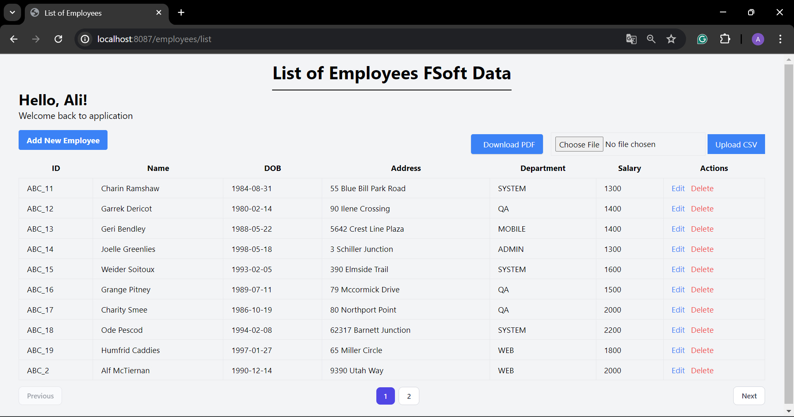
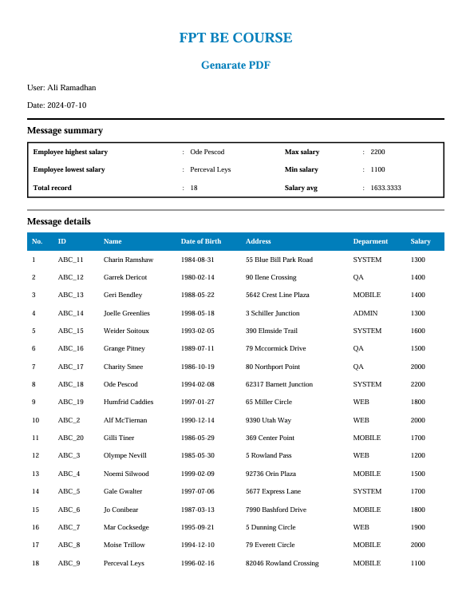

# Employee Management System with CRUD Operations and PDF Generation

#### This guide will walk you through the implementation of an Employee Management System that includes Create, Read, Update, Delete (CRUD) operations, and the ability to generate PDF reports using templates.

## Project Structure

```bash
assignment
├── .mvn/wrapper/
│   └── maven-wrapper.properties
├── src/main/
│   ├── java/aliramadhan/assignment
│   │   ├── controller/
│   │   │   └── EmployeeController.java
│   │   ├── model/
│   │   │   └── Employee.java
│   │   ├── repository/
│   │   │   └── EmployeeRepository.java
│   │   ├── service/
│   │   │   └── EmployeeService.java
│   │   ├── utils/
│   │   │   ├── DateUtils.java
│   │   │   ├── FileUtils.java
│   │   │   └── PDFUtils.java
│   │   └── AssignmentApplication.java
│   └── resources/
│       ├── data/
│       │   └── sampledata-lecture-10.csv
│       ├── static/
│       │   └── index.html
│       ├── templates/
│       │   ├── employees/
│       │   │   ├── create.html
│       │   │   ├── edit.html
│       │   │   └── list-employees.html
│       │   └── pdf/
│       │       └── pdf-template.html
│       └── application.properties
├── .gitignore
├── mvnw
├── mvnw.cmd
└── pom.xml
```

## SQL Query

### 🧩 SQL Query Data

Here is the SQL query to create the database, table, and instantiate some data.

```sql
-- Create the database
CREATE DATABASE employeeApp;

-- Use the database
USE employeeApp;

-- Create the employee table
CREATE TABLE `employee` (
    `id` VARCHAR(50) NOT NULL,
    `name` VARCHAR(100) COLLATE utf8mb4_unicode_ci NOT NULL,
    `dob` DATE NOT NULL,
    `address` VARCHAR(255) NOT NULL,
    `department` VARCHAR(100) NOT NULL,
    `salary` INT NOT NULL,
    PRIMARY KEY (id)
);

-- Insert dummy data into the employee table
INSERT INTO employee (id, name, dob, address, department, salary) VALUES
('ABC_1', 'Stesha Benyan', '1981-10-23', '6 Ronald Regan Court', 'SYSTEM', 1000),
('ABC_2', 'Alf McTiernan', '1990-12-14', '9390 Utah Way', 'WEB', 2000);
('ABC_3', 'Stesha Benyan', '1981-10-23', '6 Ronald Regan Court', 'SYSTEM', 1000),
('ABC_4', 'Alf McTiernan', '1990-12-14', '9390 Utah Way', 'WEB', 2000);
```

## Config Project

### `Application Properties`

Dont forget to configure [application properties](./assignment/src/main/resources/application.properties) with this format

```java
spring.datasource.driver-class-name=com.mysql.jdbc.Driver
spring.datasource.url=jdbc:mysql://localhost:3306/<your_database>
spring.datasource.username=<your_user_name>
spring.datasource.password=<your_password>
```

### `Pom.xml`

Dont forget to configure dependency

```xml
<dependencies>
    <dependency>
        <groupId>org.springframework.boot</groupId>
        <artifactId>spring-boot-starter-data-jpa</artifactId>
    </dependency>
    <dependency>
    <groupId>org.springframework.boot</groupId>
        <artifactId>spring-boot-devtools</artifactId>
    </dependency>
    <!-- Thymeleaf -->
    <dependency>
        <groupId>org.springframework.boot</groupId>
        <artifactId>spring-boot-starter-thymeleaf</artifactId>
    </dependency>
    <dependency>
        <groupId>org.springframework.boot</groupId>
        <artifactId>spring-boot-starter-web</artifactId>
    </dependency>
    <!-- Generator PDF -->
    <dependency>
    <groupId>com.itextpdf</groupId>
        <artifactId>html2pdf</artifactId>
        <version>3.0.1</version> <!-- use the latest version -->
    </dependency>
    <dependency>
        <groupId>com.itextpdf</groupId>
        <artifactId>kernel</artifactId>
        <version>7.1.15</version> <!-- use the latest version -->
    </dependency>
    <dependency>
        <groupId>com.itextpdf</groupId>
        <artifactId>layout</artifactId>
        <version>7.1.15</version> <!-- use the latest version -->
    </dependency>
    <dependency>
        <groupId>com.lowagie</groupId>
        <artifactId>itext</artifactId>
        <version>2.1.7</version>
    </dependency>
    <!-- Connectore -->
    <dependency>
        <groupId>com.mysql</groupId>
        <artifactId>mysql-connector-j</artifactId>
        <scope>runtime</scope>
    </dependency>
    <!-- Lombok -->
    <dependency>
        <groupId>org.projectlombok</groupId>
        <artifactId>lombok</artifactId>
        <optional>true</optional>
    </dependency>
    <dependency>
        <groupId>org.springframework.boot</groupId>
        <artifactId>spring-boot-starter-test</artifactId>
        <scope>test</scope>
    </dependency>
</dependencies>
```

### 📸 Results

Program can generate a PDF based on CSV file given from the input. Here's the documentation.

1. **List Employee**

   

2. **PDF Generated**

   
