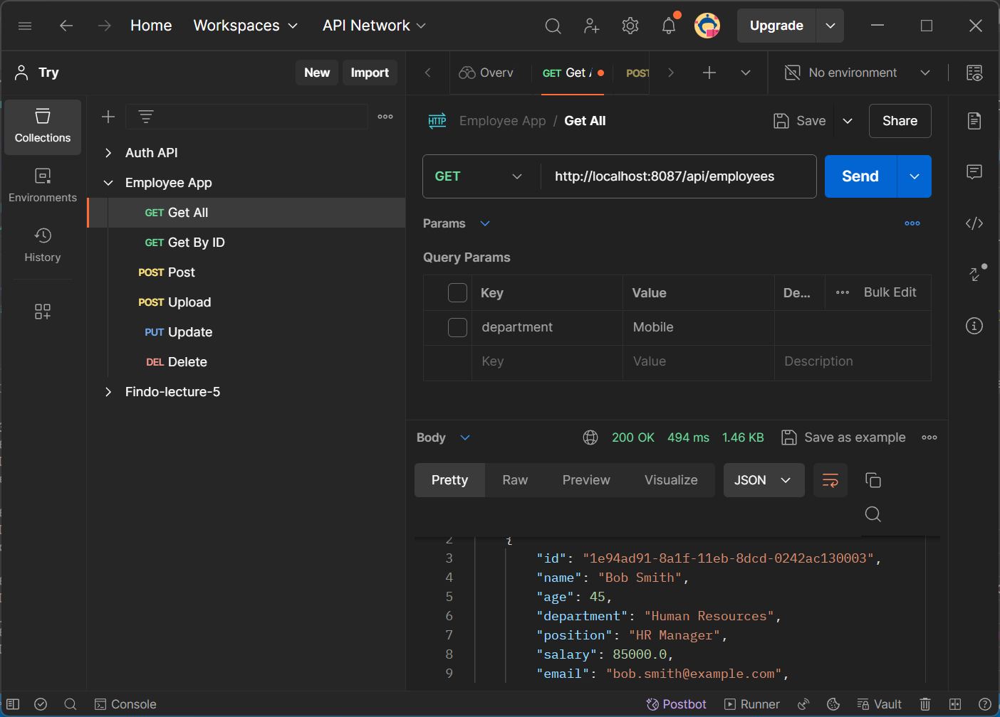
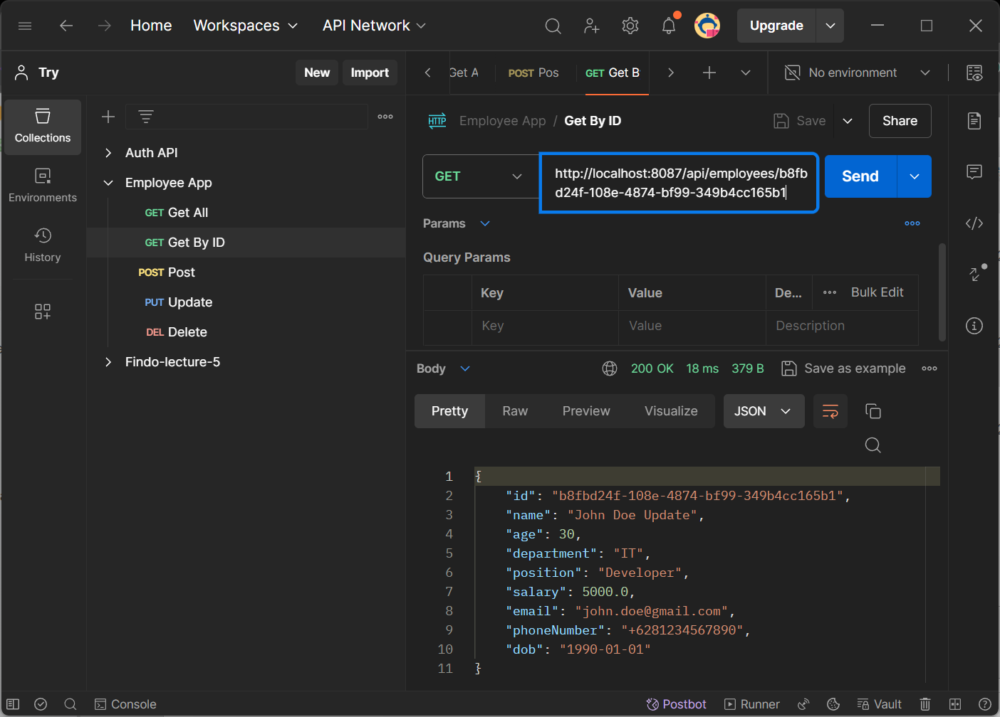
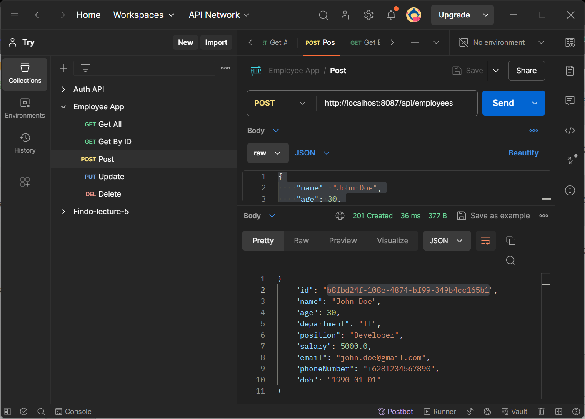
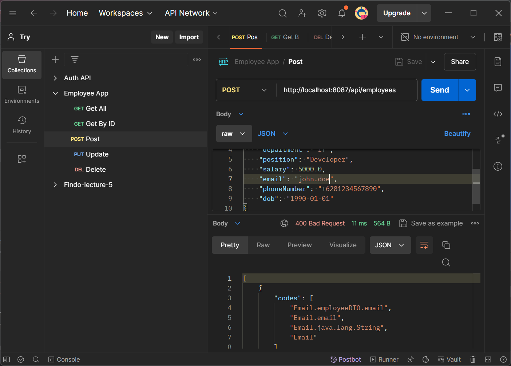
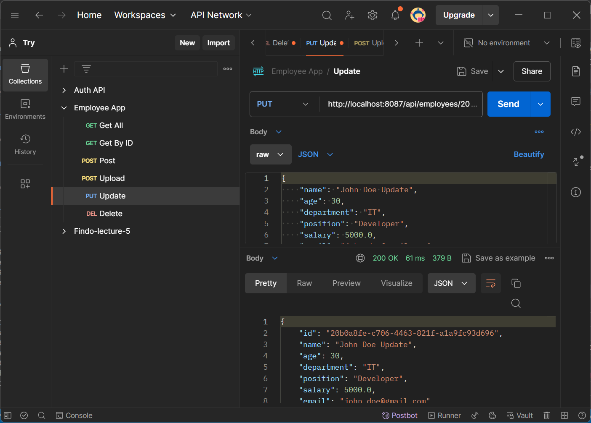
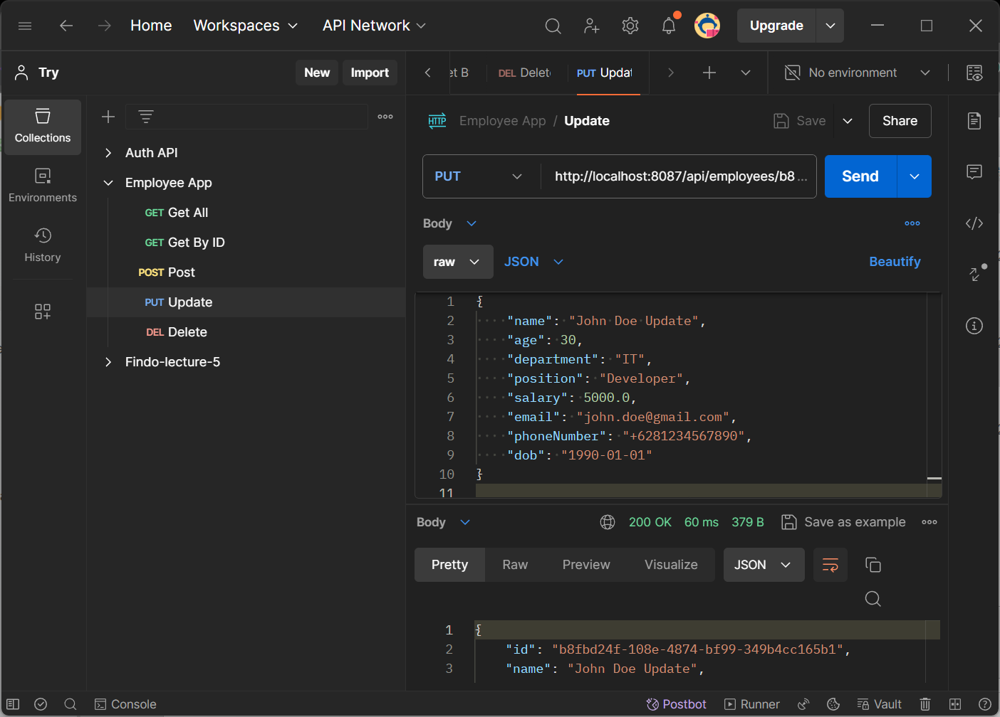
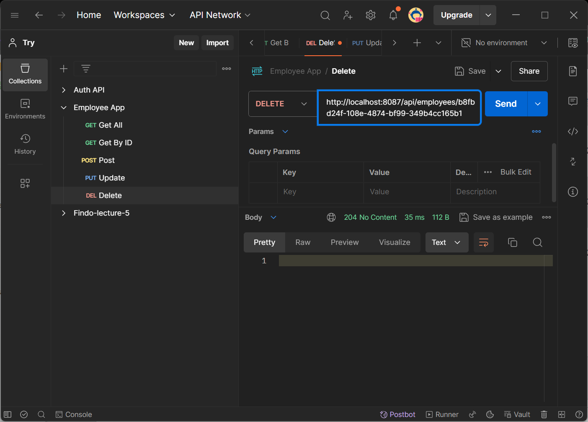
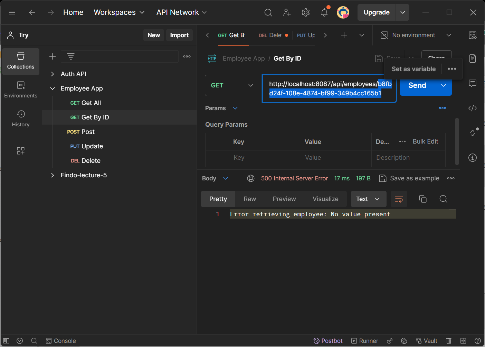
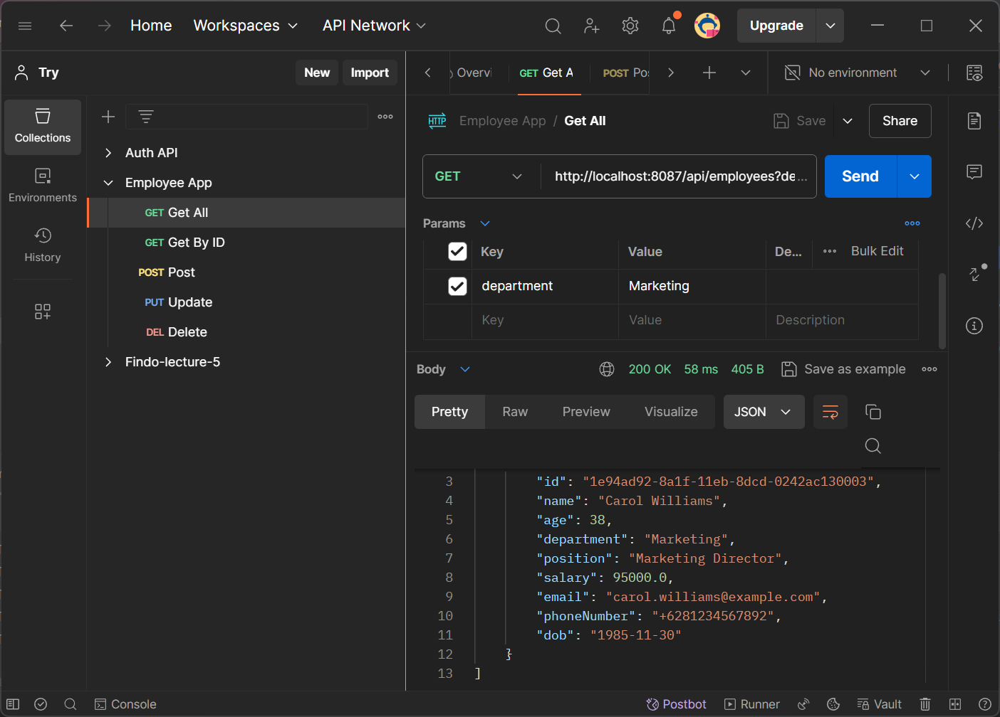
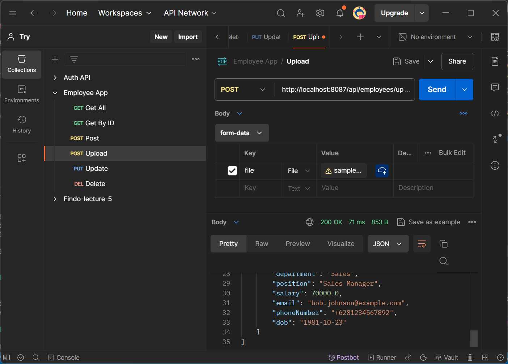

# Employee Management System with CRUD Operations

#### This guide will walk you through the implementation of an Employee Management System that includes Create, Read, Update, Delete (CRUD) operations.

## Project Structure

```bash
assignment
├── .mvn/wrapper/
│   └── maven-wrapper.properties
├── src/main/
│   ├── java/aliramadhan/assignment
│   │   ├── controller/
│   │   │   └── EmployeeController.java
│   │   ├── dto/
│   │   │   └── EmployeeDTO.java
│   │   ├── exception/
│   │   │   └── ResourceNotFoundException.java
│   │   ├── mapper/
│   │   │   └── EmployeeMapper.java
│   │   ├── model/
│   │   │   └── Employee.java
│   │   ├── repository/
│   │   │   └── EmployeeRepository.java
│   │   ├── service/
|   │   │   ├── impl/
|   │   │   │   └── EmployeeServiceImpl.java
│   │   │   └── EmployeeService.java
│   │   ├── utils/
│   │   │   ├── DateUtils.java
│   │   │   └── FileUtils.java
│   │   └── AssignmentApplication.java
│   └── resources/
│       ├── data/
│       │   └── sampledata-lecture-10.csv
│       └── application.properties
├── .gitignore
├── mvnw
├── mvnw.cmd
└── pom.xml
```

## SQL Query

### 🧩 SQL Query Data

Here is the SQL query to create the database, table, and instantiate some data.

```sql
-- Create the database
CREATE DATABASE employeeApp;

-- Use the database
USE employeeApp;

-- Create the employee table
CREATE TABLE `employee` (
  `id` varchar(255) NOT NULL PRIMARY KEY,
  `name` varchar(255) NOT NULL,
  `age` int DEFAULT NULL,
  `department` varchar(255) DEFAULT NULL,
  `position` varchar(255) DEFAULT NULL,
  `salary` double DEFAULT NULL,
  `email` varchar(255) NOT NULL,
  `phone_number` varchar(255) DEFAULT NULL,
  `dob` date DEFAULT NULL
) ENGINE=InnoDB DEFAULT CHARSET=utf8mb4 COLLATE=utf8mb4_0900_ai_ci;

-- Insert dummy data into the employee table
INSERT INTO `employee` (`id`, `name`, `age`, `department`, `position`, `salary`, `email`, `phone_number`, `dob`) VALUES
('1e94ad90-8a1f-11eb-8dcd-0242ac130003', 'Alice Johnson', 30, 'Engineering', 'Software Engineer', 75000, 'alice.johnson@example.com', '+6281234567890', '1993-05-20'),
('1e94ad91-8a1f-11eb-8dcd-0242ac130003', 'Bob Smith', 45, 'Human Resources', 'HR Manager', 85000, 'bob.smith@example.com', '+6281234567891', '1978-02-15'),
('1e94ad92-8a1f-11eb-8dcd-0242ac130003', 'Carol Williams', 38, 'Marketing', 'Marketing Director', 95000, 'carol.williams@example.com', '+6281234567892', '1985-11-30'),
('1e94ad93-8a1f-11eb-8dcd-0242ac130003', 'David Brown', 28, 'Sales', 'Sales Associate', 55000, 'david.brown@example.com', '+6281234567893', '1995-08-10'),
('1e94ad94-8a1f-11eb-8dcd-0242ac130003', 'Eva Davis', 32, 'Finance', 'Accountant', 65000, 'eva.davis@example.com', '+6281234567894', '1992-12-25');
```

## Config Project

### `Application Properties`

Dont forget to configure [application properties](./assignment/src/main/resources/application.properties) with this format

```java
spring.datasource.driver-class-name=com.mysql.jdbc.Driver
spring.datasource.url=jdbc:mysql://localhost:3306/<your_database>
spring.datasource.username=<your_user_name>
spring.datasource.password=<your_password>
```

### `Pom.xml`

Dont forget to configure dependency

```xml
<dependencies>
    <dependency>
        <groupId>org.springframework.boot</groupId>
        <artifactId>spring-boot-starter-data-jpa</artifactId>
    </dependency>
    <dependency>
    <groupId>org.springframework.boot</groupId>
        <artifactId>spring-boot-devtools</artifactId>
    </dependency>
    <!-- Thymeleaf -->
    <dependency>
        <groupId>org.springframework.boot</groupId>
        <artifactId>spring-boot-starter-thymeleaf</artifactId>
    </dependency>
    <dependency>
        <groupId>org.springframework.boot</groupId>
        <artifactId>spring-boot-starter-web</artifactId>
    </dependency>
    <!-- Connectore -->
    <dependency>
        <groupId>com.mysql</groupId>
        <artifactId>mysql-connector-j</artifactId>
        <scope>runtime</scope>
    </dependency>
    <!-- Lombok -->
    <dependency>
        <groupId>org.projectlombok</groupId>
        <artifactId>lombok</artifactId>
        <optional>true</optional>
    </dependency>
    <dependency>
        <groupId>org.springframework.boot</groupId>
        <artifactId>spring-boot-starter-test</artifactId>
        <scope>test</scope>
    </dependency>
</dependencies>
```

### 📸 Results

Program can generate a PDF based on CSV file given from the input. Here's the documentation.

1. **List Employee**

   

2. **Get Id Employee**

   

3. **POST Employee**

   

4. **Invalid POST Employee**

   

5. **Update Employee**

   

   1. **Result**

   

6. **Delete Employee**

   

   1. **Result**

   

7. **All by Department**

   

8. **Upload CSV File**

   
