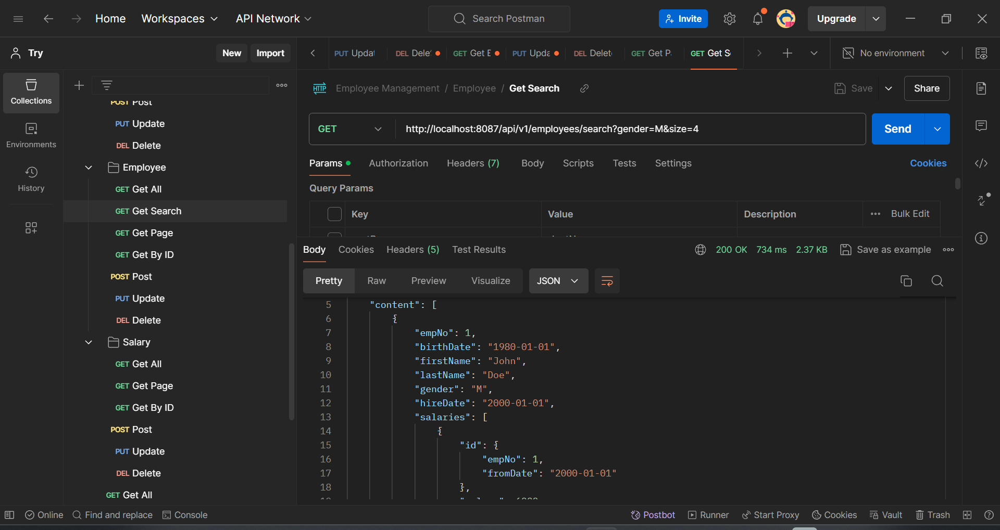

# Employee Management System with CRUD, Sorting, Pagination , and Dynamic Criteria for Employee Search

#### This guide will walk you through the implementation of an Employee Management System that includes Create, Read, Update, Delete (CRUD) operations, sorting , pagination, and dynamic search for employee data.

## Search employee info with dynamic criteria

#### Using the Specification interface that provided by Spring Data JPA to implement the search functionality for employeees with dynamic criteria. With this Specification interface, it can build queries dynamically based on the given criteria. This search will returning a list of employee with pagination.

### Query Parameters with any combination: `firstName`, `lastName`, `gender`, `birthDate`, `hireDate`.

Example Search Result with query: http://localhost:8087/api/v1/employees/search?gender=M&size=4

For look other result click this [Readme.md](../Lecture%2011/Readme.md)
