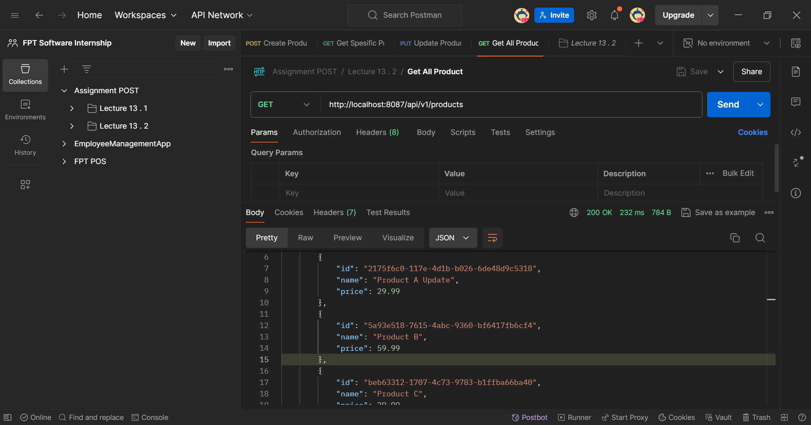
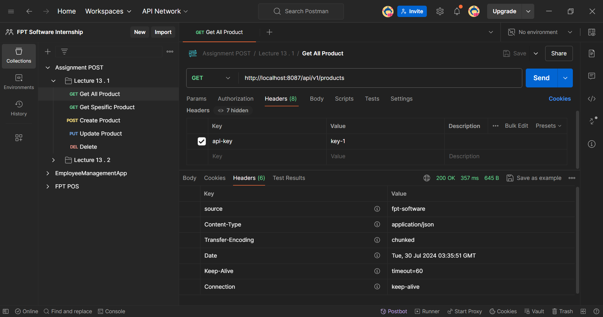

# 🖋️ CRUD Product System with Filter Authorization

#### This guide will walk you through the implementation of an Product Management System that includes Create, Read, Update, Delete (CRUD) operations, with Filter Authorization

## Research Filter

Filters are part of the Servlet API and operate at the web container level. They can intercept and manipulate requests and responses before they reach the servlet and after the servlet has processed them and even block requests from reaching any servlet.

### Key Points about Filters:

- `Lifecycle`: They are initialized once when the application starts and destroyed when the application shuts down.
- `Scope`: Can apply to all or specific URL patterns.
- `Use Cases`: Ideal for tasks such as authentication, logging, performance monitoring, and request/response modification.
- `Order`: Filters can be ordered to control the sequence in which they execute.

Filters are used for broad tasks at the servlet level, such as logging, authentication, and request/response modification.

## Project Structure

```bash
assignment
├── .mvn/wrapper/
│   └── maven-wrapper.properties
├── src/main/
│   ├── java/aliramadhan/assignment
│   │   ├── config/
│   │   │   └── FilterConfig.java
│   │   ├── controller/
│   │   │   └── ProductController.java
│   │   ├── data/
│   │   │   └── model/
|   │   │   │    └── ApiKey.java
|   │   │   │    └── Product.java
│   │   |   ├── repository/
|   │   │   │    └── ApiKeyRepository.java
|   │   │   │    └── ProductRepository.java
│   │   ├── dto/
│   │   │   └── ProductDTO.java
│   │   │   └── ProductSaveDTO.java
│   │   │   └── ProductShowDTO.java
│   │   ├── filter/
│   │   │   └── ApiKeyFilter.java
│   │   ├── mapper/
│   │   │   └── ProductMapper.java
│   │   ├── service/
|   │   │   ├── impl/
|   │   │   │   └── ApiKeyServiceImpl.java
|   │   │   │   └── ProductServiceImpl.java
│   │   │   └── ApiKeyService.java
│   │   │   └── ProductService.java
│   │   └── AssignmentApplication.java
│   └── resources/
│       └── application.properties
├── .gitignore
├── mvnw
├── mvnw.cmd
└── pom.xml
```

## SQL Query

### 🧩 SQL Query Data

Here is the SQL query to create the database, table, and instantiate some data.

````sql
-- Create the database
CREATE DATABASE assignmentpost;

-- Use the database
USE assignmentpost;

-- Create the API Key table
CREATE TABLE api_key (
    prodkey varchar(255) PRIMARY KEY
);

-- Create the Product table
CREATE TABLE product (
    id varchar(255) PRIMARY KEY,
    name VARCHAR(255),
    price DOUBLE
);
-- Insert data into api_key Table
INSERT INTO api_key (key) VALUES ('key-1');
INSERT INTO api_key (key) VALUES ('key-2');

-- Insert data into Product Table
INSERT INTO product (id, name, price) VALUES ('550e8400-e29b-41d4-a716-446655440000', 'Product 1', 19.99);
INSERT INTO product (id, name, price) VALUES ('550e8400-e29b-41d4-a716-446655440001', 'Product 2', 29.99);
INSERT INTO product (id, name, price) VALUES ('550e8400-e29b-41d4-a716-446655440003', 'Product 3', 39.99);

## Config Project

### `Application Properties`

Dont forget to configure [application properties](./assignment/assignment/src/main/resources/application.properties) with this format

```java
spring.datasource.driver-class-name=com.mysql.jdbc.Driver
spring.datasource.url=jdbc:mysql://localhost:3306/<your_database>
spring.datasource.username=<your_user_name>
spring.datasource.password=<your_password>
spring.jpa.hibernate.ddl-auto=update
````

### `Pom.xml`

Dont forget to configure dependency

```xml
<dependencies>
    <!-- JPA -->
    <dependency>
        <groupId>org.springframework.boot</groupId>
        <artifactId>spring-boot-starter-data-jpa</artifactId>
    </dependency>
    <!-- Devtools for enable reload -->
    <dependency>
    <groupId>org.springframework.boot</groupId>
        <artifactId>spring-boot-devtools</artifactId>
    </dependency>
    <dependency>
        <groupId>org.springframework.boot</groupId>
        <artifactId>spring-boot-starter-web</artifactId>
    </dependency>
    <!-- Connectore -->
    <dependency>
        <groupId>com.mysql</groupId>
        <artifactId>mysql-connector-j</artifactId>
        <scope>runtime</scope>
    </dependency>
    <!-- Lombok -->
    <dependency>
        <groupId>org.projectlombok</groupId>
        <artifactId>lombok</artifactId>
        <optional>true</optional>
    </dependency>
    <dependency>
        <groupId>org.springframework.boot</groupId>
        <artifactId>spring-boot-starter-test</artifactId>
        <scope>test</scope>
    </dependency>
    <!-- Mapper and struct -->
    <dependency>
        <groupId>org.mapstruct</groupId>
        <artifactId>mapstruct</artifactId>
        <version>1.5.3.Final</version>
    </dependency>
    <dependency>
        <groupId>org.mapstruct</groupId>
        <artifactId>mapstruct-processor</artifactId>
        <version>1.5.3.Final</version>
        <scope>provided</scope>
    </dependency>
</dependencies>
```

## Filter Code Explanation

### `ApiKeyServiceImpl` Class

```java
package aliramadhan.assignment.service.impl;

import aliramadhan.assignment.data.repository.ApiKeyRepository;
import aliramadhan.assignment.service.ApiKeyService;
import org.springframework.beans.factory.annotation.Autowired;
import org.springframework.stereotype.Service;

@Service
public class ApiKeyServiceImpl implements ApiKeyService {
@Autowired
private ApiKeyRepository apiKeyRepository;

    @Override
    public boolean isValidApiKey(String apiKey) {
        return apiKeyRepository.findById(apiKey).isPresent();
    }

}
```

### Summary Code

This code for checks if an API key exists in the repository.
The isValidApiKey method checks if a given API key is present in the repository by calling findById on apiKeyRepository.

### `ApiKeyFilter` Class

```java
package aliramadhan.assignment.filter;

import aliramadhan.assignment.service.ApiKeyService;
import org.springframework.beans.factory.annotation.Autowired;
import org.springframework.stereotype.Component;

import jakarta.servlet.FilterChain;
import jakarta.servlet.FilterConfig;
import jakarta.servlet.ServletException;
import jakarta.servlet.ServletRequest;
import jakarta.servlet.ServletResponse;
import jakarta.servlet.Filter;
import jakarta.servlet.http.HttpServletRequest;
import jakarta.servlet.http.HttpServletResponse;
import java.io.IOException;

@Component
public class ApiKeyFilter implements Filter {

    @Autowired
    private ApiKeyService apiKeyService;

    @Override
    public void init(FilterConfig filterConfig) throws ServletException {
        // No initialization needed
    }

    @Override
    public void doFilter(ServletRequest request, ServletResponse response, FilterChain chain)
            throws IOException, ServletException {

        HttpServletRequest httpRequest = (HttpServletRequest) request;
        HttpServletResponse httpResponse = (HttpServletResponse) response;

        String apiKey = httpRequest.getHeader("api-key");

        if (apiKey == null || !apiKeyService.isValidApiKey(apiKey)) {
            httpResponse.setStatus(HttpServletResponse.SC_UNAUTHORIZED);
            return;
        }

        chain.doFilter(request, response);
    }

    @Override
    public void destroy() {
        // No cleanup needed
    }
}
```

### Summary Code

The ApiKeyFilter class is a servlet filter that checks incoming HTTP requests for a valid API key in the api-key header. If the API key is missing or invalid, it responds with 401 Unauthorized. If the API key is valid, the request is passed along the filter chain for further processing. This filter is integrated with the Spring framework using the @Component annotation and dependency injection for the ApiKeyService.

### `FilterConfig` Class

```java
package aliramadhan.assignment.config;

import aliramadhan.assignment.filter.ApiKeyFilter;
import org.springframework.beans.factory.annotation.Autowired;
import org.springframework.context.annotation.Bean;
import org.springframework.context.annotation.Configuration;
import org.springframework.boot.web.servlet.FilterRegistrationBean;

@Configuration
public class FilterConfig {

    @Autowired
    private ApiKeyFilter apiKeyFilter;

    @Bean
    public FilterRegistrationBean<ApiKeyFilter> apiKeyFilterRegistration() {
        FilterRegistrationBean<ApiKeyFilter> registrationBean = new FilterRegistrationBean<>();
        registrationBean.setFilter(apiKeyFilter);
        registrationBean.addUrlPatterns("/api/v1/*"); // Apply the filter to the specified URL patterns
        return registrationBean;
    }
}
```

### Summary Code

The FilterConfig class is a Spring configuration class that registers the ApiKeyFilter to apply to requests matching the URL pattern /api/v1/\*. It uses Spring’s dependency injection to automatically inject the ApiKeyFilter and defines a bean for FilterRegistrationBean<ApiKeyFilter> to register and configure the filter. This setup ensures that any request to the specified URL pattern will be filtered to check for a valid API key.

### 📸 Results

Program can CRUD of the data with Filter Authorization
Here's the documentation.

#### Product Entity

1. **List Data Authorized**
   
2. **Unauthorized**
   
3. **Header Request**
   
4. **Header Response**
   

### Postman Collection

Here is the [postman collection](../Assignment%20POST%20Lecture%2013.postman_collection.json) you can use to demo the API functionality this API.
