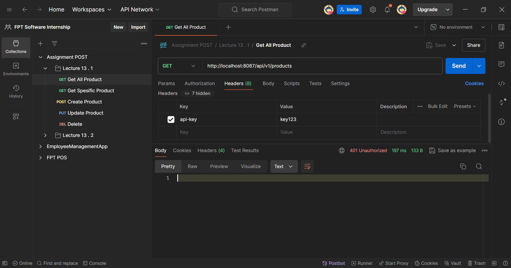
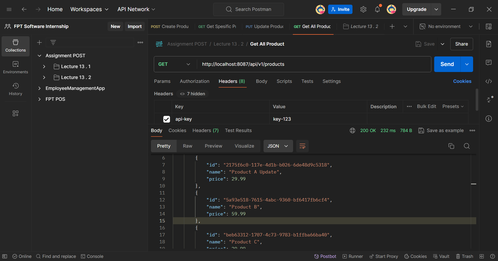
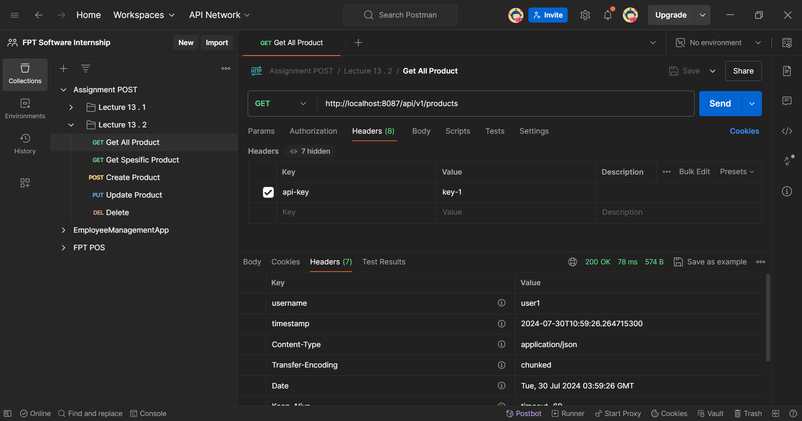

# 🖋️ CRUD Product System with Interceptor Authorization

#### This guide will walk you through the implementation of an Product Management System that includes Create, Read, Update, Delete (CRUD) operations, with Interceptor

## Research Interceptor

Interceptors are part of the Spring framework and work at the controller level. They can intercept requests before they reach a controller and after the controller has processed the request but before the view is rendered.

### Key Points about Interceptors:

- `Lifecycle`: They are managed by the Spring context and can be configured as beans.
- `Scope`: Apply to handler methods (typically within controllers).
- `Use Cases`: Useful for tasks such as logging, security checks, modifying the model and view, and handling cross-cutting concerns specific to web requests.
- `Order`: Multiple interceptors can be ordered to control their execution sequence.

Interceptors are used for finer-grained tasks at the controller level, such as modifying the model and view, handling security checks, and more.

## Project Structure

```bash
assignment
├── .mvn/wrapper/
│   └── maven-wrapper.properties
├── src/main/
│   ├── java/aliramadhan/assignment
│   │   ├── config/
│   │   │   └── WebConfig.java
│   │   ├── controller/
│   │   │   └── ProductController.java
│   │   ├── data/
│   │   │   └── model/
|   │   │   │    └── ApiKey.java
|   │   │   │    └── Product.java
│   │   |   ├── repository/
|   │   │   │    └── ApiKeyRepository.java
|   │   │   │    └── ProductRepository.java
│   │   ├── dto/
│   │   │   └── ProductDTO.java
│   │   │   └── ProductSaveDTO.java
│   │   │   └── ProductShowDTO.java
│   │   ├── interceptor/
│   │   │   └── ApiKeyInterceptor.java
│   │   ├── mapper/
│   │   │   └── ProductMapper.java
│   │   ├── service/
|   │   │   ├── impl/
|   │   │   │   └── ApiKeyServiceImpl.java
|   │   │   │   └── ProductServiceImpl.java
│   │   │   └── ApiKeyService.java
│   │   │   └── ProductService.java
│   │   └── AssignmentApplication.java
│   └── resources/
│       └── application.properties
├── .gitignore
├── mvnw
├── mvnw.cmd
└── pom.xml
```

## SQL Query

### 🧩 SQL Query Data

Here is the SQL query to create the database, table, and instantiate some data.

````sql
-- Create the database
CREATE DATABASE assignmentpost;

-- Use the database
USE assignmentpost;

-- Create the API Key table
CREATE TABLE api_key (
    prodkey varchar(255) PRIMARY KEY
);

-- Create the Product table
CREATE TABLE product (
    id varchar(255) PRIMARY KEY,
    name VARCHAR(255),
    price DOUBLE
);
-- Insert data into api_key Table
INSERT INTO api_key (key) VALUES ('key-1');
INSERT INTO api_key (key) VALUES ('key-2');

-- Insert data into Product Table
INSERT INTO product (id, name, price) VALUES ('550e8400-e29b-41d4-a716-446655440000', 'Product 1', 19.99);
INSERT INTO product (id, name, price) VALUES ('550e8400-e29b-41d4-a716-446655440001', 'Product 2', 29.99);
INSERT INTO product (id, name, price) VALUES ('550e8400-e29b-41d4-a716-446655440003', 'Product 3', 39.99);

## Config Project

### `Application Properties`

Dont forget to configure [application properties](./assignment/assignment/src/main/resources/application.properties) with this format

```java
spring.datasource.driver-class-name=com.mysql.jdbc.Driver
spring.datasource.url=jdbc:mysql://localhost:3306/<your_database>
spring.datasource.username=<your_user_name>
spring.datasource.password=<your_password>
spring.jpa.hibernate.ddl-auto=update
````

### `Pom.xml`

Dont forget to configure dependency

```xml
<dependencies>
    <!-- JPA -->
    <dependency>
        <groupId>org.springframework.boot</groupId>
        <artifactId>spring-boot-starter-data-jpa</artifactId>
    </dependency>
    <!-- Devtools for enable reload -->
    <dependency>
    <groupId>org.springframework.boot</groupId>
        <artifactId>spring-boot-devtools</artifactId>
    </dependency>
    <dependency>
        <groupId>org.springframework.boot</groupId>
        <artifactId>spring-boot-starter-web</artifactId>
    </dependency>
    <!-- Connectore -->
    <dependency>
        <groupId>com.mysql</groupId>
        <artifactId>mysql-connector-j</artifactId>
        <scope>runtime</scope>
    </dependency>
    <!-- Lombok -->
    <dependency>
        <groupId>org.projectlombok</groupId>
        <artifactId>lombok</artifactId>
        <optional>true</optional>
    </dependency>
    <dependency>
        <groupId>org.springframework.boot</groupId>
        <artifactId>spring-boot-starter-test</artifactId>
        <scope>test</scope>
    </dependency>
    <!-- Mapper and struct -->
    <dependency>
        <groupId>org.mapstruct</groupId>
        <artifactId>mapstruct</artifactId>
        <version>1.5.3.Final</version>
    </dependency>
    <dependency>
        <groupId>org.mapstruct</groupId>
        <artifactId>mapstruct-processor</artifactId>
        <version>1.5.3.Final</version>
        <scope>provided</scope>
    </dependency>
</dependencies>
```

## Filter Code Explanation

### `ApiKeyServiceImpl` Class

```java
package aliramadhan.assignment.service.impl;

import aliramadhan.assignment.data.repository.ApiKeyRepository;
import aliramadhan.assignment.service.ApiKeyService;
import org.springframework.beans.factory.annotation.Autowired;
import org.springframework.stereotype.Service;

@Service
public class ApiKeyServiceImpl implements ApiKeyService {
@Autowired
private ApiKeyRepository apiKeyRepository;

    @Override
    public boolean isValidApiKey(String apiKey) {
        return apiKeyRepository.findById(apiKey).isPresent();
    }

}
```

### Summary Code

This code for checks if an API key exists in the repository.
The isValidApiKey method checks if a given API key is present in the repository by calling findById on apiKeyRepository.

### `ApiKeyInterceptor` Class

```java
package aliramadhan.assignment.interceptor;

import aliramadhan.assignment.data.model.ApiKey;
import aliramadhan.assignment.data.repository.ApiKeyRepository;
import org.springframework.beans.factory.annotation.Autowired;
import org.springframework.stereotype.Component;
import org.springframework.web.servlet.HandlerInterceptor;

import jakarta.servlet.http.HttpServletRequest;
import jakarta.servlet.http.HttpServletResponse;
import java.time.LocalDateTime;

@Component
public class ApiKeyInterceptor implements HandlerInterceptor {

    @Autowired
    private ApiKeyRepository apiKeyRepository;

    @Override
    public boolean preHandle(HttpServletRequest request, HttpServletResponse response, Object handler) throws Exception {
        String apiKey = request.getHeader("api-key");
        if (apiKey == null || !apiKeyRepository.existsById(apiKey)) {
            response.setStatus(HttpServletResponse.SC_UNAUTHORIZED);
            return false;
        }

        ApiKey key = apiKeyRepository.findById(apiKey).orElseThrow();
        key.setLastUsed(LocalDateTime.now());
        apiKeyRepository.save(key);

        // Add username to the header
        response.setHeader("username", key.getUsername());
        return true;
    }
}
```

### Summary Code

The ApiKeyInterceptor class is a Spring HandlerInterceptor that validates API keys for incoming HTTP requests. It checks the presence and validity of the API key by retrieving it from the request header and verifying it against the database. If the API key is missing or invalid, the interceptor responds with a 401 Unauthorized status and halts further processing. For valid API keys, the interceptor updates the lastUsed timestamp in the database to the current time and adds the associated username to the response headers. This ensures that only authorized requests proceed and that relevant user information is included in the response.

### `WebConfig` Class

```java
package aliramadhan.assignment.config;

import aliramadhan.assignment.interceptor.ApiKeyInterceptor;
import org.springframework.beans.factory.annotation.Autowired;
import org.springframework.context.annotation.Configuration;
import org.springframework.web.servlet.config.annotation.InterceptorRegistry;
import org.springframework.web.servlet.config.annotation.WebMvcConfigurer;

@Configuration
public class WebConfig implements WebMvcConfigurer {

    @Autowired
    private ApiKeyInterceptor apiKeyInterceptor;

    @Override
    public void addInterceptors(InterceptorRegistry registry) {

        registry.addInterceptor(apiKeyInterceptor);
    }
}
```

### Summary Code

The WebConfig class is a Spring configuration class that registers the ApiKeyInterceptor for intercepting and processing HTTP requests. By implementing WebMvcConfigurer and overriding the addInterceptors method, it ensures that the ApiKeyInterceptor is applied to incoming requests, enabling API key validation and other related tasks before the request reaches the controller.

### 📸 Results

Program can CRUD of the data with Filter Authorization
Here's the documentation.

#### Product Entity

1. **List Data Authorized**
   
2. **Unauthorized**
   
3. **Header Request**
   
4. **Header Response**
   

### Postman Collection

Here is the [postman collection](../Assignment%20POST%20Lecture%2013.postman_collection.json) you can use to demo the API functionality this API.
