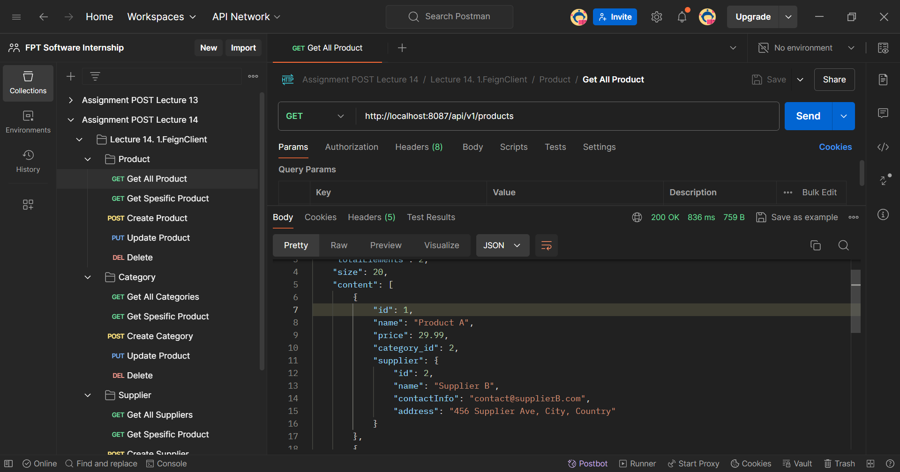
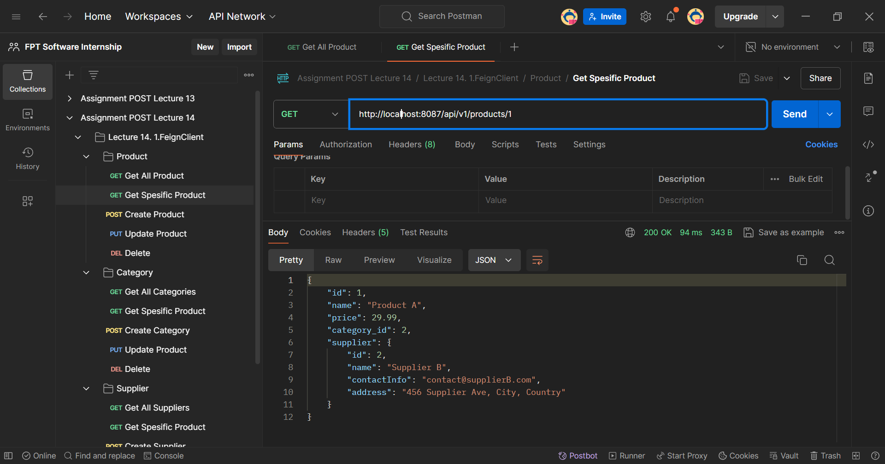
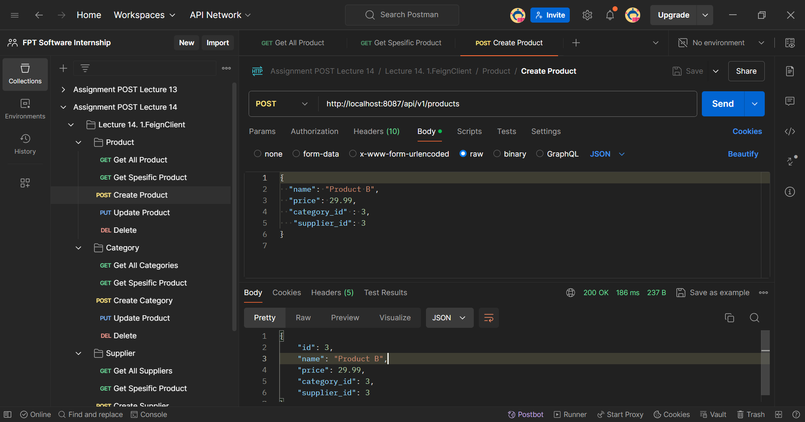
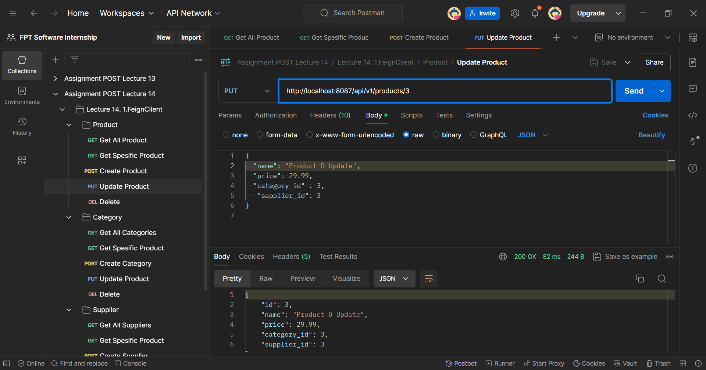
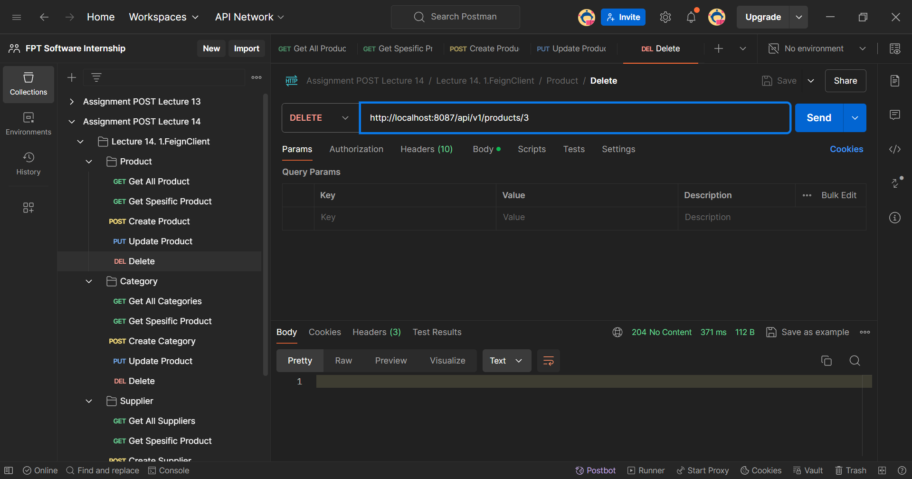
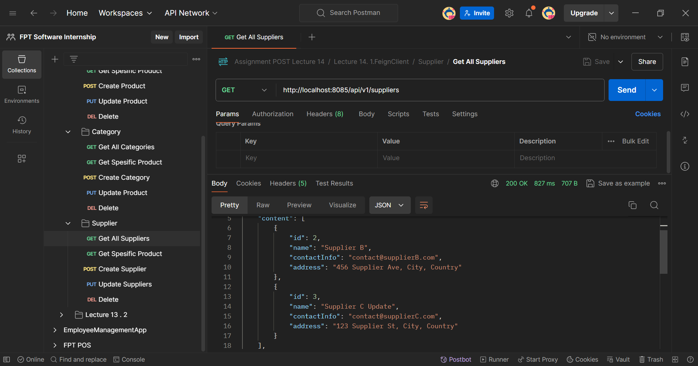

# 🖋️ CRUD Product System with WebClient, Request-template and Feign Client

#### This guide will walk you through the implementation of an Product Management System that includes Create, Read, Update, Delete (CRUD) operations, with WebClient, Request-template and Feign Client

## Overview `FeignClient`

Feign Client is a declarative web service client that simplifies making HTTP requests in a Spring Boot application. Instead of manually building requests (like you would with RestTemplate or WebClient), Feign allows you to define an interface that mimics the external service's API. The implementation is provided at runtime by Feign, handling all the underlying HTTP communication.

### `Key Components of Feign Client`

- `@FeignClient` Annotation: This annotation is used to declare a Feign client interface.It includes attributes like name, which specifies the name of the client, and url, which provides the base URL for the service.
- `@EnableFeignClients` Annotation: `This annotation is used to enable the Feign clients in your Spring Boot application.

### `Configuration of Feign Client`

```java
@Configuration
public class AppConfig {

    @Bean
    public Logger.Level feignLoggerLevel() {
        return Logger.Level.BASIC;  // Set the logging level for Feign clients
    }

    @Bean
    public RequestInterceptor requestInterceptor() {
        return requestTemplate -> {
            requestTemplate.header("Header", "FPT SOFTWARE");
        };
    }
}
```

- `feignLoggerLevel`: Sets the logging level for the Feign client. It can be NONE, BASIC, HEADERS, or FULL.
- `requestInterceptor`: Adds custom headers to every request sent by the Feign client.

## `FeignClient`

Feign Client is a declarative web service client that simplifies making HTTP requests in a Spring Boot application. Instead of manually building requests (like you would with RestTemplate or WebClient), Feign allows you to define an interface that mimics the external service's API. The implementation is provided at runtime by Feign, handling all the underlying HTTP communication.

### `Key Components of Feign Client`

- `@FeignClient` Annotation: This annotation is used to declare a Feign client interface.It includes attributes like name, which specifies the name of the client, and url, which provides the base URL for the service.
- `@EnableFeignClients` Annotation: `This annotation is used to enable the Feign clients in your Spring Boot application.

### Configuration of Feign Client

```java
@Configuration
public class AppConfig {

    @Bean
    public Logger.Level feignLoggerLevel() {
        return Logger.Level.BASIC;  // Set the logging level for Feign clients
    }

    @Bean
    public RequestInterceptor requestInterceptor() {
        return requestTemplate -> {
            requestTemplate.header("Header", "FPT SOFTWARE");
        };
    }
}
```

- `feignLoggerLevel`: Sets the logging level for the Feign client. It can be NONE, BASIC, HEADERS, or FULL.
- `requestInterceptor`: Adds custom headers to every request sent by the Feign client.

### Example Usage

```java
 @Autowired
    private SupplierClient supplierClient;

    @Override
    public ProductDTO saveProduct(ProductSaveDTO productSaveDTO) {
        // Validate supplier ID
        if (productSaveDTO.getSupplier_id() != null) {
            SupplierDTO supplierDTO = supplierClient.getSupplierById(productSaveDTO.getSupplier_id());
            if (supplierDTO == null) {
                throw new RuntimeException("Supplier not found");
            }
        }

        Product product = productMapper.toProduct(productSaveDTO);
        product = productRepository.save(product);
        return productMapper.toProductDTO(product);
    }
```

## Overview `Rest-template`

RestTemplate is useful for interacting with other microservices or external APIs within a Spring Boot application. However, note that RestTemplate is considered somewhat legacy, and Spring encourages using WebClient from the Spring WebFlux module for non-blocking, reactive web requests in newer projects.

### Configuration of `Rest-template`

```java
package aliramadhan.assignment.config;

import org.springframework.context.annotation.Bean;
import org.springframework.context.annotation.Configuration;
import org.springframework.web.client.RestTemplate;

@Configuration
public class AppConfig {

    @Bean
    public RestTemplate restTemplate() {
        return new RestTemplate();
    }

}
```

RestTemplate Bean: The AppConfig class defines a RestTemplate bean, which is a synchronous client to perform HTTP requests. By declaring it as a bean, you make it available for dependency injection throughout your application.

### Example Usage

```java
SupplierDTO supplierDTO = restTemplate.getForObject(url, SupplierDTO.class);
if (supplierDTO == null) {
    throw new RuntimeException("Supplier not found");
}
```

## Overview `Web-Client`

WebClient: A reactive, non-blocking HTTP client provided by Spring WebFlux. It's the successor to RestTemplate and is used for making asynchronous HTTP requests.

- Mono: A reactive type that represents a single value or an empty response. In this code, Mono<SupplierDTO> is used to represent the supplier information that will be returned by the supplier service.
- block(): This method is used to block the current thread and wait for the Mono to complete, effectively making the request synchronous. This is useful when integrating with synchronous methods or libraries.

### Configuration of `Web-client`

```java
package aliramadhan.assignment.config;

import org.springframework.context.annotation.Bean;
import org.springframework.context.annotation.Configuration;
import org.springframework.web.reactive.function.client.WebClient;

@Configuration
public class AppConfig {

    @Bean
    public WebClient.Builder webClientBuilder() {
        return WebClient.builder();
    }
}
```

WebClient.Builder Bean: The AppConfig class defines a WebClient.Builder bean, which is used to build WebClient instances. This allows you to configure and reuse WebClient instances throughout your application.

### Example Usage

```java
@Autowired
private WebClient.Builder webClientBuilder;

private final String SUPPLIER_SERVICE_URL = "http://localhost:8085/api/v1/suppliers/";

@Override
public ProductDTO saveProduct(ProductSaveDTO productSaveDTO) {
    // Validate supplier ID
    if (productSaveDTO.getSupplier_id() != null) {
        String url = SUPPLIER_SERVICE_URL + productSaveDTO.getSupplier_id();
        SupplierDTO supplierDTO = webClientBuilder.build()
                .get()
                .uri(url)
                .retrieve()
                .bodyToMono(SupplierDTO.class)
                .block();  // Wait for the response synchronously

        if (supplierDTO == null) {
            throw new RuntimeException("Supplier not found");
        }
    }

    Product product = productMapper.toProduct(productSaveDTO);
    product = productRepository.save(product);
    return productMapper.toProductDTO(product);
}
```

## SQL Query

### 🧩 SQL Query Data Server 1

Here is the SQL query to create the database, table, and instantiate some data.

`````sql
-- Create the database
CREATE DATABASE assignmentpost1;

-- Use the database
USE assignmentpost1;

-- Create the Product table
CREATE TABLE `product` (
  `id` bigint NOT NULL,
  `name` varchar(255) NOT NULL,
  `price` double NOT NULL,
  `category_id` bigint NOT NULL,
  `supplier_id` bigint DEFAULT NULL
   FOREIGN KEY (`category_id`) REFERENCES `categories` (`id`) ON DELETE CASCADE;
)

-- Create the Categories table
CREATE TABLE `categories` (
  `id` bigint NOT NULL,
  `name` varchar(255) NOT NULL
) ENGINE=InnoDB DEFAULT CHARSET=utf8mb4 COLLATE=utf8mb4_0900_ai_ci;

-- Insert data into categories Table
INSERT INTO `categories` (`id`, `name`) VALUES
(2, 'Category A'),
(3, 'Category B'),
(4, 'Category C');

-- Insert data into Product Table
INSERT INTO `product` (`id`, `name`, `price`, `category_id`, `supplier_id`) VALUES
(1, 'Product A', 29.99, 2, 2),
(2, 'Product B', 29.99, 3, 3);

### 🧩 SQL Query Data Server 2

Here is the SQL query to create the database, table, and instantiate some data.

````sql
-- Create the database
CREATE DATABASE assignmentpost2;

-- Use the database
USE assignmentpost2;

-- Create the Supplier table
CREATE TABLE `supplier` (
  `id` bigint NOT NULL,
  `name` varchar(255) NOT NULL,
  `contact_info` varchar(255) DEFAULT NULL,
  `address` tinytext,
  `created_at` timestamp NULL DEFAULT CURRENT_TIMESTAMP,
  `updated_at` timestamp NULL DEFAULT CURRENT_TIMESTAMP ON UPDATE CURRENT_TIMESTAMP
) ENGINE=InnoDB DEFAULT CHARSET=utf8mb4 COLLATE=utf8mb4_0900_ai_ci;

-- Insert data into supplier Table
INSERT INTO `supplier` (`id`, `name`, `contact_info`, `address`, `created_at`, `updated_at`) VALUES
(2, 'Supplier B', 'contact@supplierB.com', '456 Supplier Ave, City, Country', '2024-08-01 09:17:03', '2024-08-01 09:17:03'),
(3, 'Supplier C Update', 'contact@supplierC.com', '123 Supplier St, City, Country', '2024-08-01 09:28:42', '2024-08-01 09:29:33');


## Config Project

### `Application Properties`

Dont forget to configure [application properties](./assignment/assignment/src/main/resources/application.properties) with this format

```java
spring.datasource.driver-class-name=com.mysql.jdbc.Driver
spring.datasource.url=jdbc:mysql://localhost:3306/<your_database>
spring.datasource.username=<your_user_name>
spring.datasource.password=<your_password>
spring.jpa.hibernate.ddl-auto=update
server.port= port
`````

### `Pom.xml`

Dont forget to configure dependency

```xml
<dependencies>
    <!-- Feign Client -->
    <dependency>
        <groupId>org.springframework.cloud</groupId>
        <artifactId>spring-cloud-starter-openfeign</artifactId>
    </dependency>
    <dependencyManagement>
        <dependencies>
            <dependency>
                <groupId>org.springframework.cloud</groupId>
                <artifactId>spring-cloud-dependencies</artifactId>
                <version>${spring-cloud.version}</version>
                <type>pom</type>
                <scope>import</scope>
            </dependency>
        </dependencies>
    </dependencyManagement>
    <!-- Rest-template -->
        // use web client
    <!-- Web-Client -->
    <dependency>
        <groupId>org.springframework.boot</groupId>
        <artifactId>spring-boot-starter-webflux</artifactId>
    </dependency>
</dependencies>
```

### 📸 Results

Here's the documentation.

#### Product Entity

1. **Get All Product**
   
2. **Get Product by Id**
   
3. **Post Product**
   
4. **Update Product**
   
5. **Delete Product**
   
6. **Get All Suppliers**
   
