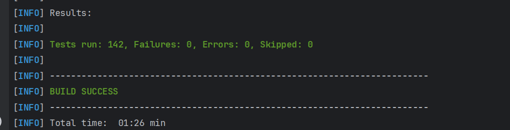
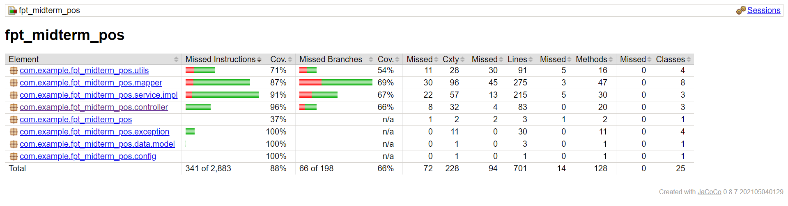
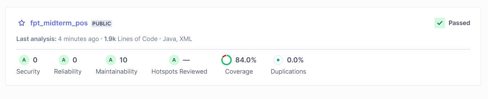
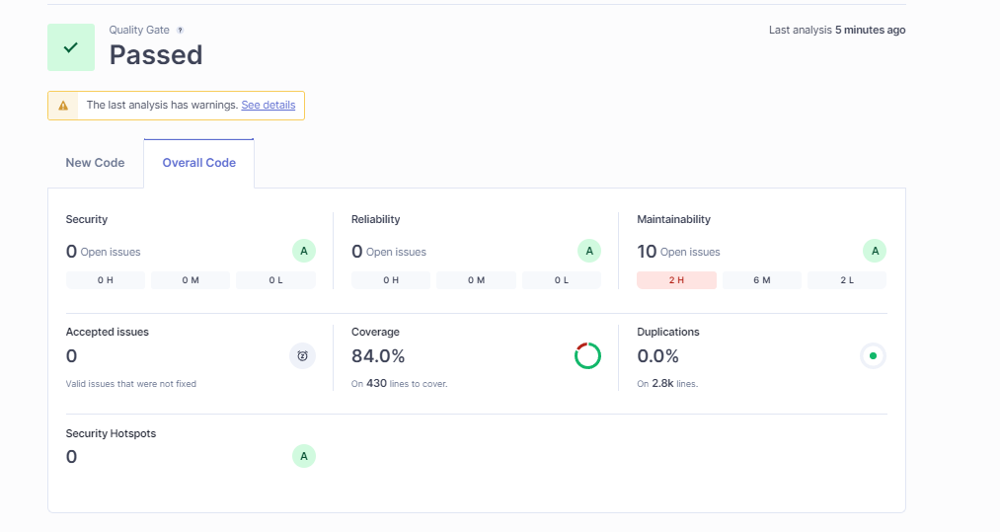

# Unit Test and Code Quality Measurement with Manual and Automation Tools

## Overview Unit Test

### `Unit Test`

A unit test is a type of software testing where individual units or components of a software are tested in isolation from the rest of the application. The main purpose is to validate that each unit of the software performs as expected. A "unit" typically refers to a small piece of code, such as a function or a method. Unit tests help ensure that code works correctly and can catch bugs early in the development process.

### `JUnit`

JUnit is a widely used testing framework in Java, specifically designed for writing and running unit tests. JUnit provides annotations, assertions, and test runners that help developers structure their tests, verify outcomes, and organize test cases. The latest version, JUnit 5 (also known as Jupiter), offers enhanced features like more flexible test configuration, improved support for parameterized tests, and better integration with modern build tools.

### `Mockito`

Mockito is a popular mocking framework for Java that allows developers to create mock objects for unit testing. Mock objects simulate the behavior of real objects in a controlled way, making it possible to test code in isolation without relying on external dependencies like databases or web services. Mockito helps in verifying interactions, setting expectations, and defining return values for mock objects, which makes it easier to test complex scenarios.

## Sample Unit Test

```java
@Service
public class UserService {

    public User createUser(Long id, String name, String email) {
        if (name == null || email == null) {
            throw new IllegalArgumentException("Name and email must not be null");
        }
        return new User(id, name, email);
    }

    public String getUserEmail(User user) {
        return user.getEmail();
    }
}
```

```java
@ExtendWith(MockitoExtension.class)
public class UserServiceTest {

    @InjectMocks
    private UserService userService;

    @Test
    public void testCreateUser_ValidData() {
        User user = userService.createUser(1L, "John Doe", "john@example.com");

        assertNotNull(user);
        assertEquals(1L, user.getId());
        assertEquals("John Doe", user.getName());
        assertEquals("john@example.com", user.getEmail());
    }

    @Test
    public void testCreateUser_NullNameOrEmail() {
        assertThrows(IllegalArgumentException.class, () -> {
            userService.createUser(1L, null, "john@example.com");
        });

        assertThrows(IllegalArgumentException.class, () -> {
            userService.createUser(1L, "John Doe", null);
        });
    }

    @Test
    public void testGetUserEmail() {
        User user = new User(1L, "Jane Doe", "jane@example.com");

        String email = userService.getUserEmail(user);

        assertEquals("jane@example.com", email);
    }
}
```

For the run test use IDE or by using Maven/Gradle commands `mvn test`. The tests will ensure that the UserService methods behave as expected, and any failures will indicate issues in the code.

**All the unit test cases for this project is exist on this [folders](./fpt_midterm_pos/src/test).**

## Overview Code Quality

### `Code Quality`

Code Quality refers to the measure of how well-written and maintainable your source code is. High-quality code is essential for the longevity, performance, and security of software. Key aspects of code quality include:

Key Aspects of Code Quality

- Readability: Code should be easy to read and understand. This includes clear naming conventions, proper indentation, and well-organized code structures.
- Maintainability: The code should be easy to modify and extend. This involves using modular design, proper documentation, and minimizing complex dependencies.

- Efficiency: The code should perform its tasks in an optimal manner, minimizing resource usage and execution time.

- Reliability: The code should work correctly under all expected conditions, handling edge cases and errors gracefully.

- Testability: The code should be designed in a way that makes it easy to test. This includes having well-defined interfaces and minimal dependencies.

- Scalability: The code should be able to handle increasing amounts of data or load without requiring significant changes.
  Security:

The code should be free from vulnerabilities and should follow best practices for secure coding.

### `SonarQube`

SonarLint: An IDE add-on that gives developers instant feedback on newly discovered bugs and quality problems inserted into their code.

SonarQube : an online tool web-based platform for ongoing code quality inspection. To find errors, bad code, and security flaws, it automatically reviews the code using static analysis.

#### Key Features

- Install SonarLint in the IDE (e.g., IntelliJ, Eclipse, VSCode).
- Install SonarQube on the local machine or use a hosted version.
  `sonar-project.properties`

```properties
  sonar.projectKey=project-key
  sonar.projectName=project-name
  sonar.projectVersion=project-version
  sonar.host.url=project-host-url
  sonar.login=project-token
  sonar.exclusions=\**/\_.java
```

- Run Analysis

```properties
mvn sonar:sonar
```

### `Jacoco`

JaCoCo (Java Code Coverage) is a free code coverage library for Java. It offers comprehensive code coverage data, displaying the sections of the code that have and have not been run by tests.

#### Key Features

**Dependencies**

```pom
<build>
    <plugins>
        <plugin>
            <groupId>org.jacoco</groupId>
            <artifactId>jacoco-maven-plugin</artifactId>
            <version>0.8.7</version>
            <executions>
                <execution>
                    <goals>
                        <goal>prepare-agent</goal>
                    </goals>
                </execution>
                <execution>
                    <id>report</id>
                    <phase>prepare-package</phase>
                    <goals>
                        <goal>report</goal>
                    </goals>
                </execution>
            </executions>
        </plugin>
    </plugins>
</build>
```

**Run the test**

```wsl
mvn clean test
mvn jacoco:report
```

### Result Documentation

### Result Unit Test with JUnit5 and Mockito `Code Created`



### Result Jacoco Report `Code Coverage`

All test run succesfully



### Result Sonar Analysis `Code Quality`



Full overal code quality analysis

# 🛒 Revisit - Midterm Exam Project - Point of Sales

> This repository is created as a part of Midterm Exam Project by Group 3

## ⚡ Requirements

1. All APIs Have Pagination
2. Create RESTful APIs using Best Practice
3. Using Validate Annotation/Function
4. All Entities Should have created_time, Updated_time
5. Customer Implementation
   1. Show List Customer Field(id, name, phone number)
   2. Add New Customer
   3. Edit Existing Customer
   4. Edit Status Existing Customer
6. Product Implementation
   1. Show List Product Field(id, name, price, status), Search by name, Sort by name or price
   2. Add New Product
   3. Edit Existing Product
   4. Edit Status Existing Product
   5. Add New Product by Excel File
7. Invoice Implementation
   1. Show List Invoice Field(id, invoice amount, customer name, invoice date) with Invoice Detail Field(Customer: id, name; Invoice: id, invoice amount, invoice date; List Product: quantity, price, amount), Search by name(like) or customer(id) or date or month, Sort by date or amount
   2. Add New Invoice
   3. Edit Existing Invoice
   4. Export Invoice Detail to PDF
   5. Create Revenue by day or month or year(Optional)
   6. Export Invoice Detail to Excel(Optional)

## 🌳 Project Structure

```bash
fpt_midterm_pos
├── .mvn/wrapper/
│   └── maven-wrapper.properties
├── src/main/
│   ├── java/com/example/fpt_midterm_pos/
│   │   ├── config/
│   │   │   └── WebConfig.java
│   │   ├── controller/
│   │   │   ├── CustomerController.java
│   │   │   ├── InvoiceController.java
│   │   │   └── ProductController.java
│   │   ├── data/
│   │   │   ├── model/
│   │   │   │   ├── Customer.java
│   │   │   │   ├── Invoice.java
│   │   │   │   ├── InvoiceDetail.java
│   │   │   │   ├── InvoiceDetailKey.java
│   │   │   │   ├── Product.java
│   │   │   │   └── Status.java
│   │   │   └── repository/
│   │   │       ├── CustomerRepository.java
│   │   │       ├── InvoiceDetailRepository.java
│   │   │       ├── InvoiceRepository.java
│   │   │       └── ProductRepository.java
│   │   ├── dto/
│   │   │   ├── CustomerDTO.java
│   │   │   ├── CustomerInvoiceDTO.java
│   │   │   ├── CustomerSaveDTO.java
│   │   │   ├── CustomerShowDTO.java
│   │   │   ├── InvoiceDetailDTO.java
│   │   │   ├── InvoiceDetailSaveDTO.java
│   │   │   ├── InvoiceDetailSearchCriteriaDTO.java
│   │   │   ├── InvoiceDTO.java
│   │   │   ├── InvoiceSaveDTO.java
│   │   │   ├── InvoiceSearchCriteriaDTO.java
│   │   │   ├── ProductDTO.java
│   │   │   ├── ProductSaveDTO.java
│   │   │   ├── ProductSearchCriteriaDTO.java
│   │   │   ├── ProductShowDTO.java
│   │   │   └── ReevenueShowDTO.java
│   │   ├── exception/
│   │   │   ├── BadRequestException.java
│   │   │   ├── DuplicateStatusException.java
│   │   │   ├── GlobalExceptionHandler.java
│   │   │   └── ResourceNotFound.java
│   │   ├── mapper/
│   │   │   ├── CustomerMapper.java
│   │   │   ├── InvoiceDetailMapper.java
│   │   │   ├── InvoiceMapper.java
│   │   │   └── ProductMapper.java
│   │   ├── service/
│   │   │   ├── impl/
│   │   │   │   ├── CustomerServiceImpl.java
│   │   │   │   ├── InvoiceServiceImpl.java
│   │   │   │   └── ProductServiceImpl.java
│   │   │   ├── CustomerService.java
│   │   │   ├── InvoiceService.java
│   │   │   └── ProductService.java
│   │   ├── utils/
│   │   │   ├── DateUtils.java
│   │   │   ├── ExcelGenerator.java
│   │   │   ├── FileUtils.java
│   │   │   └── PDFGenerator.java
│   │   └── FptMidtermPosApplication.java
│   └── resources/
│       ├── templates/
│       │   └── invoice-template.html
│       ├── application.properties
│       ├── data.sql
│       └── productSample.csv
├── .gitignore
├── env.properties
├── mvnw
├── mvnw.cmd
├── pom.xml
├── run.bat
└── run.sh
```

## 🔎 Class Diagram

Here is our Class Diagram. You can see it detail [here](https://lucid.app/lucidchart/b66fa0c2-f3c7-49e4-9873-633c505bda5c/edit?beaconFlowId=96FD403F7522998F&invitationId=inv_c0d2a63e-ac6d-4693-b6bd-b15393c9d14e&page=0_0#).


## 🧩 Entity Relationship Diagram (ERD) and SQL Query Data

Here is our ERD. You can see it detail [here](https://lucid.app/lucidchart/b66fa0c2-f3c7-49e4-9873-633c505bda5c/edit?beaconFlowId=96FD403F7522998F&invitationId=inv_c0d2a63e-ac6d-4693-b6bd-b15393c9d14e&page=0_0#).


And here is the SQL query to create the database, table, and instantiate some data.

```sql
-- Create the database
CREATE DATABASE fpt_midterm_pos;

-- Use the database
USE fpt_midterm_pos;

-- Initialize table with DDL
-- Create `Customer` table
CREATE TABLE Customer (
    ID BINARY(16) PRIMARY KEY,
    name VARCHAR(255) NOT NULL,
    phoneNumber VARCHAR(255),
    status ENUM('Active', 'Deactivate') NOT NULL,
    createdAt DATETIME,
    updatedAt DATETIME
);

-- Create `Product` table
CREATE TABLE Product (
    ID BINARY(16) PRIMARY KEY,
    name VARCHAR(255) NOT NULL,
    price INT NOT NULL,
    status ENUM('Active', 'Deactivate') NOT NULL,
    quantity INT(10),
    createdAt DATETIME,
    updatedAt DATETIME
);

-- Create `Invoice` table
CREATE TABLE Invoice (
    ID BINARY(16) PRIMARY KEY,
    amount INT(10) NOT NULL,
    date DATE NOT NULL,
    createdAt DATETIME,
    updatedAt DATETIME,
    customerId BINARY(16),
    FOREIGN KEY (customerId) REFERENCES Customer(ID)
);

-- Create `InvoiceDetails` table
CREATE TABLE InvoiceDetails (
    invoiceID BINARY(16),
    productID BINARY(16),
    quantity INT(10),
    productPrice INT(10),
    productName VARCHAR(255),
    amount INT(10),
    createdAt DATETIME,
    updatedAt DATETIME,
    PRIMARY KEY (invoiceID, productID),
    FOREIGN KEY (invoiceID) REFERENCES invoice(ID),
    FOREIGN KEY (productID) REFERENCES product(ID)
);
```

There are also query to insert some generated dummy data. All the MySQL queries is available on [this file](/fpt_midterm_pos/src/main/resources/data.sql). Here is the query to drop the database.

```sql
-- Drop the database
DROP DATABASE IF EXISTS fpt_midterm_pos;
```

In this test, we're also discovering safer way to save the credential. You can configure env.properties on the **root of the project** (aligned with [pom.xml](/fpt_midterm_pos/pom.xml)) with this format.

```java
DB_DATABASE=<your database url>
DB_USER=<your database username>
DB_PASSWORD=M<your database password>
PORT=<your preferred port number>
```

Don't forget to add this to re-update the SQL DDL queries.

```java
spring.jpa.hibernate.ddl-auto=update
```

finally, don't forget to add this for hibernate SQL logging.

```java
spring.jpa.show-sql=true
spring.jpa.properties.hibernate.format_sql=true
logging.level.org.hibernate.SQL=DEBUG
logging.level.org.hibernate.type.descriptor.sql.BasicBinder=TRACE
```

## ⚙️ How to run the program

1. Go to the `fpt_midterm_pos` directory by using this command
   ```bash
   $ cd fpt_midterm_pos
   ```
2. Make sure you have maven installed on my computer, use `mvn -v` to check the version.
3. If you are using windows, you can run the program by using this command.
   ```bash
   $ ./run.bat
   ```
   And if you are using Linux, you can run the program by using this command.
   ```bash
   $ chmod +x run.sh
   $ ./run.sh
   ```

If all the instruction is well executed, Open [localhost:8080](http://localhost:8080) to see that the REST APIs is now works.

## 🔑 List of Endpoints

| Endpoints                                                                   | Method | Description                                                                                                                                                                                          |
| --------------------------------------------------------------------------- | :----: | ---------------------------------------------------------------------------------------------------------------------------------------------------------------------------------------------------- |
| /api/v1/products                                                            |  GET   | Retrieve all products with default pagination (page 1 with size 20 elements/page). Consider only active products.                                                                                    |
| /api/v1/products?page={X}&size={Y}                                          |  GET   | Retrieve all products with custom pagination (page X (0-based index) with size Y elements/page). Consider only active products.                                                                      |
| /api/v1/products?name={A}                                                   |  GET   | Retrieve all products with name A. Consider only active products.                                                                                                                                    |
| /api/v1/products?sortByName={P}                                             |  GET   | Retrieve all products sorted by name in order P. P is either asc or desc, default asc.                                                                                                               |
| /api/v1/products?sortByPrice={Q}                                            |  GET   | Retrieve all products sorted by price in order Q. Q is either asc or desc, default asc.                                                                                                              |
| /api/v1/products?minPrice={X}&maxPrice={Y}                                  |  GET   | Retrieve all products with a price between X and Y.                                                                                                                                                  |
| /api/v1/products?name=ProductB&sortByPrice=desc&minPrice=200&page=2&size=10 |  GET   | Retrieve all products with name “Product B” with price above 200, then sort it by price descending, and show the result with custom pagination (page 3 with size 10). Consider only active products. |
| /api/v1/products                                                            |  POST  | Create a new product. Validate POST request format.                                                                                                                                                  |
| /api/v1/products/{id}                                                       |  PUT   | Update an existing product by product ID. Make sure the product ID exists.                                                                                                                           |
| /api/v1/products/active/{id}                                                |  PUT   | Activate the existing product by their product ID. Make sure the product ID exists and is currently inactive.                                                                                        |
| /api/v1/products/deactive/{id}                                              |  PUT   | Deactivate the existing product by their product ID. Make sure the product ID exists and is currently active.                                                                                        |
| /api/v1/products/upload                                                     |  POST  | Import list of products from Excel file from form data. Consider Excel format and data validation.                                                                                                   |
| /api/v1/customers                                                           |  GET   | Retrieve all customers with default pagination (page 1 with size 20 elements/page). Consider only active customers.                                                                                  |
| /api/v1/customers?page={X}&size={Y}                                         |  GET   | Retrieve all customers with custom pagination (page X (0-based index) with size Y elements/page). Consider only active customers.                                                                    |
| /api/v1/customers                                                           |  POST  | Create a new customer. Validate POST request format.                                                                                                                                                 |
| /api/v1/customers/{id}                                                      |  PUT   | Update an existing customer by customer ID. Make sure the customer ID exists.                                                                                                                        |
| /api/v1/customers/active/{id}                                               |  PUT   | Activate the existing customer by their customer ID. Make sure the customer ID exists and is currently inactive.                                                                                     |
| /api/v1/customers/deactive/{id}                                             |  PUT   | Deactivate the existing customer by their customer ID. Make sure the customer ID exists and is currently active.                                                                                     |
| /api/v1/invoices                                                            |  GET   | Retrieve all invoices with default pagination (page 1 with size 20 elements/page).                                                                                                                   |
| /api/v1/invoices?page={X}&size={Y}                                          |  GET   | Retrieve all invoices with custom pagination (page X (0-based index) with size Y elements/page).                                                                                                     |
| /api/v1/invoices?customerName={A}                                           |  GET   | Retrieve all invoices from customer name A.                                                                                                                                                          |
| /api/v1/invoices?customerId={A}                                             |  GET   | Retrieve all invoices from customer ID A. Make sure customer ID exists.                                                                                                                              |
| /api/v1/invoices?startDate={X}&endDate={Y}                                  |  GET   | Retrieve all invoices from date X to date Y.                                                                                                                                                         |
| /api/v1/invoices?month={C}                                                  |  GET   | Retrieve all invoices on month C. Consider case insensitive.                                                                                                                                         |
| /api/v1/invoices?sortByDate={P}                                             |  GET   | Retrieve all invoices sorted by date in order P. P is either asc or desc, default asc.                                                                                                               |
| /api/v1/invoices?sortByAmount={Q}                                           |  GET   | Retrieve all invoices sorted by amount in order Q. Q is either asc or desc, default asc.                                                                                                             |
| /api/v1/invoices?customerId=1&month=July&sortByAmount=desc                  |  GET   | Retrieve all invoices from customer with ID 1 in July, sort it by amount ascending.                                                                                                                  |
| /api/v1/invoices                                                            |  POST  | Create a new invoice. Validate POST request format.                                                                                                                                                  |
| /api/v1/invoices/{id}                                                       |  PUT   | Update existing invoice. Has the same business flow as creating a new invoice. Make sure the invoice ID exists. Invoice can only be edited in 10 minutes from created time.                          |
| /api/v1/invoices/{id}/export                                                |  GET   | Export the invoice details data into PDF. Include all information on invoice details.                                                                                                                |
| /api/v1/invoices/excel?customerId={id}&month={month}&year={year}            |  GET   | Export the invoice details data into Excel with criteria filter. Include all information on invoice details.                                                                                         |
| /api/v1/invoices/revenue                                                    |  GET   | Create a report revenue invoice based on a given year, month, or day. Make sure the input filter value is between year, month, or day.                                                               |

## 📝 Full Documentation and Report

To get the full documentation and report on what we already make, please visit the document we already have [here](https://docs.google.com/document/d/13k0Ruc8sySpOKDno9zcgG8Uq9EcpTQm4mUqg1-gfvNA/edit?usp=sharing).

## 📬 API Documentation

For API documentation we're using Swagger, so you can see the detail of API documentation on [http://localhost:8080/swagger-ui/index.html](http://localhost:8080/swagger-ui/index.html) after running the program.

## 🙋🏻‍♂️ Contributors

<a href = "https://github.com/affandyfandy/MidtermExamGroup03/graphs/contributors">
  
</a>
